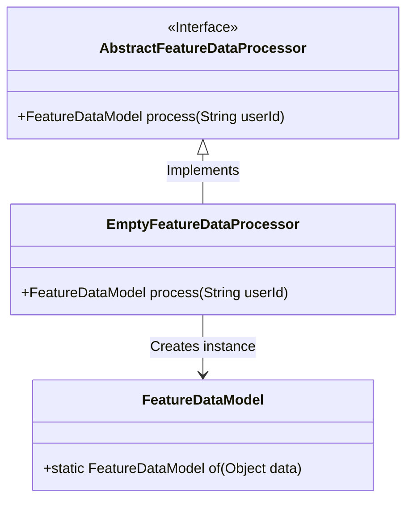
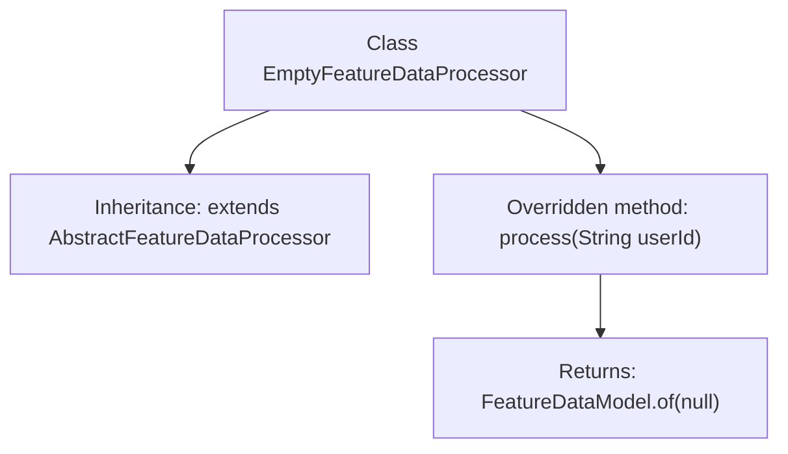

# Basic Information

|      |      |
|------|------|
| Name | EmptyFeatureDataProcessor |
| Language | .java |
| Code Path | WeFe/serving/serving-service/src/main/java/com/welab/wefe/serving/service/feature/code/EmptyFeatureDataProcessor.java |
| Package Name | com.welab.wefe.serving.service.feature.code |
| Dependencies | ['com.welab.wefe.serving.sdk.model.FeatureDataModel'] |
| Brief Description | EmptyFeatureDataProcessor inherits from AbstractFeatureDataProcessor, overrides the process method, and returns an empty FeatureDataModel. |

# Description

EmptyFeatureDataProcessor is a class that inherits from AbstractFeatureDataProcessor, designed to handle feature data. It overrides the process method, which takes a user ID parameter but directly returns a FeatureDataModel instance with a null value. This processor does not perform any actual data processing and only provides empty results.

# Class Summary

| Name   | Type  | Description |
|-------|------|-------------|
| EmptyFeatureDataProcessor | class | Empty feature data processing class, inherits from the abstract processor, overrides the process method, and returns an empty feature data model. |

## Class EmptyFeatureDataProcessor

|      |      |
|------|------|
| Access Modifier | public |
| Type | class |
| Name | EmptyFeatureDataProcessor |
| Description | Empty feature data processing class, inherits from the abstract processor, overrides the process method, and returns an empty feature data model. |

### UML Class Diagram

This class diagram illustrates that EmptyFeatureDataProcessor inherits from the AbstractFeatureDataProcessor interface and implements its process method, which returns an instance created via the FeatureDataModel.of() method. EmptyFeatureDataProcessor is a concrete implementation class specifically designed for empty feature data scenarios, overriding the parent interface method to return a FeatureDataModel object containing null values. The entire design demonstrates the application of the Null Object pattern, providing a default implementation solution for feature data processing.

### Internal Method Call Graph

This code demonstrates an empty feature data processor class that inherits from AbstractFeatureDataProcessor. The flowchart clearly illustrates the class inheritance relationship and the sole overridden process method, which takes a user ID parameter but always returns a FeatureDataModel object containing a null value. This design is typically used to implement the Null Object pattern, providing default no-op behavior for the system to avoid null pointer exceptions and maintain interface consistency.

### Field List

| Name  | Type  | Description |
|-------|-------|------|

### Method List

| Name  | Type  | Description |
|-------|-------|------|
| process | FeatureDataModel | The method `process` takes a `userId` parameter and returns an empty `FeatureDataModel` instance. |

