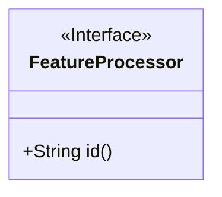
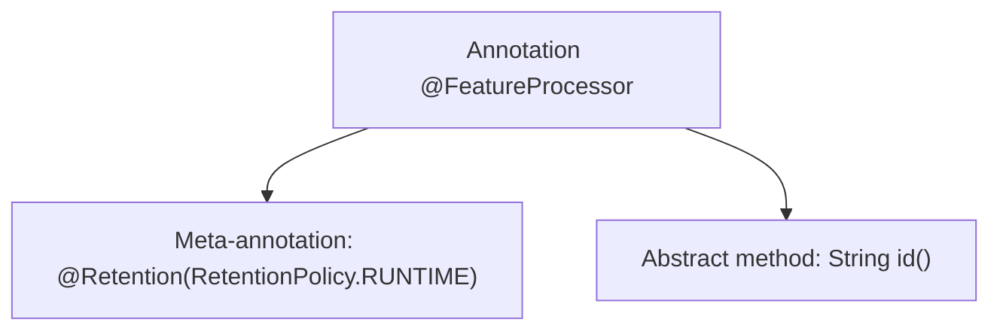

# Basic Information

|      |      |
|------|------|
| Name | FeatureProcessor |
| Language | .java |
| Code Path | WeFe/serving/serving-service/src/main/java/com/welab/wefe/serving/service/feature/code/FeatureProcessor.java |
| Package Name | com.welab.wefe.serving.service.feature.code |
| Dependencies | ['java.lang.annotation.Retention', 'java.lang.annotation.RetentionPolicy'] |
| Brief Description | Define the runtime-retained annotation FeatureProcessor, which includes an id attribute. |

# Description

The content defines a Java annotation named FeatureProcessor, specified with @Retention(RetentionPolicy.RUNTIME) to indicate that the annotation is retained at runtime. The annotation includes a mandatory string-type attribute named id. This annotation can be used to process specific functionalities at runtime through reflection mechanisms.

# Class Summary

| Name   | Type  | Description |
|-------|------|-------------|
| FeatureProcessor | annotation | The annotation FeatureProcessor retained at runtime must specify the id attribute. |

## Class FeatureProcessor

|      |      |
|------|------|
| Access Modifier | @Retention(RetentionPolicy.RUNTIME);public |
| Type | annotation |
| Name | FeatureProcessor |
| Description | The annotation FeatureProcessor retained at runtime must specify the id attribute. |

### UML Class Diagram

This class diagram describes an annotation interface named FeatureProcessor, marked with <<Interface>> to denote its annotation characteristic. The annotation contains a public abstract method id() that returns a String value. Since annotations are essentially specialized interfaces, the interface notation is used here, adhering to the runtime retention policy (via the @Retention annotation). This design is commonly employed to identify processors with specific functionalities, using the id attribute for unique identification, and is suitable for scenarios requiring dynamic recognition or configuration handling.

### Internal Method Call Graph

This flowchart illustrates the structure of the `@FeatureProcessor` annotation, which consists of two core components: the `@Retention` meta-annotation specifying runtime retention, and a mandatory `id()` abstract method for identifying feature processors. This design is commonly used for framework-level extension point marking, enabling dynamic functionality loading through runtime reflection of annotation information.

### Field List

| Name  | Type  | Description |
|-------|-------|------|
| id | String | The method id() returns a string-type identifier. |

### Method List

| Name  | Type  | Description |
|-------|-------|------|

