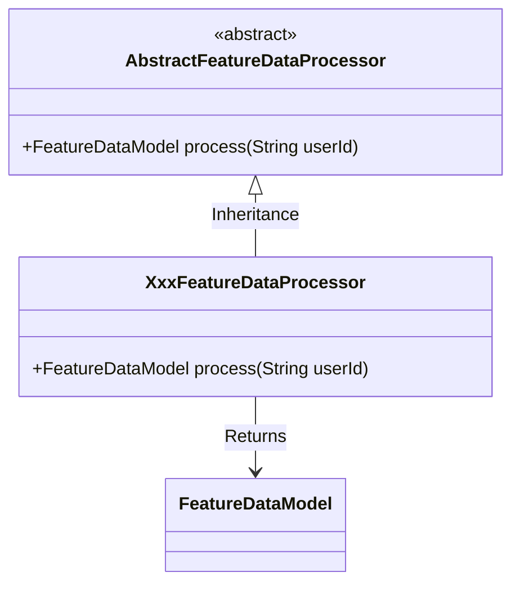
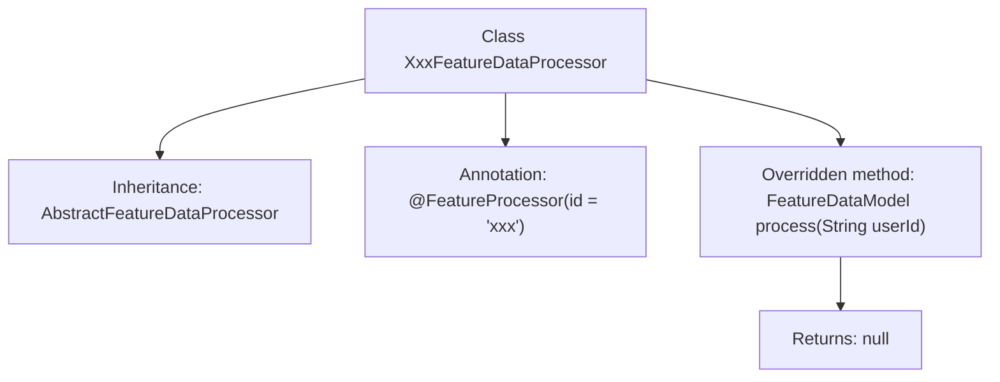

# Basic Information

|      |      |
|------|------|
| Name | XxxFeatureDataProcessor |
| Language | .java |
| Code Path | WeFe/serving/serving-service/src/main/java/com/welab/wefe/serving/service/feature/code/XxxFeatureDataProcessor.java |
| Package Name | com.welab.wefe.serving.service.feature.code |
| Dependencies | ['com.welab.wefe.serving.sdk.model.FeatureDataModel', 'java.util.Map'] |
| Brief Description | This is a Java class named XxxFeatureDataProcessor, which extends AbstractFeatureDataProcessor and is used for processing feature data. It is identified by the @FeatureProcessor annotation and implements the process method, accepting a userId parameter and returning a FeatureDataModel object. Currently, the process method returns null. |

# Description

The content describes a Java class named XxxFeatureDataProcessor, which inherits from the AbstractFeatureDataProcessor abstract class and is identified by the @FeatureProcessor annotation with an ID of "xxx". The class overrides the process method, accepting a userId string parameter and returning a FeatureDataModel object, though the current implementation directly returns null. This indicates that the class is intended for processing specific feature data, but the concrete processing logic has not yet been implemented.

# Class Summary

| Name   | Type  | Description |
|-------|------|-------------|
| XxxFeatureDataProcessor | class | This is a Java class named XxxFeatureDataProcessor, which extends AbstractFeatureDataProcessor and is used for processing feature data. It includes a process method that takes a userId parameter and returns a FeatureDataModel object. |

## Class XxxFeatureDataProcessor

|      |      |
|------|------|
| Access Modifier | @FeatureProcessor(id = "xxx");public |
| Type | class |
| Name | XxxFeatureDataProcessor |
| Description | This is a Java class named XxxFeatureDataProcessor, which extends AbstractFeatureDataProcessor and is used for processing feature data. It includes a process method that takes a userId parameter and returns a FeatureDataModel object. |

### UML Class Diagram

This class diagram illustrates an inheritance structure of feature data processors. The abstract base class `AbstractFeatureDataProcessor` defines the interface for processing feature data, while the concrete implementation class `XxxFeatureDataProcessor` inherits and implements the `process` method, which takes a user ID and returns a result of type `FeatureDataModel`. The annotation `@FeatureProcessor` indicates that this is an implementation class of a feature processor with a specific ID. The overall design follows the Template Method pattern, facilitating the extension of different feature processing logic.

### Internal Method Call Graph

This flowchart illustrates the structure of the XxxFeatureDataProcessor class, which is a processor class with specific annotations inheriting from the AbstractFeatureDataProcessor base class. It primarily describes the class inheritance relationship, annotation declaration, and the implementation of the overridden process method. The processor takes a userId parameter but directly returns null, indicating this is either a template class to be implemented or a placeholder implementation. The diagram clearly presents the hierarchical relationship from class definition to method implementation, highlighting the typical structural characteristics of framework extension points.

### Field List

| Name  | Type  | Description |
|-------|-------|------|

### Method List

| Name  | Type  | Description |
|-------|-------|------|
| process | FeatureDataModel | User ID processing function, returns empty data model. |

