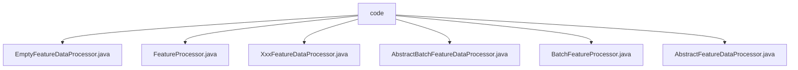

# Basic Information

|      |      |
|------|------|
| Name | code |
| Language | .java |
| Code Path | WeFe/serving/serving-service/src/main/java/com/welab/wefe/serving/service/feature/code |
| Package Name | docs.serving.serving-service.src.main.java.com.welab.wefe.serving.service.feature.code |
| Brief Description | EmptyFeatureDataProcessor returns empty feature data. FeatureProcessor is a runtime annotation containing a mandatory id. XxxFeatureDataProcessor inherits from the abstract class but returns null. AbstractBatchFeatureDataProcessor processes batch feature data and requires subclass implementation. BatchFeatureProcessor is a batch processing runtime annotation containing an id. AbstractFeatureDataProcessor defines a feature processing framework that requires subclass implementation. |

# Description

## Overview  
The core responsibility of this module is to provide a framework-style implementation for feature data processing, including both single-item and batch processing modes. It defines the basic workflow through abstract classes and marks implementation classes with annotations. The interface specification uniformly adopts abstract classes to define the `process` method: single-item processing accepts a `userId` and returns a `FeatureDataModel`, while batch processing accepts a list of user IDs and returns a nested mapping structure. Key data structures include `FeatureDataModel` (single-item result) and `Map<String, Map<String, Object>>` (batch result). The only external dependency is the Java reflection mechanism (via RUNTIME-retained annotations). For example, `EmptyFeatureDataProcessor` implements empty processing, while `XxxFeatureDataProcessor` reserves extension points for specific feature processing.  

## Main Business Scenarios  
The module adopts a design similar to the strategy pattern, where abstract classes define the algorithmic skeleton, and specific processors are registered with IDs via annotations for runtime identification. Typical applications include fallback processing for empty data (`EmptyFeatureDataProcessor`) and batch feature extraction (`AbstractBatchFeatureDataProcessor`). API types are divided into single-item processing (marked with `@FeatureProcessor`) and batch processing (marked with `@BatchFeatureProcessor`). For instance, `XxxFeatureDataProcessor` demonstrates the annotation binding method for single-item processors. Functional completeness is reflected in supporting progressive expansion from empty implementations to specific business logic.

### Package Internal Structure View

This flowchart illustrates the file structure relationships within the feature/code directory of the WeFe project. All Java files are directly located under the code directory, including six processor class files: EmptyFeatureDataProcessor, FeatureProcessor, XxxFeatureDataProcessor, etc. These files exist as peers without further subdirectory hierarchies, reflecting the code organization approach for feature data processing in this module.

# File List

| Name   | Type  | Description |
|-------|------|-------------|
| [EmptyFeatureDataProcessor.java](EmptyFeatureDataProcessor.md) | file | EmptyFeatureDataProcessor extends AbstractFeatureDataProcessor, overrides the process method, and returns an empty FeatureDataModel. |
| [FeatureProcessor.java](FeatureProcessor.md) | file | Define the runtime-retained annotation FeatureProcessor, which includes an id attribute. |
| [XxxFeatureDataProcessor.java](XxxFeatureDataProcessor.md) | file | This is a Java class named XxxFeatureDataProcessor, which extends AbstractFeatureDataProcessor and is used for processing feature data. It is identified by the @FeatureProcessor annotation and implements the process method, which takes a userId parameter and returns a FeatureDataModel object. Currently, the process method returns null. |
| [AbstractBatchFeatureDataProcessor.java](AbstractBatchFeatureDataProcessor.md) | file | The abstract class AbstractBatchFeatureDataProcessor defines an abstract method process, which is used to process a list of user IDs and return a feature data map. |
| [BatchFeatureProcessor.java](BatchFeatureProcessor.md) | file | The Java annotation `@BatchFeatureProcessor` is retained at runtime and requires a unique identifier `id` to be specified. |
| [AbstractFeatureDataProcessor.java](AbstractFeatureDataProcessor.md) | file | The abstract class AbstractFeatureDataProcessor defines an abstract method process, which takes a userId parameter and returns a FeatureDataModel object. |

