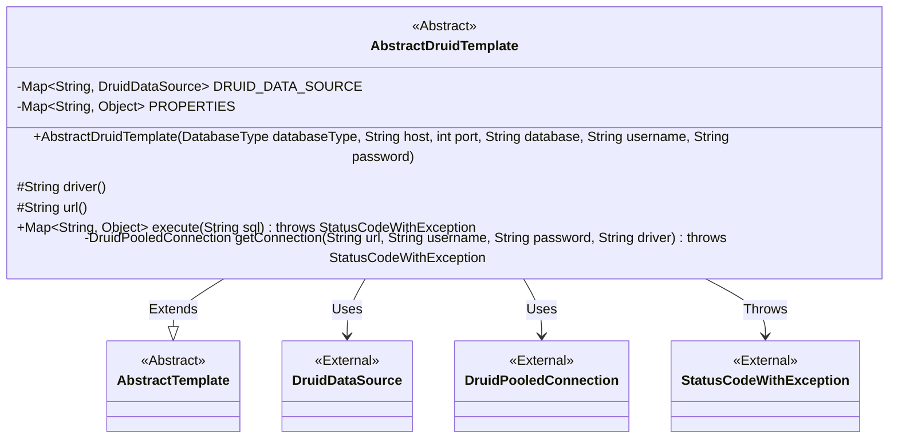
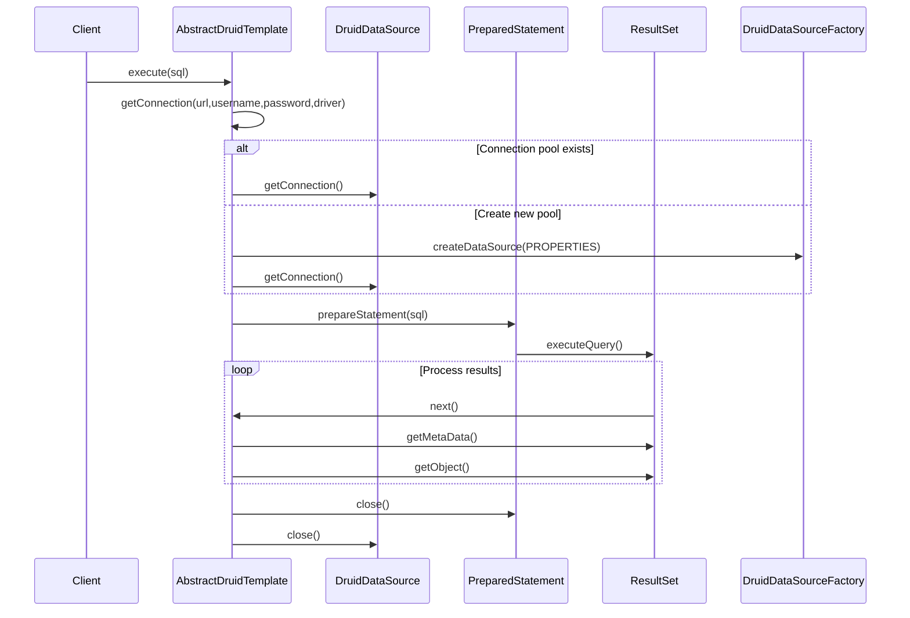

# Basic Information

|      |      |
|------|------|
| Name | AbstractDruidTemplate |
| Language | .java |
| Code Path | WeFe/serving/serving-service/src/main/java/com/welab/wefe/serving/service/feature/sql/AbstractDruidTemplate.java |
| Package Name | com.welab.wefe.serving.service.feature.sql |
| Dependencies | ['com.alibaba.druid.pool.DruidDataSource', 'com.alibaba.druid.pool.DruidDataSourceFactory', 'com.alibaba.druid.pool.DruidPooledConnection', 'com.welab.wefe.common.StatusCode', 'com.welab.wefe.common.exception.StatusCodeWithException', 'com.welab.wefe.common.jdbc.base.DatabaseType', 'java.sql.PreparedStatement', 'java.sql.ResultSet', 'java.sql.SQLException', 'java.util.HashMap', 'java.util.Map'] |
| Brief Description | The abstract class AbstractDruidTemplate extends AbstractTemplate, managing the Druid connection pool with default configurations such as connection timeout. It provides methods for executing SQL queries, returning result sets mapped as Maps. The getConnection method ensures thread safety by acquiring or creating a connection pool. Exception handling is robust. |

# Description

AbstractDruidTemplate is an abstract class that inherits from AbstractTemplate and is used to manage Druid database connection pools. It contains two static Maps: DRUID_DATA_SOURCE stores data sources, while PROPERTIES stores connection pool configuration parameters such as timeout duration and maximum connections. The constructor accepts database connection parameters. Abstract methods driver and url require implementation by subclasses. The execute method executes SQL queries, maps the result set to a Map, handles exceptions, and ensures resource release. The getConnection method synchronously creates and manages connection pools to ensure thread safety, handles connection failures, and throws exceptions.

# Class Summary

| Name   | Type  | Description |
|-------|------|-------------|
| AbstractDruidTemplate | class | The abstract class `AbstractDruidTemplate` extends `AbstractTemplate`, manages the Druid connection pool, provides database query functionality, includes configurations such as connection timeout, and executes SQL through the `execute` method to return result sets. |


## Class AbstractDruidTemplate

|      |      |
|------|------|
| Access Modifier | public abstract |
| Type | class |
| Name | AbstractDruidTemplate |
| Description | The abstract class `AbstractDruidTemplate` extends `AbstractTemplate`, manages the Druid connection pool, provides database query functionality, includes configurations such as connection timeout, and executes SQL through the `execute` method to return result sets. |


### UML Class Diagram



This code demonstrates an abstract class `AbstractDruidTemplate` that inherits from `AbstractTemplate`, primarily used for managing Druid database connection pools and executing SQL queries. The class includes static properties `DRUID_DATA_SOURCE` and `PROPERTIES` for storing connection pool and configuration information, and provides methods for obtaining connections and executing queries. The `getConnection` method implements lazy loading and thread-safe management of the connection pool, while the `execute` method handles SQL queries and returns result sets. The overall design reflects the core functionality of connection pool management and database operations.


### Internal Method Call Graph

```mermaid
graph TD
    A["Abstract Class AbstractDruidTemplate"]
    B["Static Map: DRUID_DATA_SOURCE<String,DruidDataSource>"]
    C["Static Map: PROPERTIES<String,Object>"]
    D["Static Block: Initialize connection pool parameters"]
    E["Constructor: AbstractDruidTemplate(DatabaseType, String, int, String, String, String)"]
    F["Abstract Method: String driver()"]
    G["Abstract Method: String url()"]
    H["Overridden Method: execute(String sql)"]
    I["Private Method: getConnection(String, String, String, String)"]
    J["Step: Obtain connection pool"]
    K["Step: Execute SQL query"]
    L["Step: Process result set"]
    M["Step: Close connection"]

    A -->|Extends| AbstractTemplate
    A --> B
    A --> C
    A --> D
    A --> E
    A --> F
    A --> G
    A --> H
    A --> I
    H --> J --> I
    H --> K -->|"PreparedStatement.executeQuery()"| L
    H --> M -->|"connection.close()"| end
    I -->|"DruidDataSourceFactory.createDataSource()"| J
    I -->|"druidDataSource.getConnection()"| J
```



This code implements an abstract database template class based on the Druid connection pool, with main functionalities including: 1) Initializing default connection pool parameters through static blocks; 2) Providing private methods to obtain database connections, supporting connection pool reuse; 3) Implementing SQL execution and result set processing logic. The flowchart illustrates the class structure and key method call relationships, while the sequence diagram details the interaction process during SQL query execution, including key steps such as connection acquisition, query execution, and resource release. The code ensures thread safety through a double-checked locking mechanism and standardizes the handling of various exception scenarios.

### Field List

| Name  | Type  | Description |
|-------|-------|------|
| DRUID_DATA_SOURCE = new HashMap<>() | Map<String, DruidDataSource> | Defined a static immutable HashMap with keys of type String and values of type DruidDataSource, used for storing data sources. |
| PROPERTIES = new HashMap<>() | Map<String, Object> | Define a static immutable hash map PROPERTIES with string keys and object values. |

### Method List

| Name  | Type  | Description |
|-------|-------|------|
| driver | String | Abstract method declaration, returns a string type, requires subclasses to implement specific driver logic. |
| execute | Map<String, Object> | This method executes an SQL query and returns the first row of the result set as a Map, with column names as keys and corresponding data as values. It utilizes the Druid connection pool, handles exceptions, and ensures resource closure. Returns null if the query yields no results. |
| getConnection | DruidPooledConnection | Methods to obtain a database connection: Check the existing connection pool; if none exists, create a new connection and cache it. Close the connection and throw an error in case of exceptions. |
| url | String | Abstract methods define URL strings, requiring subclasses to implement specific logic. |


