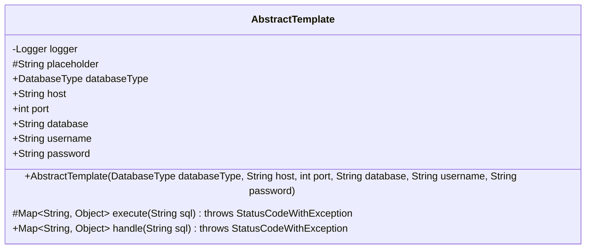
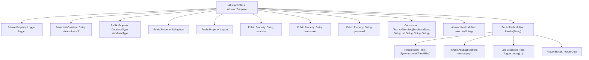

# Basic Information

|      |      |
|------|------|
| Name | AbstractTemplate |
| Language | .java |
| Code Path | WeFe/serving/serving-service/src/main/java/com/welab/wefe/serving/service/feature/sql/AbstractTemplate.java |
| Package Name | com.welab.wefe.serving.service.feature.sql |
| Dependencies | ['com.welab.wefe.common.exception.StatusCodeWithException', 'com.welab.wefe.common.jdbc.base.DatabaseType', 'org.slf4j.Logger', 'org.slf4j.LoggerFactory', 'java.util.Map'] |
| Brief Description | The abstract class AbstractTemplate defines a database template, containing connection information such as type, host, and port, and provides abstract methods for executing SQL along with logging-enabled processing methods. |

# Description

This is an abstract class named AbstractTemplate, primarily used as a database operation template. The class includes a Logger for logging and a constant placeholder. It defines fields related to database connections: the databaseType enum represents the database type, host denotes the host address, port indicates the port number, database specifies the database name, and username and password represent login credentials. These fields are initialized via the constructor.  

Two key methods are provided: execute is an abstract method requiring subclass implementation, designed to execute SQL and return a feature data map; the handle method encapsulates the execution flow, records time consumption, and invokes the execute method. The entire class is designed as a template base class for database operations, enforcing subclasses to implement specific execution logic.

# Class Summary

| Name   | Type  | Description |
|-------|------|-------------|
| AbstractTemplate | class | The abstract class AbstractTemplate defines a database template base class, which includes connection parameters and logging. It provides the abstract method execute for executing SQL and the handle method with timing functionality. |

## Class AbstractTemplate

|      |      |
|------|------|
| Access Modifier | public abstract |
| Type | class |
| Name | AbstractTemplate |
| Description | The abstract class AbstractTemplate defines a database template base class, which includes connection parameters and logging. It provides the abstract method execute for executing SQL and the handle method with timing functionality. |

### UML Class Diagram

This code defines an abstract class named `AbstractTemplate`, primarily serving as a database operation template. The class contains database connection-related fields (such as host, port, username, etc.) and a protected placeholder constant. Its core functionality involves executing SQL statements through the abstract `execute` method, with the `handle` method uniformly managing the execution process, including recording execution time. This class adopts the Template Method design pattern, requiring subclasses to implement specific SQL execution logic while providing unified execution flow control. Logger is used for recording debug information, and StatusCodeWithException represents the potential exception type that may be thrown.

### Internal Method Call Graph

This code defines an abstract template class AbstractTemplate, primarily used for database operations. It contains database connection-related properties and a template method handle for executing SQL. The template method records SQL execution time and implements specific database operations through the abstract method execute, which subclasses must implement. The class includes connection information such as database type, host, port, etc., along with logging and timing functionality, providing a common framework for SQL execution processes.

### Field List

| Name  | Type  | Description |
|-------|-------|------|
| password | String | Public string type password variable. |
| placeholder = "?" | String | Protective string constant with the value "?". |
| port | int | Declare a public integer variable port. |
| logger = LoggerFactory.getLogger(getClass()) | Logger | Define a private logger, initialized with the name of the current class. |
| username | String | Declare a public string variable username. |
| databaseType | DatabaseType | Declare a public variable databaseType of type DatabaseType. |
| host | String | Declare a public string variable host. |
| database | String | Declare a public string variable named database. |

### Method List

| Name  | Type  | Description |
|-------|-------|------|
| execute | Map<String, Object> | The abstract method `execute` accepts an SQL string and returns a `Map<String, Object>`, potentially throwing a `StatusCodeWithException`. |
| handle | Map<String, Object> | Method processes SQL queries, records execution time, and returns result data. |

