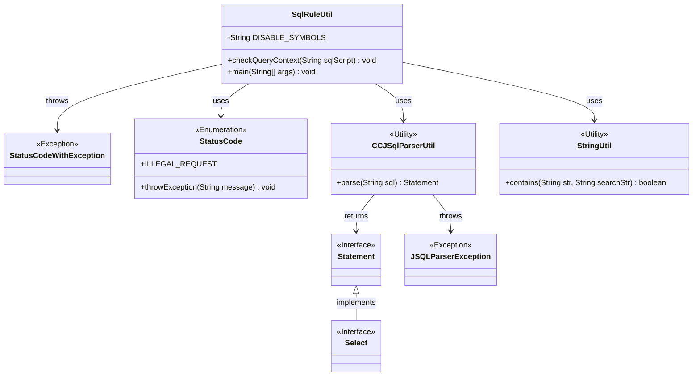
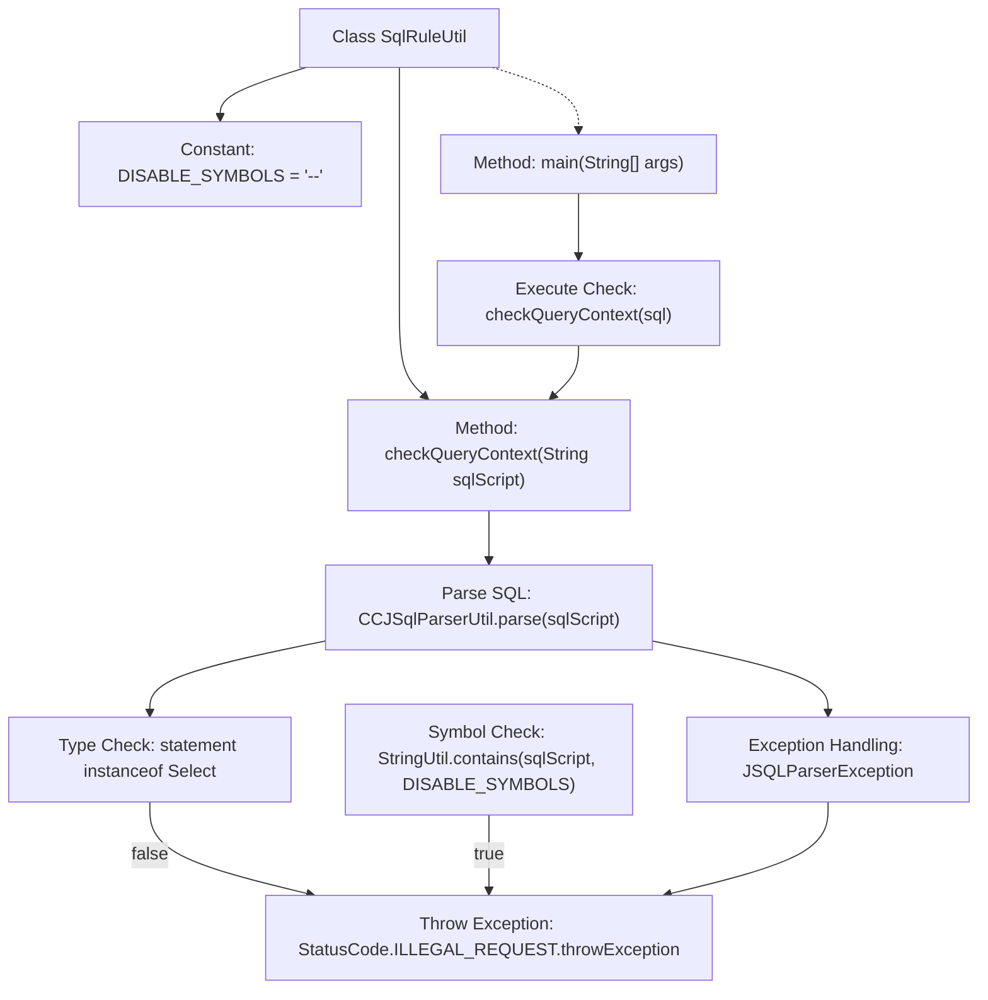

# Basic Information

|      |      |
|------|------|
| Name | SqlRuleUtil |
| Language | .java |
| Code Path | WeFe/serving/serving-service/src/main/java/com/welab/wefe/serving/service/feature/sql/SqlRuleUtil.java |
| Package Name | com.welab.wefe.serving.service.feature.sql |
| Dependencies | ['com.welab.wefe.common.StatusCode', 'com.welab.wefe.common.exception.StatusCodeWithException', 'com.welab.wefe.common.util.StringUtil', 'net.sf.jsqlparser.JSQLParserException', 'net.sf.jsqlparser.parser.CCJSqlParserUtil', 'net.sf.jsqlparser.statement.Statement', 'net.sf.jsqlparser.statement.select.Select'] |
| Brief Description | The SqlRuleUtil class checks whether an SQL script is a valid query, prohibiting comment symbols "--" and non-Select statements, otherwise throwing an exception. |

# Description

SqlRuleUtil is a utility class designed for inspecting SQL query scripts, which includes the static method checkQueryContext. This method first parses the incoming SQL script using CCJSqlParserUtil to verify if it is a SELECT statement. If the script contains prohibited symbols "--" or parsing fails, it throws a StatusCode.ILLEGAL_REQUEST exception. The example main method demonstrates the exception-throwing scenario when checking an SQL script containing comment symbols.

# Class Summary

| Name   | Type  | Description |
|-------|------|-------------|
| SqlRuleUtil | class | The SqlRuleUtil class checks whether an SQL script is a valid query, prohibiting non-Select statements and comment symbols "--", otherwise throwing an exception. |


## Class SqlRuleUtil

|      |      |
|------|------|
| Access Modifier | public |
| Type | class |
| Name | SqlRuleUtil |
| Description | The SqlRuleUtil class checks whether an SQL script is a valid query, prohibiting non-Select statements and comment symbols "--", otherwise throwing an exception. |


### UML Class Diagram



Class diagram description: This diagram illustrates the structure of the SqlRuleUtil utility class and its dependencies. SqlRuleUtil parses SQL statements via CCJSqlParserUtil, utilizes StringUtil for string validation, and may throw StatusCodeWithException exceptions. The StatusCode enumeration provides error handling, while Statement and Select interfaces represent SQL statement types. JSQLParserException handles parsing errors. The overall implementation delivers SQL script security validation functionality.


### Internal Method Call Graph



Flowchart Description: This flowchart illustrates the core logic of the SqlRuleUtil class, primarily focusing on SQL query validation. The process starts from the main method, which invokes the checkQueryContext method and then branches into two paths: 1) Parsing the SQL statement via CCJSqlParserUtil, throwing an exception if the type is not Select; 2) Checking for the presence of the forbidden symbol "--". Both exceptional cases trigger a StatusCode.ILLEGAL_REQUEST exception, ensuring only valid SELECT statements pass the validation.

### Field List

| Name  | Type  | Description |
|-------|-------|------|
| DISABLE_SYMBOLS = "--" | String | Define a constant string DISABLE_SYMBOLS with the value "--". |

### Method List

| Name  | Type  | Description |
|-------|-------|------|
| checkQueryContext | void | Check the validity of the SQL query script, allowing only SELECT statements without prohibited symbols; otherwise, throw an exception. |
| main | void | As a professional translation assistant, please accurately translate the following content into the target language.  Please strictly adhere to the following guidelines:  1. Maintain consistency with the original text in terms of semantics, context, and style.  2. Preserve the complete hierarchical structure and numbering system of the original text.  3. Strictly retain all formatting elements of the original text, such as code block identifiers (```text/```, ```mermaid/```), etc.  4. Translate only the natural language content, without making format adjustments, content additions, or explanatory processing.  5. Output only the translation result of the original text, without any additional prompt information.  Content to be translated:  The Java main method executes SQL query checks, including SELECT statements and commented table deletion operations, and calls the checkQueryContext method to validate the SQL context.  Target language code: en |


