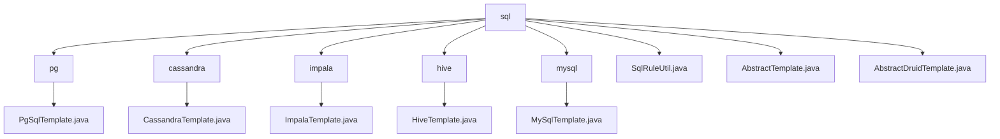

# Basic Information

|      |      |
|------|------|
| Name | sql |
| Language | .java |
| Code Path | WeFe/serving/serving-service/src/main/java/com/welab/wefe/serving/service/feature/sql |
| Package Name | docs.serving.serving-service.src.main.java.com.welab.wefe.serving.service.feature.sql |
| Brief Description | PgSqlTemplate is used for PostgreSQL connections, overriding the driver and url methods. ImpalaTemplate connects to Impala using the Hive driver and Hive2 protocol. HiveTemplate connects to Hive, overriding the driver and url. MySqlTemplate is specifically designed for MySQL, overriding the driver and url. SqlRuleUtil checks the validity of SQL scripts. AbstractTemplate serves as the base class for database operations. AbstractDruidTemplate manages the Druid connection pool, requiring subclasses to implement the driver and url. |

# Description

## Overview  
This module provides a unified framework for database connections and SQL operations, with its core responsibility being the encapsulation of JDBC connections and query execution for various databases (PostgreSQL/Impala/Hive/MySQL) through template classes. The interface specification follows the Template Method pattern, where the parent class defines the execution flow (e.g., connection pool management, exception handling), and subclasses implement differentiated logic such as driver loading and URL generation. Key data structures include the connection pool configuration Map (DRUID_DATA_SOURCE) and feature data result Map. External dependencies include the Druid connection pool, various database drivers (e.g., PostgreSQL JDBC), and the SQL parser CCJSqlParser. For example, PgSqlTemplate generates URLs in the format `jdbc:postgres://`, while SqlRuleUtil validates SQL legality through the parser.

## Primary Business Scenarios  
The module supports cross-database feature data queries, with a typical workflow as follows: establishing a connection pool through a specific template class (e.g., HiveTemplate), executing SQL, and mapping the results. The interaction pattern resembles the Factory Method, where AbstractDruidTemplate uniformly manages the connection pool, and subclasses handle protocol differences (e.g., Impala uses the Hive2 protocol). Functional completeness is reflected in SQL security validation (disabling comment symbols), connection pool reuse, and unified exception handling. Typical applications include multi-source data aggregation analysis, such as MySqlTemplate returning Map-structured data after executing a query. API types encompass connection management (getConnection), query execution (execute), and rule validation (checkQueryContext).

### Package Internal Structure View

This flowchart illustrates the file structure of the SQL feature service in the WeFe project. The root node "sql" contains 6 subdirectories (pg/cassandra/impala/hive/mysql) and 3 utility class files. Each subdirectory includes corresponding database template implementation classes, such as PgSqlTemplate.java, CassandraTemplate.java, etc., reflecting the multi-database support design architecture.

# File List

| Name   | Type  | Description |
|-------|------|-------------|
| [SqlRuleUtil.java](SqlRuleUtil.md) | file | The SqlRuleUtil class checks whether the SQL script is a valid query, prohibiting comment symbols "--" and non-Select statements, otherwise it throws an exception. |
| [AbstractTemplate.java](AbstractTemplate.md) | file | The abstract class AbstractTemplate defines a database template, containing connection information such as type, host, and port. It provides abstract methods for executing SQL and handler methods with logging. |
| [AbstractDruidTemplate.java](AbstractDruidTemplate.md) | file | The abstract class `AbstractDruidTemplate` extends `AbstractTemplate` and manages the Druid connection pool, including default configurations such as connection timeout. It provides methods for executing SQL queries, returning result sets mapped to `Map`. The `getConnection` method is used to obtain or create a connection pool, ensuring thread safety. Exception handling is robust. |
| [mysql](mysql/_module.md) | package | MySqlTemplate extends AbstractDruidTemplate, passing database connection parameters through the constructor, and overrides the driver and url methods to return MySQL driver and connection URL. |
| [hive](hive/_module.md) | package | HiveTemplate extends AbstractDruidTemplate, passing database connection parameters through the constructor, and overrides the driver and url methods to return the Hive driver and connection URL. |
| [impala](impala/_module.md) | package | ImpalaTemplate inherits from AbstractDruidTemplate, initializes database connection parameters through the constructor, and overrides the driver and url methods to return the Hive driver and connection URL. |
| [cassandra](cassandra/_module.md) | package | The input is empty, unable to generate a summary description. |
| [pg](pg/_module.md) | package | The PgSqlTemplate class inherits from AbstractDruidTemplate and is used for PostgreSQL database connections, including methods for driver and URL configuration. |

