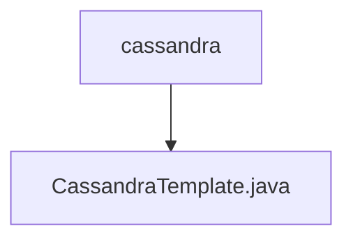

# Basic Information

|      |      |
|------|------|
| Name | cassandra |
| Language | .java |
| Code Path | WeFe/serving/serving-service/src/main/java/com/welab/wefe/serving/service/feature/sql/cassandra |
| Package Name | docs.serving.serving-service.src.main.java.com.welab.wefe.serving.service.feature.sql.cassandra |
| Brief Description | The input is empty, unable to generate a summary description. |

# Description

The input content is empty and cannot generate a summary description. Please provide the specific content that needs to be summarized.

### Package Internal Structure View

This flowchart illustrates the hierarchical structure of Cassandra-related code in the serving-service module of the WeFe project. The root node is the cassandra directory, which contains an implementation file named CassandraTemplate.java for handling Cassandra database operations. This concise tree structure exemplifies a typical code organization for a single-feature module, where the template file is placed directly under the feature directory.

# File List

| Name   | Type  | Description |
|-------|------|-------------|
| [CassandraTemplate.java](CassandraTemplate.md) | file | The input is empty, unable to generate a summary description. |

