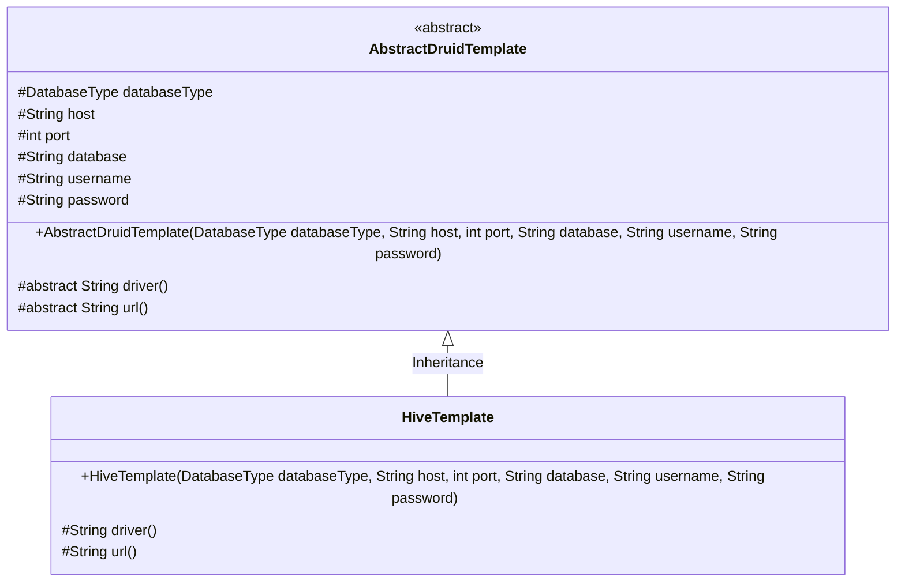
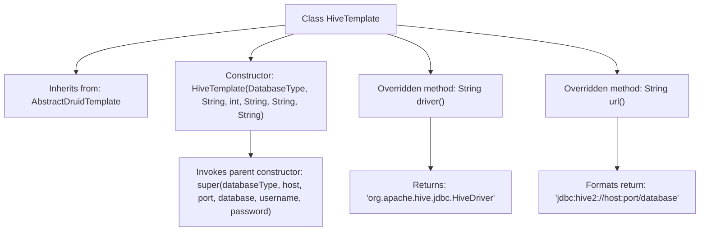

# Basic Information

|      |      |
|------|------|
| Name | HiveTemplate |
| Language | .java |
| Code Path | WeFe/serving/serving-service/src/main/java/com/welab/wefe/serving/service/feature/sql/hive/HiveTemplate.java |
| Package Name | com.welab.wefe.serving.service.feature.sql.hive |
| Dependencies | ['com.welab.wefe.common.jdbc.base.DatabaseType', 'com.welab.wefe.serving.service.feature.sql.AbstractDruidTemplate'] |
| Brief Description | HiveTemplate extends AbstractDruidTemplate, passing database connection parameters through the constructor, and overrides the driver and url methods to return the Hive driver and connection URL. |

# Description

The HiveTemplate class inherits from AbstractDruidTemplate and is used to connect to Hive databases. The constructor accepts parameters including database type, host address, port number, database name, username, and password. This class overrides the driver method to return the JDBC driver class name for Hive, and overrides the url method to generate a JDBC connection string using the Hive2 protocol, which includes host, port, and database information.

# Class Summary

| Name   | Type  | Description |
|-------|------|-------------|
| HiveTemplate | class | HiveTemplate extends AbstractDruidTemplate, passing database connection parameters through the constructor, and overrides the driver and url methods to return the Hive driver and connection URL. |

## Class HiveTemplate

|      |      |
|------|------|
| Access Modifier | public |
| Type | class |
| Name | HiveTemplate |
| Description | HiveTemplate extends AbstractDruidTemplate, passing database connection parameters through the constructor, and overrides the driver and url methods to return the Hive driver and connection URL. |

### UML Class Diagram

This class diagram illustrates the hierarchical relationship where HiveTemplate inherits from the abstract class AbstractDruidTemplate. The AbstractDruidTemplate defines fundamental database connection attributes and abstract methods (driver and url), while HiveTemplate provides concrete implementations of these methods to support Hive database connections. Specifically, driver() returns the JDBC driver class for Hive, and url() generates the connection string following the Hive2 protocol format. The overall design exemplifies the Template Method pattern, where the parent class controls the workflow and child classes implement specific details.

### Internal Method Call Graph

This code demonstrates a HiveTemplate class that inherits from AbstractDruidTemplate, primarily used for configuring Hive database connections. The class includes a constructor for initializing connection parameters and overrides the driver() and url() methods to return the Hive driver class name and formatted JDBC connection string respectively. The flowchart clearly presents the class inheritance relationship, method overriding logic, and key string generation process.

### Field List

| Name  | Type  | Description |
|-------|-------|------|

### Method List

| Name  | Type  | Description |
|-------|-------|------|
| driver | String | Rewrite the driver method to return the Hive JDBC driver class name. |
| url | String | Generate a Hive database connection URL in the format jdbc:hive2://host:port/database_name. |

