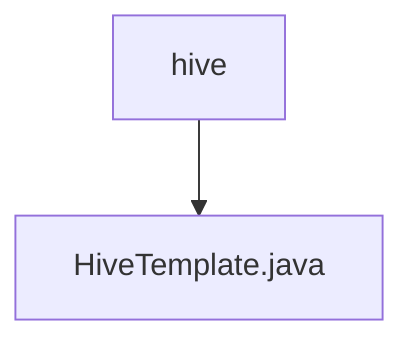

# Basic Information

|      |      |
|------|------|
| Name | hive |
| Language | .java |
| Code Path | WeFe/serving/serving-service/src/main/java/com/welab/wefe/serving/service/feature/sql/hive |
| Package Name | docs.serving.serving-service.src.main.java.com.welab.wefe.serving.service.feature.sql.hive |
| Brief Description | HiveTemplate extends AbstractDruidTemplate, passing database connection parameters through the constructor, and overrides the driver and url methods to return the Hive driver and connection URL. |

# Description

The HiveTemplate class inherits from AbstractDruidTemplate and is used to connect to Hive databases. The constructor accepts parameters including database type, host address, port number, database name, username, and password. This class overrides the driver method to return the JDBC driver class name for Hive, and overrides the url method to generate a JDBC connection string using the Hive2 protocol, which includes host, port, and database information.

### Package Internal Structure View

This flowchart illustrates the hierarchical relationship between the Hive directory and its contained Java file. The root node is the hive folder, which directly includes a HiveTemplate.java file. The structure is simple and clear, reflecting the storage location of the Hive template file within the project, in accordance with the given two path information.

# File List

| Name   | Type  | Description |
|-------|------|-------------|
| [HiveTemplate.java](HiveTemplate.md) | file | HiveTemplate extends AbstractDruidTemplate, passing database connection parameters through the constructor, and overrides the driver and url methods to return the Hive driver and connection URL. |

