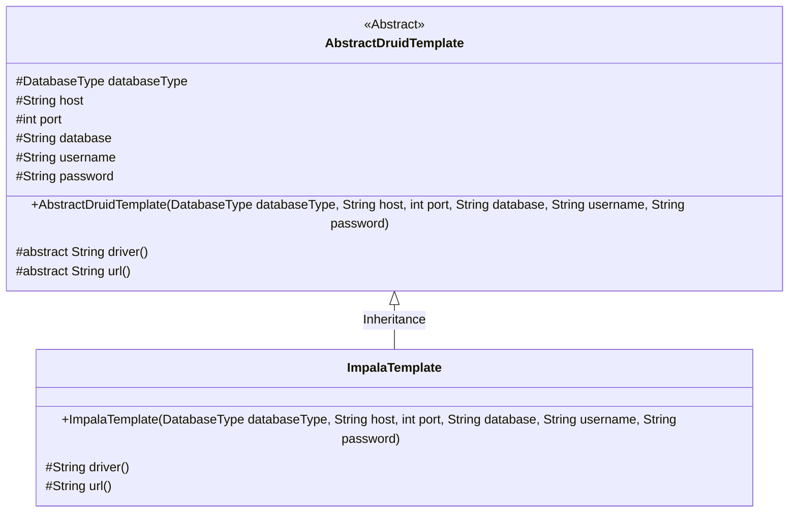
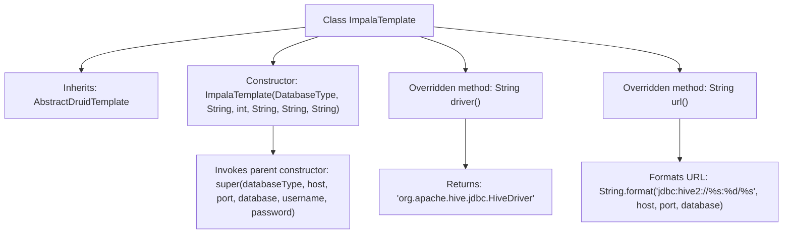

# Basic Information

|      |      |
|------|------|
| Name | ImpalaTemplate |
| Language | .java |
| Code Path | WeFe/serving/serving-service/src/main/java/com/welab/wefe/serving/service/feature/sql/impala/ImpalaTemplate.java |
| Package Name | com.welab.wefe.serving.service.feature.sql.impala |
| Dependencies | ['com.welab.wefe.common.jdbc.base.DatabaseType', 'com.welab.wefe.serving.service.feature.sql.AbstractDruidTemplate'] |
| Brief Description | ImpalaTemplate inherits from AbstractDruidTemplate, initializes database connection parameters through the constructor, and overrides the driver and url methods to return the Hive driver and connection URL. |

# Description

The `ImpalaTemplate` class inherits from `AbstractDruidTemplate` and is used to connect to Impala databases. Its constructor accepts parameters such as database type, host address, port number, database name, username, and password. This class overrides the `driver` method to return the Hive driver class path and overrides the `url` method to generate a JDBC connection string using the Hive2 protocol, formatted as `jdbc:hive2://host:port/database_name`.

# Class Summary

| Name   | Type  | Description |
|-------|------|-------------|
| ImpalaTemplate | class | ImpalaTemplate inherits from AbstractDruidTemplate, initializes database connection parameters through the constructor, and overrides the driver and url methods to return the Hive driver and connection string. |

## Class ImpalaTemplate

|      |      |
|------|------|
| Access Modifier | public |
| Type | class |
| Name | ImpalaTemplate |
| Description | ImpalaTemplate inherits from AbstractDruidTemplate, initializes database connection parameters through the constructor, and overrides the driver and url methods to return the Hive driver and connection string. |

### UML Class Diagram

This class diagram illustrates the inheritance relationship where ImpalaTemplate extends the abstract class AbstractDruidTemplate. AbstractDruidTemplate defines basic database connection properties and abstract methods, while ImpalaTemplate implements concrete driver and URL generation logic for Impala. The abstract class contains protected database connection parameters, and the subclass provides Impala-specific JDBC configurations by overriding the driver() and url() methods.

### Internal Method Call Graph

This flowchart illustrates the structure of the ImpalaTemplate class, which inherits from the AbstractDruidTemplate class. It primarily includes one constructor and two overridden methods: driver() returns the Hive driver class name, while url() formats and generates the Hive JDBC connection string. The constructor initializes database connection parameters by invoking the parent class constructor via super. The entire design implements customized configuration for the Impala database connection template, specifically adapted for the Hive JDBC driver.

### Field List

| Name  | Type  | Description |
|-------|-------|------|

### Method List

| Name  | Type  | Description |
|-------|-------|------|
| url | String | This method generates a Hive JDBC connection URL in the format jdbc:hive2://host:port/database. |
| driver | String | Rewrite the driver method to return the Hive JDBC driver class name. |

