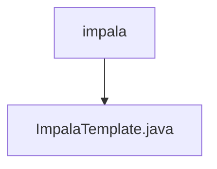

# Basic Information

|      |      |
|------|------|
| Name | impala |
| Language | .java |
| Code Path | WeFe/serving/serving-service/src/main/java/com/welab/wefe/serving/service/feature/sql/impala |
| Package Name | docs.serving.serving-service.src.main.java.com.welab.wefe.serving.service.feature.sql.impala |
| Brief Description | ImpalaTemplate inherits from AbstractDruidTemplate, initializes database connection parameters through the constructor, and overrides the driver and url methods to return the Hive driver and connection URL. |

# Description

The `ImpalaTemplate` class inherits from `AbstractDruidTemplate` and is used to connect to Impala databases. The constructor accepts parameters such as database type, host address, port number, database name, username, and password. This class overrides the `driver` method to return the Hive driver class path and overrides the `url` method to generate a JDBC connection string using the Hive2 protocol, formatted as `jdbc:hive2://host:port/database_name`.

### Package Internal Structure View

This flowchart illustrates the hierarchical relationship where the file ImpalaTemplate.java resides under the impala directory. The path structure is concise and clear, consisting of only two levels: the parent directory impala and its child file ImpalaTemplate.java. Such structure is commonly used for organizing implementation classes of specific functional modules, reflecting the principle of minimal code organization.

# File List

| Name   | Type  | Description |
|-------|------|-------------|
| [ImpalaTemplate.java](ImpalaTemplate.md) | file | ImpalaTemplate extends AbstractDruidTemplate, initializing database connection parameters through the constructor, and overrides the driver and url methods to return the Hive driver and connection URL. |

