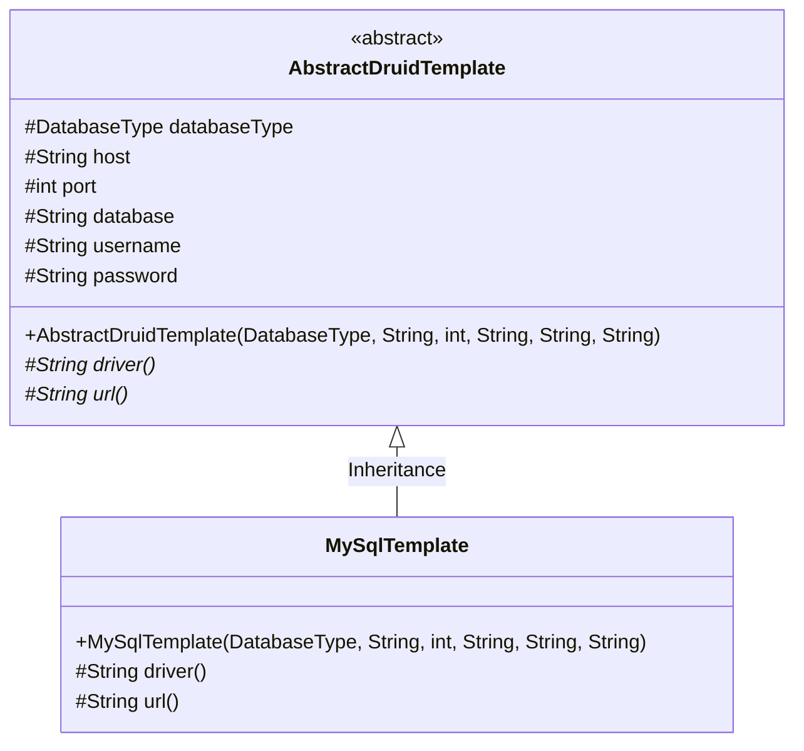
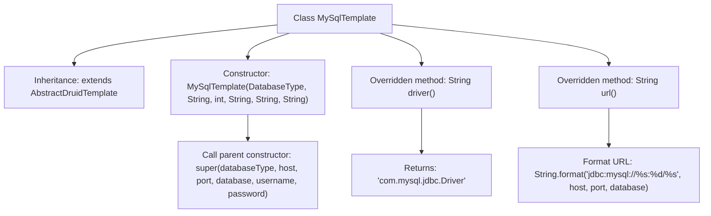

# Basic Information

|      |      |
|------|------|
| Name | MySqlTemplate |
| Language | .java |
| Code Path | WeFe/serving/serving-service/src/main/java/com/welab/wefe/serving/service/feature/sql/mysql/MySqlTemplate.java |
| Package Name | com.welab.wefe.serving.service.feature.sql.mysql |
| Dependencies | ['com.welab.wefe.common.jdbc.base.DatabaseType', 'com.welab.wefe.serving.service.feature.sql.AbstractDruidTemplate'] |
| Brief Description | MySqlTemplate extends AbstractDruidTemplate, passing database connection parameters through the constructor, and overrides the driver and url methods to return MySQL driver and connection URL. |

# Description

MySqlTemplate is a class that inherits from AbstractDruidTemplate, specifically designed for MySQL database connections. It receives parameters such as database type, host address, port number, database name, username, and password through its constructor and passes them to the parent class. This class overrides the driver method to return the JDBC driver class name for MySQL and overrides the url method to generate a JDBC connection string formatted for MySQL, including the host, port, and database name.

# Class Summary

| Name   | Type  | Description |
|-------|------|-------------|
| MySqlTemplate | class | MySqlTemplate extends AbstractDruidTemplate, passing database parameters through the constructor, and overrides the driver and url methods to return MySQL driver and connection URL. |

## Class MySqlTemplate

|      |      |
|------|------|
| Access Modifier | public |
| Type | class |
| Name | MySqlTemplate |
| Description | MySqlTemplate extends AbstractDruidTemplate, passing database parameters through the constructor, and overrides the driver and url methods to return MySQL driver and connection URL. |

### UML Class Diagram

Class Diagram Description: This diagram illustrates the implementation structure of a MySQL database connection template. The abstract base class `AbstractDruidTemplate` defines common properties required for database connections and abstract methods, including those for retrieving the driver and connection URL. The concrete subclass `MySqlTemplate` inherits from the base class and implements these two abstract methods, providing specific driver class names and URL formats tailored for MySQL databases. Through the inheritance relationship, `MySqlTemplate` reuses the connection parameters and foundational functionalities of the base class while implementing MySQL-specific details.

### Internal Method Call Graph

This flowchart illustrates the inheritance structure and key method implementations of the MySqlTemplate class. The class inherits from AbstractDruidTemplate, initializes database connection parameters through its constructor, and invokes the parent class constructor. The overridden driver() method returns the MySQL driver class name, while the url() method generates a standard MySQL connection address by formatting a string. All arrows clearly indicate the invocation relationships between class members and the data flow.

### Field List

| Name  | Type  | Description |
|-------|-------|------|

### Method List

| Name  | Type  | Description |
|-------|-------|------|
| driver | String | Rewrite the parent class method to return the JDBC driver class name for MySQL. |
| url | String | This method generates a MySQL database connection URL in the format jdbc:mysql://host:port/database_name. |

