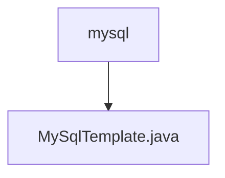

# Basic Information

|      |      |
|------|------|
| Name | mysql |
| Language | .java |
| Code Path | WeFe/serving/serving-service/src/main/java/com/welab/wefe/serving/service/feature/sql/mysql |
| Package Name | docs.serving.serving-service.src.main.java.com.welab.wefe.serving.service.feature.sql.mysql |
| Brief Description | MySqlTemplate extends AbstractDruidTemplate, passing database connection parameters through the constructor, and overrides the driver and url methods to return MySQL driver and connection URL. |

# Description

MySqlTemplate is a class that inherits from AbstractDruidTemplate, specifically designed for MySQL database connections. It receives parameters such as database type, host address, port number, database name, username, and password through its constructor and passes them to the parent class. This class overrides the driver method to return the JDBC driver class name for MySQL and overrides the url method to generate a JDBC connection string formatted for MySQL, including the host, port, and database name.

### Package Internal Structure View

This flowchart illustrates the hierarchical structure of MySQL-related code files. The top-level node is the mysql directory, which contains a specific Java implementation file, MySqlTemplate.java. This structure is commonly seen in code organization for database operations, where template classes are typically used to encapsulate the fundamental logic of database operations.

# File List

| Name   | Type  | Description |
|-------|------|-------------|
| [MySqlTemplate.java](MySqlTemplate.md) | file | MySqlTemplate extends AbstractDruidTemplate, passing database connection parameters through the constructor, and overrides the driver and url methods to return the MySQL driver and connection URL. |

