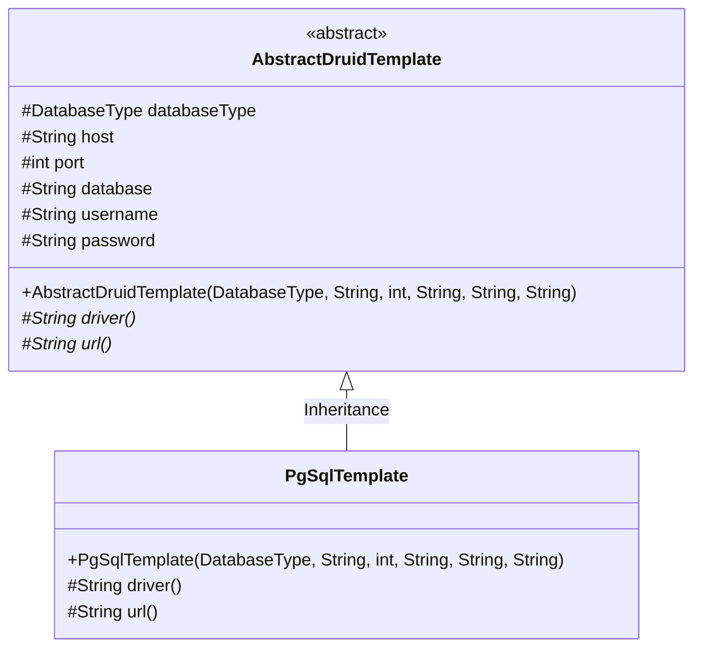
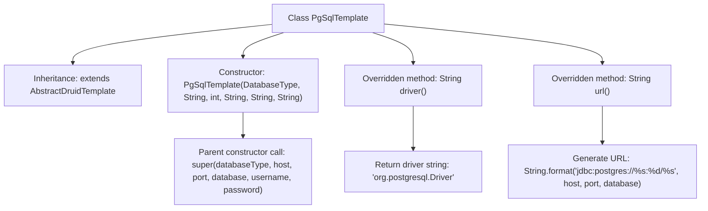

# Basic Information

|      |      |
|------|------|
| Name | PgSqlTemplate |
| Language | .java |
| Code Path | WeFe/serving/serving-service/src/main/java/com/welab/wefe/serving/service/feature/sql/pg/PgSqlTemplate.java |
| Package Name | com.welab.wefe.serving.service.feature.sql.pg |
| Dependencies | ['com.welab.wefe.common.jdbc.base.DatabaseType', 'com.welab.wefe.serving.service.feature.sql.AbstractDruidTemplate'] |
| Brief Description | The PgSqlTemplate class inherits from AbstractDruidTemplate and is used for PostgreSQL database connections, including methods for driver and URL configuration. |

# Description

The `PgSqlTemplate` class inherits from `AbstractDruidTemplate` and is used for PostgreSQL database connections. The constructor accepts parameters such as database type, host address, port number, database name, username, and password, and passes them to the parent class. This class overrides the `driver` method to return the PostgreSQL driver class name and overrides the `url` method to generate a PostgreSQL JDBC connection string in the format `jdbc:postgres://host:port/database_name`.

# Class Summary

| Name   | Type  | Description |
|-------|------|-------------|
| PgSqlTemplate | class | The PgSqlTemplate class inherits from AbstractDruidTemplate and is used for PostgreSQL database connections, including driver and URL configurations. |

## Class PgSqlTemplate

|      |      |
|------|------|
| Access Modifier | public |
| Type | class |
| Name | PgSqlTemplate |
| Description | The PgSqlTemplate class inherits from AbstractDruidTemplate and is used for PostgreSQL database connections, including driver and URL configurations. |

### UML Class Diagram

This class diagram illustrates the inheritance relationship where PgSqlTemplate extends the abstract class AbstractDruidTemplate. The AbstractDruidTemplate defines fundamental database connection attributes and abstract methods, including the generation of driver name (driver) and connection URL (url). As a concrete implementation class, PgSqlTemplate provides PostgreSQL-specific driver class names and URL formats. Through inheritance, PgSqlTemplate reuses the database connection parameters from the parent class while implementing database-specific driver logic.

### Internal Method Call Graph

This code demonstrates a PostgreSQL database template class PgSqlTemplate, which inherits from the abstract class AbstractDruidTemplate. Its primary functionalities include: initializing database connection parameters through the constructor, overriding the driver() method to return the PostgreSQL driver class name, and overriding the url() method to dynamically generate a JDBC connection string compliant with PostgreSQL specifications. The flowchart clearly presents the class inheritance relationship, constructor parameter passing, and the implementation logic of two core overridden methods, illustrating the application of the template method pattern in database connection management.

### Field List

| Name  | Type  | Description |
|-------|-------|------|

### Method List

| Name  | Type  | Description |
|-------|-------|------|
| driver | String | Java method override, returning the PostgreSQL driver class name. |
| url | String | This method generates a PostgreSQL database connection URL in the format jdbc:postgres://host:port/database. |

