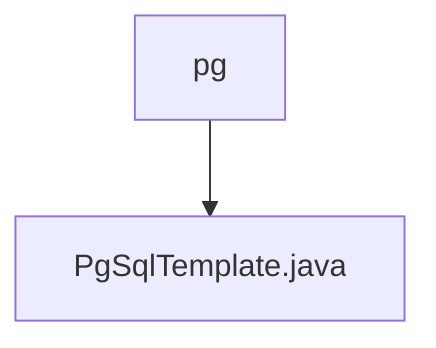

# Basic Information

|      |      |
|------|------|
| Name | pg |
| Language | .java |
| Code Path | WeFe/serving/serving-service/src/main/java/com/welab/wefe/serving/service/feature/sql/pg |
| Package Name | docs.serving.serving-service.src.main.java.com.welab.wefe.serving.service.feature.sql.pg |
| Brief Description | The PgSqlTemplate class inherits from AbstractDruidTemplate and is used for PostgreSQL database connections, including methods for driver and URL configuration. |

# Description

The PgSqlTemplate class inherits from AbstractDruidTemplate and is used for PostgreSQL database connections. The constructor accepts parameters such as database type, host address, port number, database name, username, and password, which are then passed to the parent class. This class overrides the driver method to return the PostgreSQL driver class name and overrides the url method to generate a PostgreSQL JDBC connection string in the format jdbc:postgres://host:port/database_name.

### Package Internal Structure View

This flowchart illustrates the hierarchical structure of PostgreSQL-related code. The parent directory 'pg' contains a child file 'PgSqlTemplate.java'. This concise structure suggests it is a module specifically designed for handling PostgreSQL database operations, potentially including SQL templates or query-building functionalities.

# File List

| Name   | Type  | Description |
|-------|------|-------------|
| [PgSqlTemplate.java](PgSqlTemplate.md) | file | The PgSqlTemplate class inherits from AbstractDruidTemplate and is used for PostgreSQL database connections, including methods for driver and URL configuration. |

