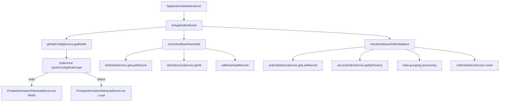
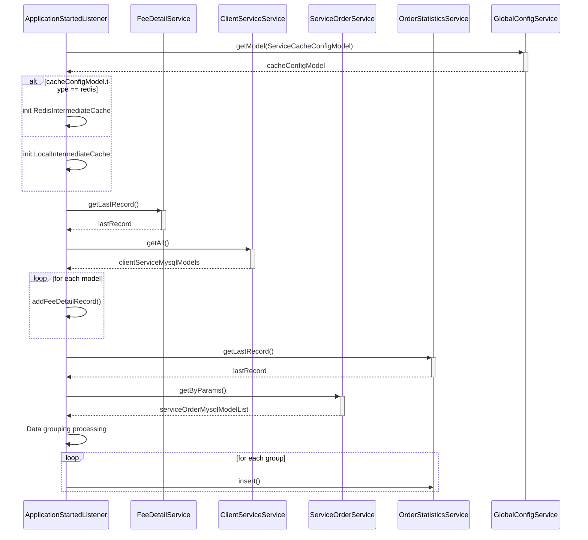

# Basic Information

|      |      |
|------|------|
| Name | ApplicationStartedListener |
| Language | .java |
| Code Path | WeFe/serving/serving-service/src/main/java/com/welab/wefe/serving/service/listener/ApplicationStartedListener.java |
| Package Name | com.welab.wefe.serving.service.listener |
| Dependencies | ['java.math.BigDecimal', 'java.util.ArrayList', 'java.util.Calendar', 'java.util.Date', 'java.util.List', 'java.util.Map', 'java.util.stream.Collectors', 'org.slf4j.Logger', 'org.slf4j.LoggerFactory', 'org.springframework.beans.factory.annotation.Autowired', 'org.springframework.boot.context.event.ApplicationStartedEvent', 'org.springframework.context.ApplicationListener', 'org.springframework.stereotype.Component', 'com.welab.wefe.common.util.DateUtil', 'com.welab.wefe.mpc.pir.server.PrivateInformationRetrievalServer', 'com.welab.wefe.serving.service.database.entity.ClientServiceMysqlModel', 'com.welab.wefe.serving.service.database.entity.FeeConfigMysqlModel', 'com.welab.wefe.serving.service.database.entity.FeeDetailMysqlModel', 'com.welab.wefe.serving.service.database.entity.OrderStatisticsMysqlModel', 'com.welab.wefe.serving.service.database.entity.PartnerMysqlModel', 'com.welab.wefe.serving.service.database.entity.ServiceOrderMysqlModel', 'com.welab.wefe.serving.service.dto.ServiceOrderInput', 'com.welab.wefe.serving.service.dto.globalconfig.ServiceCacheConfigModel', 'com.welab.wefe.serving.service.enums.CallByMeEnum', 'com.welab.wefe.serving.service.enums.ServiceClientTypeEnum', 'com.welab.wefe.serving.service.enums.ServiceOrderEnum', 'com.welab.wefe.serving.service.service.ClientServiceService', 'com.welab.wefe.serving.service.service.FeeConfigService', 'com.welab.wefe.serving.service.service.FeeDetailService', 'com.welab.wefe.serving.service.service.OrderStatisticsService', 'com.welab.wefe.serving.service.service.PartnerService', 'com.welab.wefe.serving.service.service.ServiceOrderService', 'com.welab.wefe.serving.service.service.globalconfig.GlobalConfigService', 'com.welab.wefe.serving.service.utils.RedisIntermediateCache'] |
| Brief Description | Application startup listener, initializes cache configuration and collects order and fee data. Selects Redis or local cache based on the cache type, groups and counts order statuses, calculates fee details, and saves them. |

# Description

The code is a Spring component that listens for application startup events. Its main functions include initializing cache configurations, collecting order statistics, and saving fee details. During startup, it checks and saves fee details and order statistics. Based on global configurations, it initializes the cache type (Redis or local) and logs the process. The order statistics method groups data by service, partner, and time to calculate success and failure counts, generates statistical records, and saves them. The fee details method retrieves customer service information, calculates fees, saves detailed records, handles exceptions, and logs events.

# Class Summary

| Name   | Type  | Description |
|-------|------|-------------|
| ApplicationStartedListener | class | The application startup listener initializes cache configurations and collects order and fee data. Based on the cache type, it selects either Redis or local cache, groups and tallies order statuses, calculates fee details, and saves them. |

## Class ApplicationStartedListener

|      |      |
|------|------|
| Access Modifier | @Component;public |
| Type | class |
| Name | ApplicationStartedListener |
| Description | The application startup listener initializes cache configurations and collects order and fee data. Based on the cache type, it selects either Redis or local cache, groups and tallies order statuses, calculates fee details, and saves them. |

### UML Class Diagram

```mermaid
classDiagram
    class ApplicationStartedListener {
        -Logger logger
        -FeeDetailService feeDetailService
        -ClientServiceService clientServiceService
        -FeeConfigService feeConfigService
        -ServiceOrderService serviceOrderService
        -OrderStatisticsService orderStatisticsService
        -GlobalConfigService globalConfigService
        -PartnerService partnerService
        +onApplicationEvent(ApplicationStartedEvent event) void
        +checkAndSaveOrderStatistics() void
        +checkAndSaveFeeDetail() void
        +addFeeDetailRecord(String serviceId, String clientId, Date endTime) void
    }

    class FeeDetailService {
        <<Interface>>
        +getLastRecord() FeeDetailMysqlModel
        +save(FeeDetailMysqlModel model) void
    }

    class ClientServiceService {
        <<Interface>>
        +getAll() List~ClientServiceMysqlModel~
    }

    class FeeConfigService {
        <<Interface>>
        +queryOne(String serviceId, String clientId) FeeConfigMysqlModel
    }

    class ServiceOrderService {
        <<Interface>>
        +getByParams(ServiceOrderInput input) List~ServiceOrderMysqlModel~
    }

    class OrderStatisticsService {
        <<Interface>>
        +getLastRecord() OrderStatisticsMysqlModel
        +insert(OrderStatisticsMysqlModel model) void
    }

    class GlobalConfigService {
        <<Interface>>
        +getModel(Class~T~ clazz) T
    }

    class PartnerService {
        <<Interface>>
        +findOne(String clientId) PartnerMysqlModel
    }

    ApplicationStartedListener --> FeeDetailService : Dependency
    ApplicationStartedListener --> ClientServiceService : Dependency
    ApplicationStartedListener --> FeeConfigService : Dependency
    ApplicationStartedListener --> ServiceOrderService : Dependency
    ApplicationStartedListener --> OrderStatisticsService : Dependency
    ApplicationStartedListener --> GlobalConfigService : Dependency
    ApplicationStartedListener --> PartnerService : Dependency
```

This code defines a Spring component `ApplicationStartedListener` that implements the `ApplicationListener` interface to listen for application startup events. The class autowires multiple service interfaces (such as `FeeDetailService`, `ClientServiceService`, etc.) to perform order statistics and fee detail check/save operations upon application startup. Key functionalities include: 1) Checking and saving order statistics data; 2) Checking and saving fee detail records; 3) Initializing cache services based on global configurations. The class diagram clearly illustrates the dependency relationships between this class and various service interfaces, demonstrating modular design and Spring's dependency injection features.

### Internal Method Call Graph

This code implements a Spring application startup listener with primary functionalities including: 1) Checking and saving fee detail records; 2) Checking and saving order statistics data; 3) Initializing cache services based on global configurations. The flowchart illustrates class method call relationships, while the sequence diagram details the event handling process. The code automatically wires multiple service classes to perform data validation and initialization operations during application startup, incorporating differentiated handling for Redis and local caches, as well as complex data grouping and statistical logic.

### Field List

| Name  | Type  | Description |
|-------|-------|------|
| serviceOrderService | ServiceOrderService | Automatically inject the ServiceOrderService instance. |
| feeConfigService | FeeConfigService | Automatically inject the FeeConfigService service instance. |
| logger = LoggerFactory.getLogger(ApplicationStartedListener.class) | Logger | Define a static constant logger, using LoggerFactory to obtain the logger instance for the ApplicationStartedListener class. |
| feeDetailService | FeeDetailService | Automatically inject the FeeDetailService service instance. |
| clientServiceService | ClientServiceService | Using @Autowired to automatically inject an instance of ClientServiceService. |
| partnerService | PartnerService | Use @Autowired to automatically inject the PartnerService instance. |
| globalConfigService | GlobalConfigService | Using @Autowired to automatically inject an instance of GlobalConfigService. |
| orderStatisticsService | OrderStatisticsService | Use @Autowired to automatically inject the OrderStatisticsService service instance. |

### Method List

| Name  | Type  | Description |
|-------|-------|------|
| onApplicationEvent | void | Check and save fee and order statistics upon application startup, initialize the private information retrieval service based on cache configuration, supporting Redis or local cache. |
| checkAndSaveOrderStatistics | void | The method `checkAndSaveOrderStatistics` is used to collect and save order data. Process: Retrieve the latest statistics timestamp, query orders within the specified time range, group them by service ID, partner ID, and time, calculate the counts of successes and failures, then generate and save statistical records. |
| checkAndSaveFeeDetail | void | Method to check and save expense details: Retrieve all customer services, query the last recorded time, iterate through the service list, skip invalid or activation types, count activated services, and add expense records. |
| addFeeDetailRecord | void | This method is used to add expense detail records, query orders based on service ID, customer ID, and end time, calculate the total cost, and save the details. It includes exception handling and logging. |

