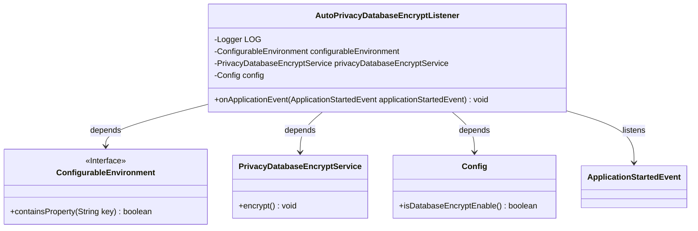
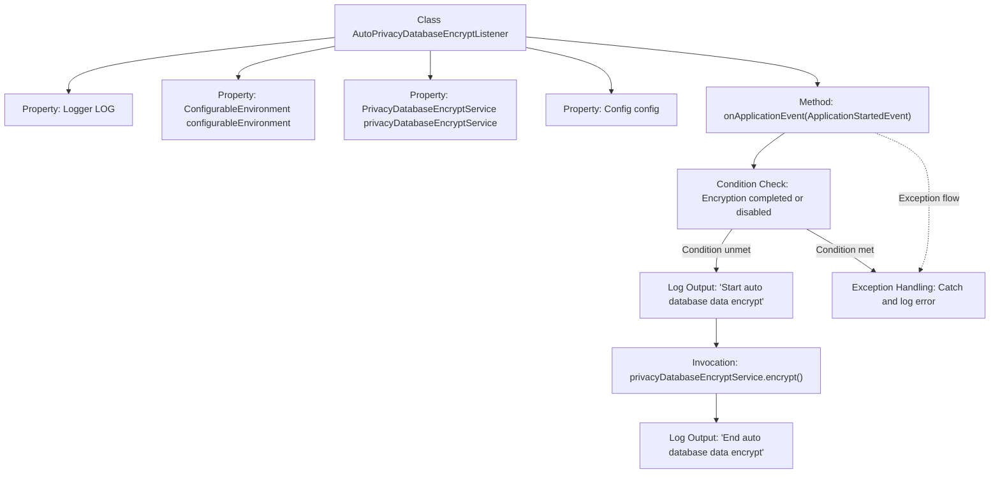

# Basic Information

|      |      |
|------|------|
| Name | AutoPrivacyDatabaseEncryptListener |
| Language | .java |
| Code Path | WeFe/serving/serving-service/src/main/java/com/welab/wefe/serving/service/listener/AutoPrivacyDatabaseEncryptListener.java |
| Package Name | com.welab.wefe.serving.service.listener |
| Dependencies | ['com.welab.wefe.serving.service.config.Config', 'com.welab.wefe.serving.service.service.PrivacyDatabaseEncryptService', 'org.slf4j.Logger', 'org.slf4j.LoggerFactory', 'org.springframework.beans.factory.annotation.Autowired', 'org.springframework.boot.context.event.ApplicationStartedEvent', 'org.springframework.context.ApplicationListener', 'org.springframework.core.env.ConfigurableEnvironment', 'org.springframework.stereotype.Component'] |
| Brief Description | This is a Spring component class that listens for application startup events, automatically executes database encryption services when configuration is enabled and encryption is not completed, and records operation logs and exceptions. |

# Description

This is a Spring component class named AutoPrivacyDatabaseEncryptListener, which implements the ApplicationListener interface to listen for application startup events. The class contains three auto-wired dependencies: ConfigurableEnvironment, PrivacyDatabaseEncryptService, and a Config configuration object. When the application starts, it checks whether database encryption has been completed or if the encryption feature is disabled. If encryption is not completed and the feature is enabled, it invokes the privacy database encryption service to perform the encryption operation and logs the start and completion. If an exception occurs during encryption, an error log is recorded. The entire process implements automatic encryption of database data.

# Class Summary

| Name   | Type  | Description |
|-------|------|-------------|
| AutoPrivacyDatabaseEncryptListener | class | This is a Spring component class that listens for application startup events, automatically executes the privacy data encryption service when database encryption is incomplete and the configuration is enabled, and logs operation records and exceptions. |

## Class AutoPrivacyDatabaseEncryptListener

|      |      |
|------|------|
| Access Modifier | @Component;public |
| Type | class |
| Name | AutoPrivacyDatabaseEncryptListener |
| Description | This is a Spring component class that listens for application startup events, automatically executes the privacy data encryption service when database encryption is incomplete and the configuration is enabled, and logs operation records and exceptions. |

### UML Class Diagram

Class diagram description: This diagram illustrates the AutoPrivacyDatabaseEncryptListener class and its dependencies. The class implements the ApplicationListener interface, listens for ApplicationStartedEvent, and relies on three components: ConfigurableEnvironment, PrivacyDatabaseEncryptService, and Config. Upon application startup, if conditions are met, the listener invokes the encryption service to encrypt database data. The diagram clearly demonstrates the collaboration between components.

### Internal Method Call Graph

This code represents a Spring component that listens for application startup events and automatically performs database encryption. The flowchart illustrates the complete process from event triggering to encryption completion: it first checks encryption conditions (whether completed or disabled), invokes the encryption service and logs the process if conditions permit, and catches/logs errors when exceptions occur. The component controls encryption behavior through environment variables and configurations to ensure automated processing of data security.

### Field List

| Name  | Type  | Description |
|-------|-------|------|
| privacyDatabaseEncryptService | PrivacyDatabaseEncryptService | Use @Autowired to automatically inject an instance of the privacy database encryption service. |
| LOG = LoggerFactory.getLogger(AutoPrivacyDatabaseEncryptListener.class) | Logger | The static log constant LOG of the class AutoPrivacyDatabaseEncryptListener is obtained through LoggerFactory. |
| config | Config | Automatically inject Config configuration instances. |
| configurableEnvironment | ConfigurableEnvironment | In the Spring framework, use @Autowired to automatically inject the ConfigurableEnvironment object for accessing and configuring application environment properties. |

### Method List

| Name  | Type  | Description |
|-------|-------|------|
| onApplicationEvent | void | The method handles the application startup event, checks the database encryption configuration. If encryption is not required, it returns; otherwise, it executes the encryption service and logs the operation, catching any exceptions and recording errors. |

