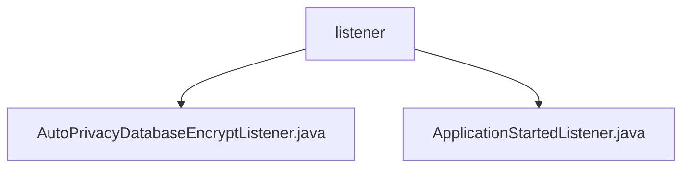

# Basic Information

|      |      |
|------|------|
| Name | listener |
| Language | .java |
| Code Path | WeFe/serving/serving-service/src/main/java/com/welab/wefe/serving/service/listener |
| Package Name | docs.serving.serving-service.src.main.java.com.welab.wefe.serving.service.listener |
| Brief Description | The AutoPrivacyDatabaseEncryptListener is a Spring component that listens for startup events, automatically checks and performs database encryption, and logs the process. The ApplicationStartedListener monitors startup, initializes caches, collects order statistics, saves fee details, handles exceptions, and logs events. |

# Description

## Overview  
This module is a collection of Spring application startup listeners, with its core responsibility being to respond to application startup events, execute initialization tasks, and automate processes (such as database encryption, cache configuration, and order statistics). The interface specification adheres to the ApplicationListener interface, uniformly handling ContextRefreshedEvent events. Key data structures include ConfigurableEnvironment (environment configuration), PrivacyDatabaseEncryptService (encryption service), and DTO objects for order statistics. External dependencies include the Spring Framework, Redis (optional caching), and logging frameworks. For example, AutoPrivacyDatabaseEncryptListener implements automatic database encryption, while ApplicationStartedListener handles cache initialization and order statistics.  

## Key Business Scenarios  
The module integrates two startup processing workflows: The database encryption process resembles a security mechanism, first checking configurations before triggering the encryption service; the statistics initialization process resembles an ETL process, involving order grouping calculations and fee detail generation. The typical interaction pattern is event-driven, with listeners responding to application startup events. Full functionality spans from data security (encryption) to business monitoring (statistics), such as counting successful/failed orders by service type or generating fee details based on customer information. The API type is Spring event listeners, and integration examples include Redis cache initialization and local cache fallback solutions.

### Package Internal Structure View

This flowchart illustrates the hierarchical structure of the listener module in the WeFe service project. The root node is the listener folder, which contains two Java listener implementation classes: AutoPrivacyDatabaseEncryptListener and ApplicationStartedListener. Both files are directly subordinate to the listener directory without deeper nesting relationships, reflecting a concise listener component structure.

# File List

| Name   | Type  | Description |
|-------|------|-------------|
| [AutoPrivacyDatabaseEncryptListener.java](AutoPrivacyDatabaseEncryptListener.md) | file | This is a Spring component class that listens for application startup events. When the configuration is enabled and encryption has not been completed, it automatically executes the database encryption service, logging operation details and exceptions. |
| [ApplicationStartedListener.java](ApplicationStartedListener.md) | file | Application startup listener, initializes cache configuration and collects order and fee data. Selects Redis or local cache based on cache type, groups and counts order statuses, calculates fee details, and saves them. |

