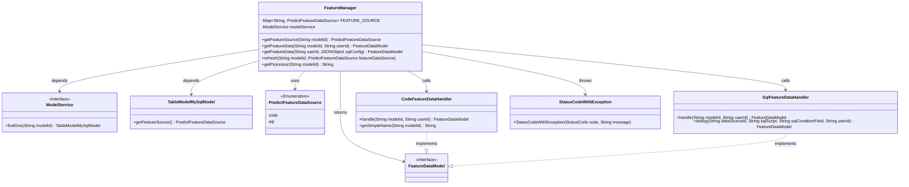
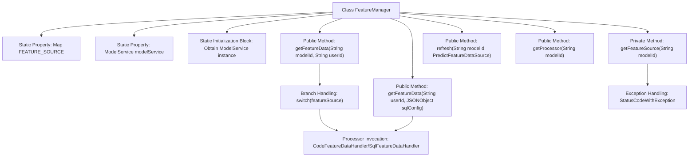

# Basic Information

|      |      |
|------|------|
| Name | FeatureManager |
| Language | .java |
| Code Path | WeFe/serving/serving-service/src/main/java/com/welab/wefe/serving/service/manager/FeatureManager.java |
| Package Name | com.welab.wefe.serving.service.manager |
| Dependencies | ['com.alibaba.fastjson.JSONObject', 'com.welab.wefe.common.StatusCode', 'com.welab.wefe.common.exception.StatusCodeWithException', 'com.welab.wefe.common.web.Launcher', 'com.welab.wefe.common.wefe.enums.PredictFeatureDataSource', 'com.welab.wefe.serving.sdk.model.FeatureDataModel', 'com.welab.wefe.serving.service.database.entity.TableModelMySqlModel', 'com.welab.wefe.serving.service.feature.CodeFeatureDataHandler', 'com.welab.wefe.serving.service.feature.SqlFeatureDataHandler', 'com.welab.wefe.serving.service.service.ModelService', 'java.util.HashMap', 'java.util.Map', 'com.welab.wefe.common.StatusCode.UNEXPECTED_ENUM_CASE'] |
| Brief Description | The FeatureManager class manages feature data sources, providing methods to retrieve feature data, supporting both code and SQL sources, and includes caching mechanisms and refresh functionality. |

# Description

The `FeatureManager` class is a utility class designed for managing feature data, with its primary functionalities including retrieving feature data sources and processing feature data. It employs a static Map to cache feature data sources, allowing retrieval of corresponding data sources via `modelId`. The class incorporates synchronized methods to ensure thread safety and supports obtaining feature data through methods such as code or SQL queries. Additionally, it provides methods for refreshing the cache and retrieving processor names. The entire class is designed for static method invocation and relies on `ModelService` for data queries.

# Class Summary

| Name   | Type  | Description |
|-------|------|-------------|
| FeatureManager | class | The FeatureManager class manages feature data sources, provides methods for retrieving feature data, supports both code and SQL approaches, and includes caching mechanisms and refresh functionality. |

## Class FeatureManager

|      |      |
|------|------|
| Access Modifier | public |
| Type | class |
| Name | FeatureManager |
| Description | The FeatureManager class manages feature data sources, provides methods for retrieving feature data, supports both code and SQL approaches, and includes caching mechanisms and refresh functionality. |

### UML Class Diagram

This code demonstrates the core structure of a FeatureManager, which manages feature data sources for different models through a static cache (FEATURE_SOURCE). Key functionalities include: retrieving feature data sources by model ID, processing feature data based on different types (code/SQL), and supporting dynamic cache refresh. The system adopts the strategy pattern, utilizing CodeFeatureDataHandler and SqlFeatureDataHandler to process feature data from different sources respectively, while relying on the ModelService interface to obtain model metadata. The overall design embodies concepts of cache management, strategy pattern, and dependency injection.

### Internal Method Call Graph

The flowchart depicts the core structure and invocation relationships of the FeatureManager class. This class primarily manages feature data source caching (FEATURE_SOURCE) and model services (modelService), providing four key methods: obtaining feature sources by modelId (getFeatureSource), retrieving feature data (two overloaded versions of getFeatureData), refreshing the cache (refresh), and obtaining processor names (getProcessor). The getFeatureData method selects different processors (CodeFeatureDataHandler/SqlFeatureDataHandler) based on feature source types (code/sql) and includes a complete exception handling mechanism. The static initialization block ensures modelService initialization during class loading.

### Field List

| Name  | Type  | Description |
|-------|-------|------|
| modelService | ModelService | Private static immutable model service instance. |
| FEATURE_SOURCE = new HashMap<>() | Map<String, PredictFeatureDataSource> | Define a static hash map FEATURE_SOURCE with string keys and values of type PredictFeatureDataSource. |

### Method List

| Name  | Type  | Description |
|-------|-------|------|
| getFeatureData | FeatureDataModel | The static method `getFeatureData` retrieves feature data by `userId` and `sqlConfig`, parses `dataSourceId`, `sqlScript`, and `sqlConditionField`, and then invokes `SqlFeatureDataHandler.debug` to return the result. |
| getFeatureSource | PredictFeatureDataSource | The method `getFeatureSource` retrieves the feature data source based on the `modelId`. If it exists in the cache, it returns directly; otherwise, it queries the database synchronously and caches the result. An exception is thrown if the `modelId` is invalid. |
| getFeatureData | FeatureDataModel | The static method `getFeatureData` retrieves feature data based on `modelId` and `userId`. It determines the feature source type (code or SQL) and invokes the corresponding processor. A `StatusCodeWithException` is thrown if an error occurs. |
| refresh | void | The synchronous method `refresh` updates the feature data source corresponding to the model ID. |
| getProcessor | String | The static method `getProcessor` invokes the `getSimpleName` method of `CodeFeatureDataHandler` using the `modelId` parameter and returns a simplified name string. |

