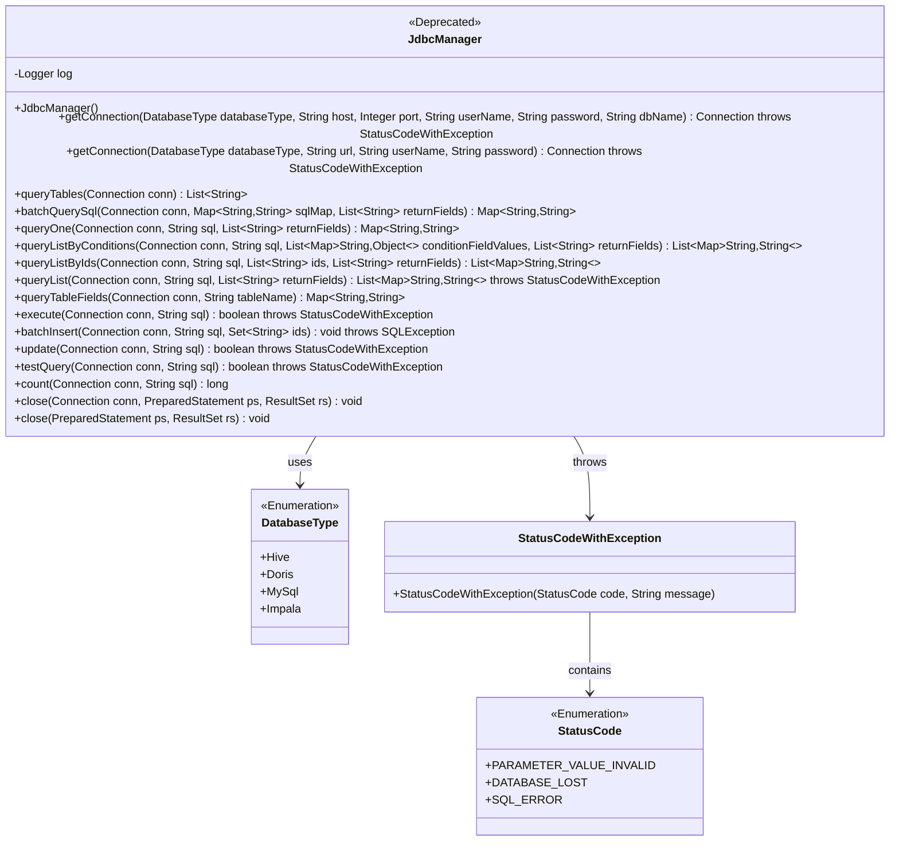

# Basic Information

|      |      |
|------|------|
| Name | JdbcManager |
| Language | .java |
| Code Path | WeFe/serving/serving-service/src/main/java/com/welab/wefe/serving/service/manager/JdbcManager.java |
| Package Name | com.welab.wefe.serving.service.manager |
| Dependencies | ['java.sql.Connection', 'java.sql.DriverManager', 'java.sql.PreparedStatement', 'java.sql.ResultSet', 'java.sql.SQLException', 'java.util.ArrayList', 'java.util.HashMap', 'java.util.LinkedHashMap', 'java.util.List', 'java.util.Map', 'java.util.Set', 'org.slf4j.Logger', 'org.slf4j.LoggerFactory', 'com.nimbusds.jose.shaded.json.JSONObject', 'com.welab.wefe.common.StatusCode', 'com.welab.wefe.common.exception.StatusCodeWithException', 'com.welab.wefe.common.jdbc.base.DatabaseType'] |
| Brief Description | Deprecated JdbcManager class, providing various database connection and query methods, supporting Hive, Doris, MySQL, etc., including connection management, batch querying, table field querying, and other functionalities. |

# Description

JdbcManager is a deprecated Java class designed for managing connections and operations across multiple databases. It supports Hive, Doris, MySQL, and Impala databases, offering connection establishment methods based on either IP-port combinations or URLs. The class provides core functionalities such as querying table structures, batch queries, conditional queries, paginated queries, and data insertion/updates, with all operations logging their execution time. It prevents SQL injection through PreparedStatement, manages resources using connection pools, and includes robust exception handling and resource release mechanisms. Key operations are logged, and the class supports transaction processing and batch insertion optimizations.

# Class Summary

| Name   | Type  | Description |
|-------|------|-------------|
| JdbcManager | class | Deprecated JdbcManager class, providing various database connection and query methods, supporting Hive, Doris, MySQL, etc., including connection management, table query, batch operations, and other functionalities. |

## Class JdbcManager

|      |      |
|------|------|
| Access Modifier | @Deprecated;public |
| Type | class |
| Name | JdbcManager |
| Description | Deprecated JdbcManager class, providing various database connection and query methods, supporting Hive, Doris, MySQL, etc., including connection management, table query, batch operations, and other functionalities. |

### UML Class Diagram

This code demonstrates a JdbcManager class marked as @Deprecated, primarily used for managing JDBC database connections and executing SQL operations. The class supports multiple database types (Hive/Doris/MySQL/Impala), providing functionalities such as connection acquisition, table queries, batch operations, and field queries. It enforces type safety through the DatabaseType and StatusCode enumeration types. All database operations include comprehensive exception handling and resource closure mechanisms, with execution times logged. However, the design is no longer recommended for use and may be replaced by more modern persistence layer solutions.

### Internal Method Call Graph

```mermaid
graph TD
    A["Class JdbcManager"]
    B["Property: Logger log"]
    C["Constructor: JdbcManager()"]
    D["Method: getConnection(DatabaseType, String, Integer, String, String, String)"]
    E["Method: getConnection(DatabaseType, String, String, String)"]
    F["Method: queryTables(Connection)"]
    G["Method: batchQuerySql(Connection, Map, List)"]
    H["Method: queryOne(Connection, String, List)"]
    I["Method: queryListByConditions(Connection, String, List, List)"]
    J["Method: queryListByIds(Connection, String, List, List)"]
    K["Method: queryList(Connection, String, List)"]
    L["Method: queryTableFields(Connection, String)"]
    M["Method: execute(Connection, String)"]
    N["Method: batchInsert(Connection, String, Set)"]
    O["Method: update(Connection, String)"]
    P["Method: testQuery(Connection, String)"]
    Q["Method: count(Connection, String)"]
    R["Method: close(Connection, PreparedStatement, ResultSet)"]
    S["Method: close(PreparedStatement, ResultSet)"]

    A --> B
    A --> C
    A --> D
    A --> E
    A --> F
    A --> G
    A --> H
    A --> I
    A --> J
    A --> K
    A --> L
    A --> M
    A --> N
    A --> O
    A --> P
    A --> Q
    A --> R
    A --> S
```

This code defines a deprecated JDBC management class JdbcManager, primarily used for handling connections and operations with various databases (such as Hive, Doris, MySQL, Impala). It provides comprehensive database operation methods including obtaining connections, querying table structures, executing SQL statements, batch inserting data, etc. All methods incorporate detailed logging and resource cleanup mechanisms, ensuring resource release through try-catch-finally structures. The class specifically handles multiple database driver loading and URL generation logic, with adaptations for different database types. The exception handling mechanism is robust, throwing exceptions with specific status codes via StatusCodeWithException.

### Field List

| Name  | Type  | Description |
|-------|-------|------|
| log = LoggerFactory.getLogger(JdbcManager.class) | Logger | Declare a static immutable log object for logging in the JdbcManager class. |

### Method List

| Name  | Type  | Description |
|-------|-------|------|
| queryTables | List<String> | The method queries the database table name list via a JDBC connection, records the start time, executes the SQL and processes the result set, logs errors in case of exceptions, and finally closes resources and records the time consumed. |
| getConnection | Connection | This method generates a connection URL based on the database type and obtains a database connection, supporting Hive, Doris, MySql, and Impala, throwing an exception upon failure. |
| batchInsert | void | The method `batchInsert` performs batch data insertion, turns off auto-commit, executes batch processing and commits every 50,000 records, and finally closes the connection while recording the time consumed. |
| execute | boolean | This method executes the SQL statement, records the start time and duration, returns true on success, and returns false while closing resources on failure. |
| testQuery | boolean | The method `testQuery` tests a database query, records the start time and duration, executes the SQL, and returns whether the result exists. In case of an exception, it logs the error and returns false, and finally closes the resources. |
| queryListByIds | List<Map<String, String>> | Java Method: Batch query the database, execute SQL in groups of 10 IDs each, return a list of field mappings, record time consumption, and handle exceptions. |
| queryListByConditions | List<Map<String, String>> | The method queries the database via SQL to generate a result set based on a condition list and a return field list. It uses prepared statements to prevent SQL injection, records execution time, handles exceptions, and ensures resource release. It returns a list of mappings between field names and their values. |
| queryList | List<Map<String, String>> | This method executes an SQL query and returns a list of field mappings. It retrieves data in a streaming manner, handles exceptions, and logs the time consumed. The returned results contain the values of the specified fields. |
| queryTableFields | Map<String, String> | This method queries the database table structure via JDBC and returns a mapping of field names and types. It records execution time, handles exceptions, and ensures resource release. |
| getConnection | Connection | This method loads the driver and establishes a connection based on the database type, supporting Hive, Doris, MySQL, and Impala, throwing an exception upon failure. |
| queryOne | Map<String, String> | The method queryOne executes an SQL query and returns field mappings. It records the start time, handles errors, measures execution time, and finally closes the connection. |
| count | long | The method executes an SQL query via JDBC to count records, replaces the original SQL with count(*), sets result set parameters, catches exceptions and logs the time consumed, and finally returns the total count. |
| close | void | Close the database connection, prepared statements, and result sets, catching and logging any exceptions. |
| update | boolean | The method executes an SQL update operation via JDBC, records the start time, creates a prepared statement to perform the update, returns whether it was successful, catches exceptions to log errors, and finally closes resources while recording the time consumed. |
| batchQuerySql | Map<String, String> | Batch query SQL method, using JDBC connection to execute multiple SQL statements, returning JSON strings with field mappings, handling empty results, and recording query execution time. |
| close | void | Closing database resources: First close the ResultSet, then close the PreparedStatement, catch and log any exceptions. |

