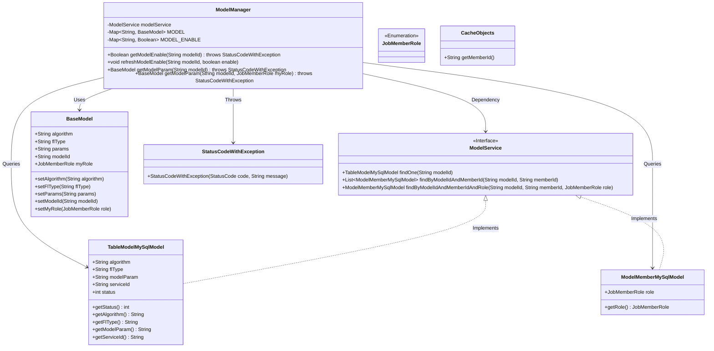
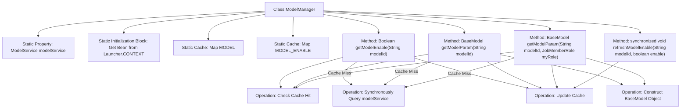

# Basic Information

|      |      |
|------|------|
| Name | ModelManager |
| Language | .java |
| Code Path | WeFe/serving/serving-service/src/main/java/com/welab/wefe/serving/service/manager/ModelManager.java |
| Package Name | com.welab.wefe.serving.service.manager |
| Dependencies | ['com.welab.wefe.common.StatusCode', 'com.welab.wefe.common.exception.StatusCodeWithException', 'com.welab.wefe.common.web.Launcher', 'com.welab.wefe.common.wefe.enums.JobMemberRole', 'com.welab.wefe.serving.sdk.model.BaseModel', 'com.welab.wefe.serving.service.database.entity.ModelMemberMySqlModel', 'com.welab.wefe.serving.service.database.entity.TableModelMySqlModel', 'com.welab.wefe.serving.service.service.CacheObjects', 'com.welab.wefe.serving.service.service.ModelService', 'java.util.HashMap', 'java.util.List', 'java.util.Map'] |
| Brief Description | The ModelManager class manages model states and parameters, improving performance through static caching. It provides methods to retrieve model activation status, model parameters, and refresh states, ensuring thread safety and handling exceptions. |

# Description

The `ModelManager` class is a utility class for managing models and their states, containing a static `ModelService` instance and two cache Maps (`MODEL` and `MODEL_ENABLE`). It provides three main methods: `getModelEnable` retrieves the model's enabled status, querying the database and updating the cache if the cache does not exist; `refreshModelEnable` manually refreshes the model state cache; `getModelParam` has two overloaded methods for fetching model parameter information, supporting queries by model ID or model ID plus role, and constructs a `BaseModel` object to store in the cache if the cache is absent. All methods include thread synchronization mechanisms to ensure data consistency and throw exceptions when the model does not exist.

# Class Summary

| Name   | Type  | Description |
|-------|------|-------------|
| ModelManager | class | The ModelManager class manages model states and parameters, utilizing static caching to enhance performance. It provides methods for retrieving model activation status, model parameters, and refreshing states, ensuring thread safety. Throws an exception if the model does not exist. |

## Class ModelManager

|      |      |
|------|------|
| Access Modifier | public |
| Type | class |
| Name | ModelManager |
| Description | The ModelManager class manages model states and parameters, utilizing static caching to enhance performance. It provides methods for retrieving model activation status, model parameters, and refreshing states, ensuring thread safety. Throws an exception if the model does not exist. |

### UML Class Diagram

This code demonstrates a `ModelManager` that manages model parameters and states through static caches `MODEL` and `MODEL_ENABLE`. The class diagram clearly illustrates the relationships between `ModelManager` and multiple data models (such as `BaseModel`, `TableModelMySqlModel`, etc.), the service interface `ModelService`, and the exception handling mechanism. `ModelManager` ensures thread safety via synchronized blocks, relies on `ModelService` to fetch model data from the database, and uses `CacheObjects` to retrieve member IDs. The overall design reflects considerations for cache optimization and thread safety.

### Internal Method Call Graph

This flowchart illustrates the core structure and data flow of the ModelManager class. The class loads ModelService through a static initialization block, maintaining two static caches (MODEL and MODEL_ENABLE) to store model data and states. All four main methods follow the "check cache -> query service if missed -> update cache" pattern, where getModelEnable handles model states, two overloaded getModelParam methods handle model parameters, and refreshModelEnable forces state refresh. Synchronized blocks ensure data consistency in multi-threaded environments, while exception handling guarantees parameter validity.

### Field List

| Name  | Type  | Description |
|-------|-------|------|
| MODEL_ENABLE = new HashMap<>() | Map<String, Boolean> | Define a static hash table MODEL_ENABLE with string keys and boolean values. |
| modelService | ModelService | Private static immutable model service instance. |
| MODEL = new HashMap<>() | Map<String, BaseModel> | Define a static Map variable MODEL with String as the key and BaseModel as the value. |

### Method List

| Name  | Type  | Description |
|-------|-------|------|
| getModelEnable | Boolean | The static method `getModelEnable` checks whether a model is enabled based on the `modelId`. If the result exists in the cache, it returns directly; otherwise, it queries the database under a lock. If the model does not exist, an exception is thrown; otherwise, it caches and returns the status (1 indicates enabled). |
| refreshModelEnable | void | The synchronous method `refreshModelEnable` updates the model enable status, storing `modelId` and `enable` into `MODEL_ENABLE`. |
| getModelParam | BaseModel | Static methods retrieve model parameters by model ID. If the cache does not exist, it queries the database and caches the result, throwing an exception if the model does not exist. |
| getModelParam | BaseModel | The static method `getModelParam` retrieves model parameters based on the `modelId` and user role. It first checks the cache; if not found, it queries the database and verifies permissions, then finally returns the model data or throws an exception. |

