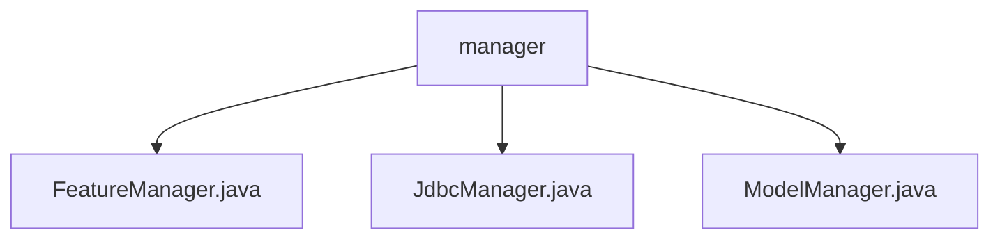

# Basic Information

|      |      |
|------|------|
| Name | manager |
| Language | .java |
| Code Path | WeFe/serving/serving-service/src/main/java/com/welab/wefe/serving/service/manager |
| Package Name | docs.serving.serving-service.src.main.java.com.welab.wefe.serving.service.manager |
| Brief Description | The FeatureManager manages feature data and caches data sources with thread safety. JdbcManager is deprecated, supporting multiple database connections and operations. The ModelManager handles model states, providing caching and synchronization methods. |

# Description

## Overview  
This module is a service-layer toolkit designed for feature data and model management, with its core responsibilities centered around unified management of feature data sources, multi-database connections, and model state caching. The interface specification adheres to a static method invocation pattern and employs thread-safe design, such as FeatureManager ensuring data consistency through synchronized methods. Key data structures include static Map caches (MODEL/MODEL_ENABLE), BaseModel objects, and database connection pools. External dependencies involve ModelService, Hive/Doris database drivers, and Jdbc connection pools. For instance, JdbcManager prevents SQL injection via PreparedStatement.  

## Core Business Scenarios  
The module supports dynamic feature data retrieval (e.g., via SQL queries), heterogeneous multi-database operations (similar to a JDBC abstraction layer), and model lifecycle management. Business workflows include: feature data cache loading → model state validation → cross-database query execution, such as ModelManager updating caches using double-checked locking. A typical interaction pattern involves chained static method calls, e.g., `getModelParam().refreshCache()`. API types encompass data queries (pagination/batch), transaction control, and cache refresh. Integration use cases demonstrate collaboration between feature computation and model inference, such as validating model states before fetching feature data.

### Package Internal Structure View

This flowchart illustrates the structural relationships within the manager directory of the serving-service module in the WeFe project. The manager serves as the parent node, encompassing three Java class files: FeatureManager.java, JdbcManager.java, and ModelManager.java, each corresponding to distinct functional management modules. This hierarchical structure clearly reflects the modular division of business logic.

# File List

| Name   | Type  | Description |
|-------|------|-------------|
| [FeatureManager.java](FeatureManager.md) | file | The FeatureManager class manages feature data sources, providing methods to retrieve feature data, supporting both code and SQL sources, and includes caching mechanisms and refresh functionality. |
| [JdbcManager.java](JdbcManager.md) | file | The deprecated JdbcManager class provides various database connection and query methods, supporting Hive, Doris, MySQL, etc. It includes features such as connection management, batch querying, and table field queries. |
| [ModelManager.java](ModelManager.md) | file | The ModelManager class manages model states and parameters, enhancing performance through static caching. It provides methods to retrieve model activation status, model parameters, and refresh states, ensuring thread safety and handling exceptional scenarios. |

