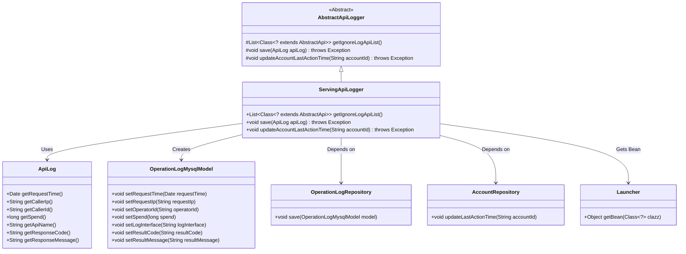
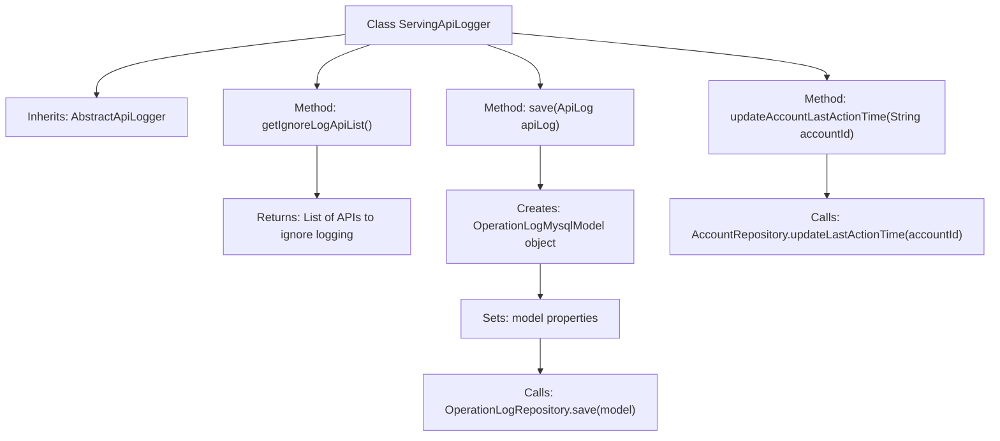

# Basic Information

|      |      |
|------|------|
| Name | ServingApiLogger |
| Language | .java |
| Code Path | WeFe/serving/serving-service/src/main/java/com/welab/wefe/serving/service/operation/ServingApiLogger.java |
| Package Name | com.welab.wefe.serving.service.operation |
| Dependencies | ['java.util.Arrays', 'java.util.List', 'com.welab.wefe.common.web.Launcher', 'com.welab.wefe.common.web.api.base.AbstractApi', 'com.welab.wefe.common.web.delegate.api_log.AbstractApiLogger', 'com.welab.wefe.common.web.delegate.api_log.ApiLog', 'com.welab.wefe.serving.service.api.pir.PrivateInformationRetrievalForNaorPinkasResultsApi', 'com.welab.wefe.serving.service.api.pir.PrivateInformationRetrievalForRandomApi', 'com.welab.wefe.serving.service.api.pir.PrivateInformationRetrievalForRandomLegalApi', 'com.welab.wefe.serving.service.api.pir.PrivateInformationRetrievalForResultsApi', 'com.welab.wefe.serving.service.api.sa.SecureAggregationForResultApi', 'com.welab.wefe.serving.service.database.entity.OperationLogMysqlModel', 'com.welab.wefe.serving.service.database.repository.AccountRepository', 'com.welab.wefe.serving.service.database.repository.OperationLogRepository'] |
| Brief Description | ServingApiLogger inherits from AbstractApiLogger, ignores logging for specific APIs, saves operation logs to the database, and updates the account's last operation time. |

# Description

The `ServingApiLogger` class extends `AbstractApiLogger` and implements three core functionalities: defining a list of APIs to exclude from logging (including five privacy-related APIs), saving API logs to a MySQL database (recording request time, IP, operator ID, duration, interface name, response code, and message), and updating the account's last operation time. It performs database operations by obtaining `Repository` instances through Spring's `Launcher`.

# Class Summary

| Name   | Type  | Description |
|-------|------|-------------|
| ServingApiLogger | class | ServingApiLogger extends AbstractApiLogger, ignores logs for specific APIs, records operation logs to the database, and updates the account's last operation time. |

## Class ServingApiLogger

|      |      |
|------|------|
| Access Modifier | public |
| Type | class |
| Name | ServingApiLogger |
| Description | ServingApiLogger extends AbstractApiLogger, ignores logs for specific APIs, records operation logs to the database, and updates the account's last operation time. |

### UML Class Diagram

This class diagram illustrates that ServingApiLogger inherits from AbstractApiLogger and implements three core methods: retrieving the list of APIs to ignore logging, saving API logs to the database, and updating the account's last action time. It obtains Repository instances via Launcher, interacts with OperationLogMysqlModel and ApiLog for data operations, forming a complete API logging workflow. The system decouples log recording, data transformation, and persistence operations through layered design, demonstrating excellent extensibility and maintainability.

### Internal Method Call Graph

This code implements the ServingApiLogger class, which inherits from the AbstractApiLogger abstract class. Its main functionalities include: 1) Defining the list of API classes to exclude from logging; 2) Saving API call logs to the database by creating an OperationLogMysqlModel object, setting relevant properties, and invoking Repository for persistence; 3) Updating the last action time of accounts. The entire process clearly demonstrates the logging and account update handling, showcasing the core features of the logging system.

### Field List

| Name  | Type  | Description |
|-------|-------|------|

### Method List

| Name  | Type  | Description |
|-------|-------|------|
| save | void | This method converts the ApiLog object into an OperationLogMysqlModel and saves it to the database, including fields such as request time, IP, operator ID, duration, interface name, response code, and message. |
| getIgnoreLogApiList | List<Class<? extends AbstractApi>> | This method returns a list of API classes that ignore logging, including five API classes related to private information retrieval and secure aggregation. |
| updateAccountLastActionTime | void | This method is used to update the last operation time of an account by invoking updateLastActionTime through AccountRepository. |

