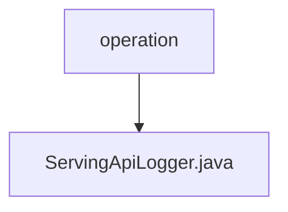

# Basic Information

|      |      |
|------|------|
| Name | operation |
| Language | .java |
| Code Path | WeFe/serving/serving-service/src/main/java/com/welab/wefe/serving/service/operation |
| Package Name | docs.serving.serving-service.src.main.java.com.welab.wefe.serving.service.operation |
| Brief Description | The ServingApiLogger inherits from AbstractApiLogger, skips logging for specific APIs, saves operation logs to the database, and updates the account's last operation time. |

# Description

The `ServingApiLogger` class extends `AbstractApiLogger` and implements three core functionalities: defining a list of APIs to exclude from logging (including five privacy-related APIs), saving API logs to a MySQL database (recording request time, IP, operator ID, duration, interface name, response code, and message), and updating the account's last operation time. It utilizes Spring's `Launcher` to obtain `Repository` instances for database operations.

### Package Internal Structure View

This flowchart illustrates the hierarchical relationship between the operation package in the serving-service module of the WeFe project and the ServingApiLogger.java file. The operation directory serves as the parent, containing a child file named ServingApiLogger.java. This represents a typical Java project file structure, indicating an API logging service class file within an operation package.

# File List

| Name   | Type  | Description |
|-------|------|-------------|
| [ServingApiLogger.java](ServingApiLogger.md) | file | The ServingApiLogger inherits from AbstractApiLogger, ignores logging for specific APIs, saves operation logs to the database, and updates the account's last operation time. |

