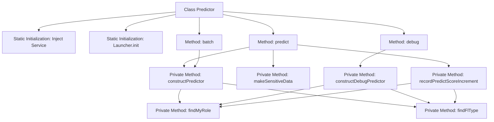
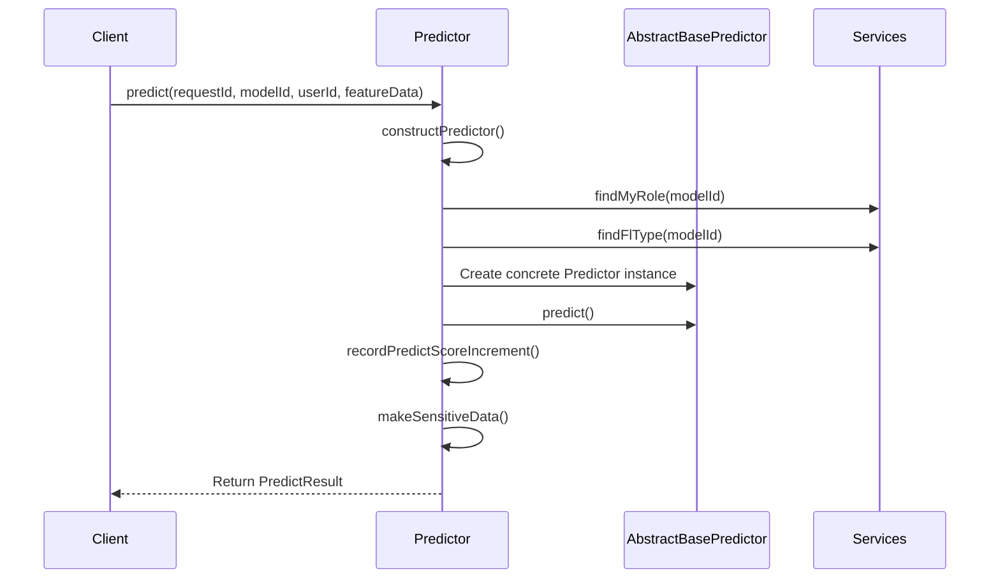

# Basic Information

|      |      |
|------|------|
| Name | Predictor |
| Language | .java |
| Code Path | WeFe/serving/serving-service/src/main/java/com/welab/wefe/serving/service/predicter/Predictor.java |
| Package Name | com.welab.wefe.serving.service.predicter |
| Dependencies | ['com.alibaba.fastjson.JSONObject', 'com.welab.wefe.common.StatusCode', 'com.welab.wefe.common.exception.StatusCodeWithException', 'com.welab.wefe.common.web.Launcher', 'com.welab.wefe.common.wefe.enums.FederatedLearningType', 'com.welab.wefe.common.wefe.enums.JobMemberRole', 'com.welab.wefe.common.wefe.enums.PredictFeatureDataSource', 'com.welab.wefe.serving.sdk.dto.PredictResult', 'com.welab.wefe.serving.sdk.model.lr.LrPredictResultModel', 'com.welab.wefe.serving.sdk.model.xgboost.XgboostPredictResultModel', 'com.welab.wefe.serving.sdk.predicter.AbstractBasePredictor', 'com.welab.wefe.serving.service.database.entity.ModelMemberMySqlModel', 'com.welab.wefe.serving.service.database.entity.TableModelMySqlModel', 'com.welab.wefe.serving.service.dto.ServiceResultOutput', 'com.welab.wefe.serving.service.predicter.batch.BatchPromoterPredictor', 'com.welab.wefe.serving.service.predicter.batch.BatchProviderPredictor', 'com.welab.wefe.serving.service.predicter.single.DebugPromoterPredictor', 'com.welab.wefe.serving.service.predicter.single.DebugProviderPredictor', 'com.welab.wefe.serving.service.predicter.single.PromoterPredictor', 'com.welab.wefe.serving.service.predicter.single.ProviderPredictor', 'com.welab.wefe.serving.service.service.CacheObjects', 'com.welab.wefe.serving.service.service.ModelMemberService', 'com.welab.wefe.serving.service.service.ModelPredictScoreStatisticsService', 'com.welab.wefe.serving.service.service.ModelService', 'org.apache.commons.collections4.CollectionUtils', 'java.util.List', 'java.util.Map'] |
| Brief Description | The Predictor class provides prediction functionality, including single and batch prediction methods, supports debug mode, selects different predictors based on roles and federated learning types, records prediction scores, and handles sensitive data. |

# Description

The Predictor class is a static utility tool for prediction. It loads dependent services such as ModelMemberService, ModelService, and ModelPredictScoreStatisticsService through a static initialization block and initializes the Launcher configuration. It provides three core methods—predict, batch, and debug—for handling single prediction, batch prediction, and debug prediction, respectively. The predict method constructs a specific predictor (PromoterPredictor or ProviderPredictor) via constructPredictor, executes the prediction, records the score, and processes sensitive data. The batch method operates similarly but supports batch user prediction. The debug method is designed for debugging scenarios, constructing either DebugPromoterPredictor or DebugProviderPredictor. Internal methods findMyRole and findFlType are used to query member roles and federated learning types, recordPredictScoreIncrement logs score increments based on prediction result types, and makeSensitiveData handles sensitive data.

# Class Summary

| Name   | Type  | Description |
|-------|------|-------------|
| Predictor | class | The Predictor class provides prediction functionality, initializes services through static methods, and supports the singleton pattern. It includes predict, batch, and debug methods, selecting different predictors based on roles and model types, recording prediction scores, and handling sensitive data. |

## Class Predictor

|      |      |
|------|------|
| Access Modifier | public |
| Type | class |
| Name | Predictor |
| Description | The Predictor class provides prediction functionality, initializes services through static methods, and supports the singleton pattern. It includes predict, batch, and debug methods, selecting different predictors based on roles and model types, recording prediction scores, and handling sensitive data. |

### UML Class Diagram

```mermaid
classDiagram
    class Predictor {
        -ModelMemberService modelMemberService
        -ModelService modelService
        -ModelPredictScoreStatisticsService modelPredictScoreStatisticsService
        +predict(String requestId, String modelId, String userId, Map~String, Object~ featureData) PredictResult
        +batch(String requestId, String modelId, List~String~ userIds, Map~String, Map~String, Object~~ featureDataMap) PredictResult
        +debug(String modelId, String userId, Map~String, Object~ featureData, PredictFeatureDataSource featureSource, JSONObject extendParams) PredictResult
        -recordPredictScoreIncrement(String modelId, PredictResult result)
        -makeSensitiveData(PredictResult result)
        -constructPredictor(String requestId, String modelId, String userId, Map~String, Object~ featureData) AbstractBasePredictor
        -constructPredictor(String requestId, String modelId, List~String~ userIds, Map~String, Map~String, Object~~ featureDataMap) AbstractBasePredictor
        -findMyRole(String modelId) JobMemberRole
        -findFlType(String modelId) FederatedLearningType
        -constructDebugPredictor(String modelId, String userId, Map~String, Object~ featureData, PredictFeatureDataSource featureDataSource, JSONObject extendParams) AbstractBasePredictor
    }

    class AbstractBasePredictor {
        <<Abstract>>
        +predict() PredictResult
    }

    class PromoterPredictor {
        +PromoterPredictor(String requestId, String modelId, String userId, Map~String, Object~ featureData)
    }

    class ProviderPredictor {
        +ProviderPredictor(String modelId, String userId, Map~String, Object~ featureData)
    }

    class BatchPromoterPredictor {
        +BatchPromoterPredictor(String requestId, String modelId, List~String~ userIds, Map~String, Map~String, Object~~ featureDataMap)
    }

    class BatchProviderPredictor {
        +BatchProviderPredictor(String modelId, List~String~ userIds, Map~String, Map~String, Object~~ featureDataMap)
    }

    class DebugPromoterPredictor {
        +DebugPromoterPredictor(String id, String modelId, String userId, Map~String, Object~ featureData, PredictFeatureDataSource featureDataSource, JSONObject extendParams)
    }

    class DebugProviderPredictor {
        +DebugProviderPredictor(String modelId, String userId, Map~String, Object~ featureData, PredictFeatureDataSource featureDataSource, JSONObject extendParams)
    }

    class ModelMemberService {
        <<Interface>>
        +findListByModelIdAndMemberId(String modelId, String memberId) List~ModelMemberMySqlModel~
    }

    class ModelService {
        <<Interface>>
        +findOne(String modelId) TableModelMySqlModel
    }

    class ModelPredictScoreStatisticsService {
        <<Interface>>
        +asyncIncrement(String modelId, Double score)
    }

    Predictor --> AbstractBasePredictor : creates
    AbstractBasePredictor <|-- PromoterPredictor
    AbstractBasePredictor <|-- ProviderPredictor
    AbstractBasePredictor <|-- BatchPromoterPredictor
    AbstractBasePredictor <|-- BatchProviderPredictor
    AbstractBasePredictor <|-- DebugPromoterPredictor
    AbstractBasePredictor <|-- DebugProviderPredictor
    Predictor --> ModelMemberService : depends on
    Predictor --> ModelService : depends on
    Predictor --> ModelPredictScoreStatisticsService : depends on
```

This code demonstrates a predictor class `Predictor` that loads service instances through static initialization blocks and provides prediction functionality. The class relies on three service interfaces (`ModelMemberService`, `ModelService`, `ModelPredictScoreStatisticsService`) and an abstract base class `AbstractBasePredictor`, which has multiple concrete implementations (e.g., `PromoterPredictor`, `ProviderPredictor`, etc.). Based on the model ID, user role, and federated learning type, `Predictor` dynamically creates different predictor instances to handle single and batch prediction requests while recording prediction scores. The class diagram clearly illustrates the inheritance and dependency relationships among these classes.

### Internal Method Call Graph

This code implements a predictor class that injects services and initializes the system through static initialization blocks. It primarily provides three prediction methods: predict, batch, and debug, internally constructing different predictor implementation classes (Promoter/Provider) to handle various types of federated learning tasks. The core logic includes role determination, model type checking, prediction result processing, and sensitive data cleanup. It retrieves model metadata through the service layer and supports both single and batch prediction scenarios.

### Field List

| Name  | Type  | Description |
|-------|-------|------|
| modelPredictScoreStatisticsService | ModelPredictScoreStatisticsService | Private static model prediction score statistics service instance. |
| modelMemberService | ModelMemberService | Declare a static private ModelMemberService class variable modelMemberService. |
| modelService | ModelService | Declare a private static ModelService class instance variable modelService. |

### Method List

| Name  | Type  | Description |
|-------|-------|------|
| recordPredictScoreIncrement | void | Method records prediction score increment: returns if the role is provider and type is vertical; processes Xgboost and Lr prediction results and asynchronously updates score statistics. |
| batch | PredictResult | The static method `batch` receives the request ID, model ID, user ID list, and feature data mapping, constructs a predictor, and returns the prediction results. The functionality for recording prediction scores remains to be added. |
| constructPredictor | AbstractBasePredictor | Static methods construct predictors based on roles and types: returns PromoterPredictor for the initiator role in non-horizontal federated scenarios, otherwise returns ProviderPredictor. |
| constructPredictor | AbstractBasePredictor | Static methods construct predictors based on roles and federated learning types: returns BatchPromoterPredictor when the initiator is in non-horizontal federated learning, otherwise returns BatchProviderPredictor. |
| makeSensitiveData | void | This method checks the type of the prediction result. If it is LrPredictResultModel, it clears its scorecard data and resets the result. |
| predict | PredictResult | The static method `predict` takes a request ID, model ID, user ID, and feature data as input, constructs a predictor to perform the prediction, records the score increment, processes sensitive data, and returns the result. It may throw a `StatusCodeWithException` exception. |
| findMyRole | JobMemberRole | Query the user's role in the current model. If no data is found, throw an exception. |
| findFlType | FederatedLearningType | This method retrieves model data from the database by querying the model ID. If the model does not exist, it throws an exception; if it exists, it returns the federated learning type of the model. |
| debug | PredictResult | The static method `debug` accepts parameters such as model ID, user ID, and feature data, constructs a predictor, and returns the prediction result. |
| constructDebugPredictor | AbstractBasePredictor | Static methods construct debug predictors based on roles and federated learning types: returns DebugPromoterPredictor for initiators in non-horizontal federated learning, otherwise returns DebugProviderPredictor. |

