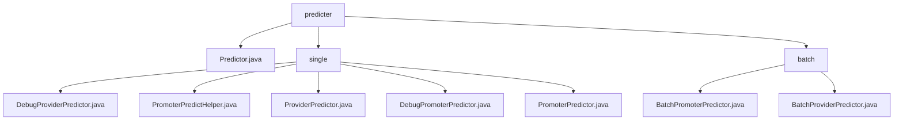

# Basic Information

|      |      |
|------|------|
| Name | predicter |
| Language | .java |
| Code Path | WeFe/serving/serving-service/src/main/java/com/welab/wefe/serving/service/predicter |
| Package Name | docs.serving.serving-service.src.main.java.com.welab.wefe.serving.service.predicter |
| Brief Description | This module provides federated learning prediction functionality, supporting standard/debug modes, including single-user/batch prediction, collaborator API calls, and feature retrieval. Key classes include Predictor, PromoterPredictHelper, etc., and rely on model and feature management services. It is suitable for multi-party data collaboration scenarios such as financial risk control. |

# Description

## Overview  
This module serves as a prediction engine in a federated learning environment, with its core responsibility being to coordinate multi-party data for joint prediction, supporting standard mode, batch processing, and debugging scenarios. It unifies interface specifications through the Predictor class family, including single prediction (`predict`), batch prediction (`batch`), and debugging prediction (`debug`) methods. Key data structures encompass `PredictFeatureDataSource` for feature sources, `FederatedPredictParam` for request parameters, and model/user ID mapping tables. External dependencies involve `ModelManager`, `FeatureManager`, HTTP clients, and JNI calls. For instance, `DebugProviderPredictor` supports SQL feature replay, while `BatchPromoterPredictor` enables cross-node batch prediction via `federatedResultByProviders`.

## Core Business Scenarios  
The module handles three typical workflows: 1) Standard prediction, where `PromoterPredictor` coordinates computations across multiple collaborators; 2) Batch prediction, handled by classes prefixed with `Batch` for user lists; 3) Debugging workflows, locally simulated via `Debug` classes. The interaction model resembles a master-slave architecture, following the "initialization → fetch model/features → federated invocation → result aggregation" pipeline, with exception handling and logging audits throughout. For example, in financial risk control scenarios, a bank (initiator) collaborates with partners to complete credit score predictions, leveraging the retry mechanism of `PromoterPredictHelper` to ensure communication reliability. API integration covers three types of interfaces—model fetching, feature querying, and federated communication—forming a complete prediction loop.

### Package Internal Structure View

This flowchart illustrates the hierarchical structure of the predictor module in the WeFe project. The top level is the predicter directory, which contains the main class Predictor.java and two subdirectories: single (for singleton predictors) and batch (for batch predictors). The single directory includes 5 specific predictor implementation classes, while the batch directory contains 2 batch predictor implementation classes, clearly reflecting the file organization structure of the predictor module.

# File List

| Name   | Type  | Description |
|-------|------|-------------|
| [Predictor.java](Predictor.md) | file | The Predictor class provides prediction functionality, including single and batch prediction methods, supports debug mode, selects different predictors based on roles and federated learning types, records prediction scores, and handles sensitive data. |
| [single](single/_module.md) | package | DebugProviderPredictor is used for debugging mode prediction, containing featureSource and extendParams attributes. PromoterPredictHelper handles prediction calls, including API invocation, parameter construction, and logging. ProviderPredictor provides prediction functionality by obtaining models through ModelManager. DebugPromoterPredictor is designed for debugging scenarios and supports multiple feature data acquisition methods. PromoterPredictor implements prediction functionality, involving model management and collaborator invocation. |
| [batch](batch/_module.md) | package | BatchPromoterPredictor is the initiator batch predictor for vertical federated learning, handling model acquisition, federated prediction, and feature lookup. BatchProviderPredictor is a batch predictor that encapsulates model and feature data retrieval logic. Both inherit from an abstract class and support batch user prediction. |

