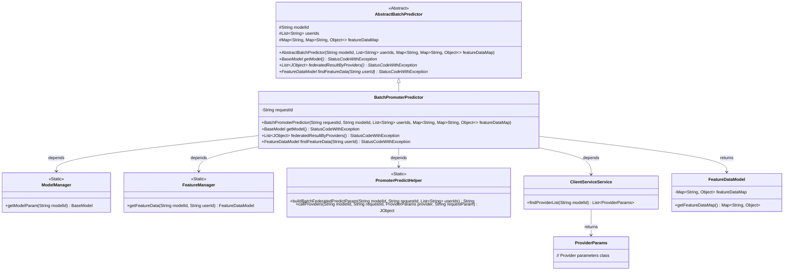
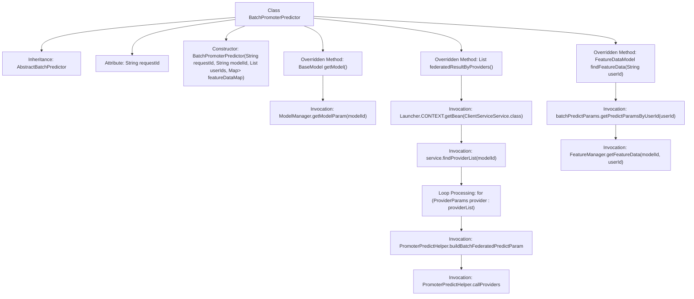

# Basic Information

|      |      |
|------|------|
| Name | BatchPromoterPredictor |
| Language | .java |
| Code Path | WeFe/serving/serving-service/src/main/java/com/welab/wefe/serving/service/predicter/batch/BatchPromoterPredictor.java |
| Package Name | com.welab.wefe.serving.service.predicter.batch |
| Dependencies | ['com.welab.wefe.common.StatusCode', 'com.welab.wefe.common.exception.StatusCodeWithException', 'com.welab.wefe.common.util.JObject', 'com.welab.wefe.common.web.Launcher', 'com.welab.wefe.serving.sdk.dto.ProviderParams', 'com.welab.wefe.serving.sdk.model.BaseModel', 'com.welab.wefe.serving.sdk.model.FeatureDataModel', 'com.welab.wefe.serving.sdk.predicter.batch.AbstractBatchPredictor', 'com.welab.wefe.serving.service.manager.FeatureManager', 'com.welab.wefe.serving.service.manager.ModelManager', 'com.welab.wefe.serving.service.predicter.single.PromoterPredictHelper', 'com.welab.wefe.serving.service.service.ClientServiceService', 'org.apache.commons.collections4.CollectionUtils', 'org.apache.commons.collections4.MapUtils', 'java.util.ArrayList', 'java.util.List', 'java.util.Map'] |
| Brief Description | The BatchPromoterPredictor class inherits from AbstractBatchPredictor and implements batch prediction functionality. It includes requestId, retrieves the model via getModel, invokes collaborators for federated prediction through federatedResultByProviders, and obtains user feature data via findFeatureData. |

# Description

BatchPromoterPredictor is a batch predictor class inherited from AbstractBatchPredictor, primarily designed to handle the initiator prediction tasks in vertical federated learning. This class contains a requestId member variable and initializes the parent class's modelId, userIds, and featureDataMap parameters through its constructor. Its key functionalities include: retrieving model parameters from ModelManager via the getModel method; performing federated prediction with collaborators through the federatedResultByProviders method, which utilizes the PromoterPredictHelper utility class to construct request parameters and obtain responses; and locating user feature data via the findFeatureData method, prioritizing local parameters and falling back to FeatureManager if unavailable. The class throws a DATA_NOT_FOUND exception when the collaborator list is empty.

# Class Summary

| Name   | Type  | Description |
|-------|------|-------------|
| BatchPromoterPredictor | class | The `BatchPromoterPredictor` class inherits from `AbstractBatchPredictor` and implements batch prediction functionality. It includes methods for `requestId`, model retrieval, federated result processing, and feature data querying. |

## Class BatchPromoterPredictor

|      |      |
|------|------|
| Access Modifier | public |
| Type | class |
| Name | BatchPromoterPredictor |
| Description | The `BatchPromoterPredictor` class inherits from `AbstractBatchPredictor` and implements batch prediction functionality. It includes methods for `requestId`, model retrieval, federated result processing, and feature data querying. |

### UML Class Diagram

Class diagram description: BatchPromoterPredictor inherits from the abstract class AbstractBatchPredictor and implements batch prediction functionality. It retrieves model parameters via ModelManager, obtains feature data through FeatureManager, and uses PromoterPredictHelper to construct prediction parameters and invoke provider services. ClientServiceService is used to locate provider lists, while ProviderParams represents provider parameters. FeatureDataModel encapsulates feature data. The entire class diagram illustrates the collaboration relationships among components in a vertical federated prediction scenario.

### Internal Method Call Graph

This code demonstrates a batch predictor class `BatchPromoterPredictor`, which inherits from `AbstractBatchPredictor` and is primarily used for handling prediction tasks in federated learning. The class contains three core methods: `getModel()` for retrieving model parameters, `federatedResultByProviders()` for obtaining federated prediction results by invoking collaborator services, and `findFeatureData()` for locating user feature data. The flowchart clearly illustrates the class inheritance relationship, attribute definitions, method invocation chains, and loop processing logic, particularly highlighting the interaction process with multiple external components during federated prediction.

### Field List

| Name  | Type  | Description |
|-------|-------|------|
| requestId | String | The private string variable requestId is used to uniquely identify a request. |

### Method List

| Name  | Type  | Description |
|-------|-------|------|
| findFeatureData | FeatureDataModel | Method to retrieve feature data based on user ID: If the user's feature data exists in the batch prediction parameters, return it; otherwise, fetch it from the feature manager. |
| getModel | BaseModel | Retrieve the model parameters for the specified ID, throwing an exception on failure. |
| federatedResultByProviders | List<JObject> | The method retrieves a list of collaborators through the service, throwing an exception if it is empty. It iterates through the collaborators, constructs prediction parameters, invokes their interfaces, and returns the aggregated results. |

