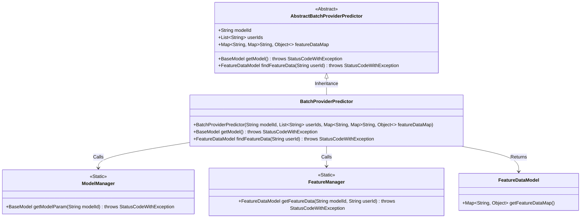
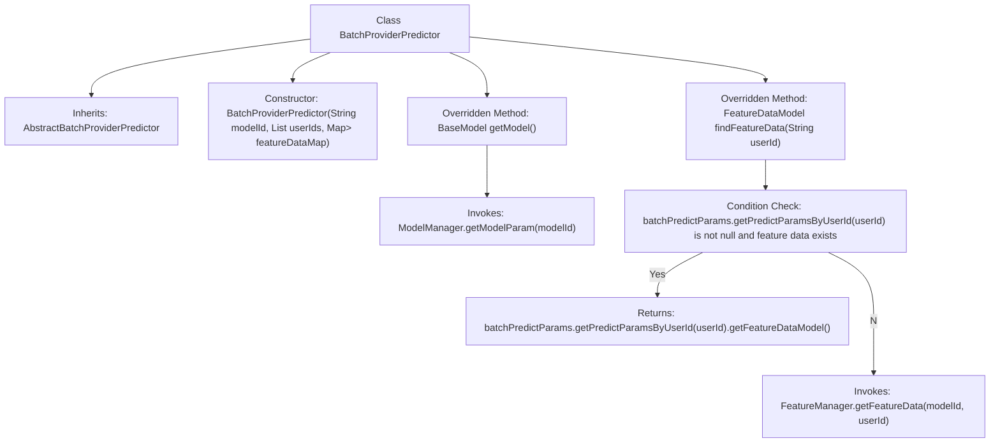

# Basic Information

|      |      |
|------|------|
| Name | BatchProviderPredictor |
| Language | .java |
| Code Path | WeFe/serving/serving-service/src/main/java/com/welab/wefe/serving/service/predicter/batch/BatchProviderPredictor.java |
| Package Name | com.welab.wefe.serving.service.predicter.batch |
| Dependencies | ['com.welab.wefe.common.exception.StatusCodeWithException', 'com.welab.wefe.serving.sdk.model.BaseModel', 'com.welab.wefe.serving.sdk.model.FeatureDataModel', 'com.welab.wefe.serving.sdk.predicter.batch.AbstractBatchProviderPredictor', 'com.welab.wefe.serving.service.manager.FeatureManager', 'com.welab.wefe.serving.service.manager.ModelManager', 'org.apache.commons.collections4.MapUtils', 'java.util.List', 'java.util.Map'] |
| Brief Description | The `BatchProviderPredictor` class inherits from `AbstractBatchProviderPredictor` and is initialized with `modelId`, `userIds`, and `featureDataMap`. It provides methods to retrieve model and user feature data, prioritizing reading from `batchPredictParams` and falling back to `FeatureManager` if the data is not found. |

# Description

The `BatchProviderPredictor` class inherits from `AbstractBatchProviderPredictor` and is designed for batch prediction. Its constructor accepts a model ID, a list of user IDs, and a feature data map. It provides two core methods: `getModel` retrieves model parameters via `ModelManager`, while `findFeatureData` looks up feature data based on user IDs, prioritizing retrieval from `batchPredictParams` and falling back to `FeatureManager` if unavailable. This class encapsulates the logic for fetching both model and feature data, supporting batch user prediction scenarios.

# Class Summary

| Name   | Type  | Description |
|-------|------|-------------|
| BatchProviderPredictor | class | The `BatchProviderPredictor` class inherits from `AbstractBatchProviderPredictor` and provides batch prediction functionality. The constructor accepts a model ID, a list of user IDs, and feature data. It overrides the `getModel` method to retrieve model parameters and the `findFeatureData` method to look up feature data based on user IDs, prioritizing the feature data from batch prediction parameters if available; otherwise, it fetches from `FeatureManager`. |

## Class BatchProviderPredictor

|      |      |
|------|------|
| Access Modifier | public |
| Type | class |
| Name | BatchProviderPredictor |
| Description | The `BatchProviderPredictor` class inherits from `AbstractBatchProviderPredictor` and provides batch prediction functionality. The constructor accepts a model ID, a list of user IDs, and feature data. It overrides the `getModel` method to retrieve model parameters and the `findFeatureData` method to look up feature data based on user IDs, prioritizing the feature data from batch prediction parameters if available; otherwise, it fetches from `FeatureManager`. |

### UML Class Diagram

This class diagram illustrates that BatchProviderPredictor inherits from AbstractBatchProviderPredictor and implements core functionalities for retrieving models and feature data. It utilizes two static utility classes, ModelManager and FeatureManager, to obtain model parameters and feature data, ultimately returning a FeatureDataModel object. The diagram clearly depicts inheritance relationships and dependency calls between classes, with FeatureDataModel serving as a data carrier used by multiple classes.

### Internal Method Call Graph

This flowchart illustrates the structure and method invocation relationships of the BatchProviderPredictor class. The class inherits from AbstractBatchProviderPredictor and includes a constructor and two overridden methods. The getModel() method retrieves model parameters via ModelManager, while findFeatureData() first checks if user prediction parameters and feature data exist—returning local data if present, otherwise fetching feature data through FeatureManager. The flow clearly demonstrates conditional branching and external dependency calls.

### Field List

| Name  | Type  | Description |
|-------|-------|------|

### Method List

| Name  | Type  | Description |
|-------|-------|------|
| findFeatureData | FeatureDataModel | The method retrieves feature data based on user ID, prioritizing the feature data in batch prediction parameters. If not found, it fetches the data from the feature manager. |
| getModel | BaseModel | The method `getModel` calls `ModelManager` to retrieve the model parameters for the specified `modelId`, and may throw a `StatusCodeWithException` exception. |

