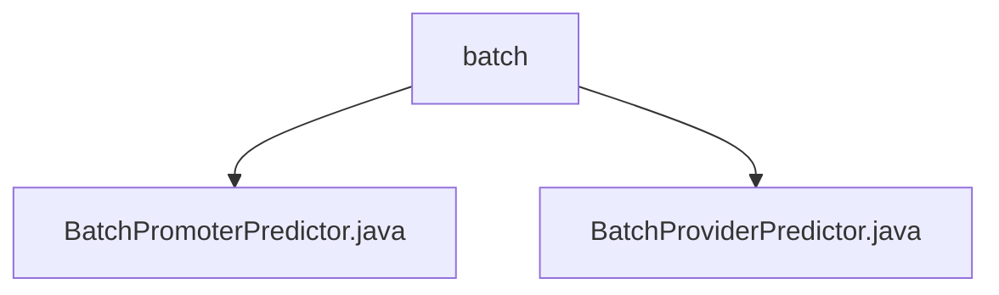

# Basic Information

|      |      |
|------|------|
| Name | batch |
| Language | .java |
| Code Path | WeFe/serving/serving-service/src/main/java/com/welab/wefe/serving/service/predicter/batch |
| Package Name | docs.serving.serving-service.src.main.java.com.welab.wefe.serving.service.predicter.batch |
| Brief Description | BatchPromoterPredictor is the initiator batch predictor for vertical federated learning, handling model acquisition, federated prediction, and feature lookup. BatchProviderPredictor is a batch predictor that encapsulates model and feature data retrieval logic. Both inherit from an abstract class and support batch user prediction. |

# Description

## Overview  
This module is a batch predictor component in vertical federated learning, comprising two types of predictors: the initiator (BatchPromoterPredictor) and the collaborator (BatchProviderPredictor). Its core responsibility is to coordinate multi-party feature data and model parameters to complete joint predictions. The interface specifications include: uniformly obtaining model parameters from ModelManager via `getModel`; acquiring feature data by priority (local cache → FeatureManager) via `findFeatureData`; and the initiator needing to construct federated requests through PromoterPredictHelper. Key data structures include model ID, user ID lists, and feature data mapping tables. External dependencies include ModelManager, FeatureManager, and the PromoterPredictHelper utility class. For example, BatchPromoterPredictor initiates cross-node predictions via `federatedResultByProviders`.  

## Key Business Scenarios  
The typical workflow is: 1) Load models and user features during initialization; 2) The initiator invokes collaborator data via JNI calls; 3) Aggregate results to return predicted values. The interaction pattern resembles a master-slave architecture, with the initiator acting as the coordinating node to drive the process. Functional completeness is reflected in support for batch user processing, local cache optimization, and exception handling (e.g., throwing DATA_NOT_FOUND for empty collaborator lists). Application scenarios include joint modeling for financial risk control, such as a bank (initiator) collaborating with multiple institutions (collaborators) to complete customer credit score predictions. API types encompass model acquisition, feature query, and federated communication interfaces.

### Package Internal Structure View

This flowchart illustrates the file structure relationships of batch predictors in the WeFe project. The root node "batch" contains two Java implementation classes: BatchPromoterPredictor and BatchProviderPredictor. Both classes reside under the batch predictor package of the serving-service module and are designed to implement different types of batch prediction functionalities.

# File List

| Name   | Type  | Description |
|-------|------|-------------|
| [BatchPromoterPredictor.java](BatchPromoterPredictor.md) | file | The BatchPromoterPredictor class inherits from AbstractBatchPredictor and implements batch prediction functionality. It includes requestId, retrieves the model via getModel, invokes federated prediction with collaborators through federatedResultByProviders, and obtains user feature data using findFeatureData. |
| [BatchProviderPredictor.java](BatchProviderPredictor.md) | file | The `BatchProviderPredictor` class inherits from `AbstractBatchProviderPredictor` and is initialized via `modelId`, `userIds`, and `featureDataMap`. It provides methods for retrieving model and user feature data, prioritizing reading from `batchPredictParams` and falling back to `FeatureManager` if unavailable. |

