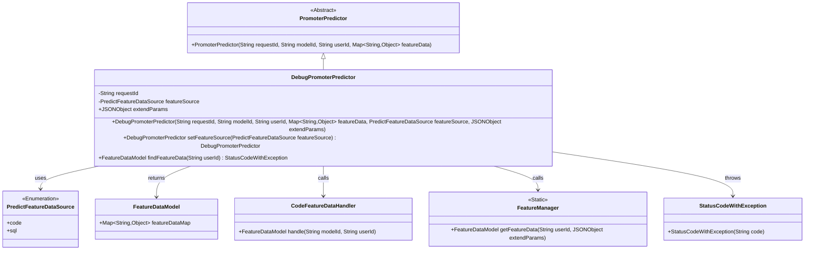

# Basic Information

|      |      |
|------|------|
| Name | DebugPromoterPredictor |
| Language | .java |
| Code Path | WeFe/serving/serving-service/src/main/java/com/welab/wefe/serving/service/predicter/single/DebugPromoterPredictor.java |
| Package Name | com.welab.wefe.serving.service.predicter.single |
| Dependencies | ['com.alibaba.fastjson.JSONObject', 'com.welab.wefe.common.exception.StatusCodeWithException', 'com.welab.wefe.common.wefe.enums.PredictFeatureDataSource', 'com.welab.wefe.serving.sdk.model.FeatureDataModel', 'com.welab.wefe.serving.service.feature.CodeFeatureDataHandler', 'com.welab.wefe.serving.service.manager.FeatureManager', 'org.apache.commons.collections4.MapUtils', 'java.util.Map', 'com.welab.wefe.common.StatusCode.UNEXPECTED_ENUM_CASE'] |
| Brief Description | DebugPromoterPredictor inherits from PromoterPredictor and is used for debugging predictors. It contains attributes such as requestId, featureSource, and extendParams, providing methods to set featureSource and functionality to obtain feature data from different sources. It supports two types of feature data sources: code and SQL. |

# Description

DebugPromoterPredictor is a subclass of PromoterPredictor, designed for prediction functionality in debugging scenarios. It includes properties such as requestId, featureSource, and extendParams, which are initialized via the constructor along with parent class parameters. The setFeatureSource method is provided to configure the feature data source. It overrides the findFeatureData method, selecting different approaches to fetch feature data based on the featureSource enum value: if feature data already exists, it returns directly; otherwise, it retrieves via code or SQL; if neither is available, it throws an exception.

# Class Summary

| Name   | Type  | Description |
|-------|------|-------------|
| DebugPromoterPredictor | class | The DebugPromoterPredictor inherits from PromoterPredictor and is used for debugging predictors. It includes properties such as requestId, featureSource, and extendParams. The constructor initializes parameters, and the setFeatureSource method sets the data source. The findFeatureData method selects the processing approach based on featureSource: it calls CodeFeatureDataHandler for "code," FeatureManager for "sql," and throws an exception otherwise. |


## Class DebugPromoterPredictor

|      |      |
|------|------|
| Access Modifier | public |
| Type | class |
| Name | DebugPromoterPredictor |
| Description | The DebugPromoterPredictor inherits from PromoterPredictor and is used for debugging predictors. It includes properties such as requestId, featureSource, and extendParams. The constructor initializes parameters, and the setFeatureSource method sets the data source. The findFeatureData method selects the processing approach based on featureSource: it calls CodeFeatureDataHandler for "code," FeatureManager for "sql," and throws an exception otherwise. |


### UML Class Diagram



Class diagram description: DebugPromoterPredictor inherits from the abstract class PromoterPredictor and includes the enumeration type PredictFeatureDataSource to identify feature data sources. It retrieves feature data through CodeFeatureDataHandler and FeatureManager, returning a FeatureDataModel object. When exceptions occur, it throws StatusCodeWithException. This class is primarily used for feature data prediction processing in debugging scenarios.


### Internal Method Call Graph

```mermaid
graph TD
    A["Class DebugPromoterPredictor"]
    B["Inherits from: PromoterPredictor"]
    C["Property: String requestId"]
    D["Property: PredictFeatureDataSource featureSource"]
    E["Property: JSONObject extendParams"]
    F["Constructor: DebugPromoterPredictor(String requestId, String modelId, String userId, Map<String, Object> featureData, PredictFeatureDataSource featureSource, JSONObject extendParams)"]
    G["Method: setFeatureSource(PredictFeatureDataSource featureSource)"]
    H["Overridden method: findFeatureData(String userId)"]
    I["Condition: MapUtils.isNotEmpty(featureDataMap)"]
    J["Branch: featureSource == code"]
    K["Branch: featureSource == sql"]
    L["Exception handling: throw StatusCodeWithException"]

    A --> B
    A --> C
    A --> D
    A --> E
    A --> F
    A --> G
    A --> H
    H --> I
    I --"Yes"--> H
    I --"No"--> J
    J --"code"--> K
    J --"sql"--> L
    K --> "new CodeFeatureDataHandler().handle()"
    L --> "FeatureManager.getFeatureData()"
    J --"default"--> "throw UNEXPECTED_ENUM_CASE"
```

This code demonstrates a debug predictor class that inherits from a base predictor class. Its core functionality is to retrieve feature data through the findFeatureData method based on different feature data sources (code/sql), incorporating null checks, enum branch handling, and exception throwing mechanisms. The flowchart clearly presents property inheritance relationships, constructor chaining calls, and the branching logic for feature data acquisition, particularly highlighting three processing paths for the featureSource enum values. The class design employs the builder pattern (setFeatureSource returns this) and rigorously handles edge cases (empty feature data/invalid enum values).

### Field List

| Name  | Type  | Description |
|-------|-------|------|
| extendParams | JSONObject | Extended parameter field, of type JSON object. |
| featureSource | PredictFeatureDataSource | Protection type PredictFeatureDataSource variable featureSource. |
| requestId | String | Protect the string-type request ID. |

### Method List

| Name  | Type  | Description |
|-------|-------|------|
| setFeatureSource | DebugPromoterPredictor | This is a Java method used to set the feature data source and return the current object instance, supporting chained invocation. |
| findFeatureData | FeatureDataModel | The method retrieves feature data based on user ID. If data already exists, it returns directly; otherwise, it processes by source: code calls CodeFeatureDataHandler, sql calls FeatureManager, and other cases throw an exception. |


