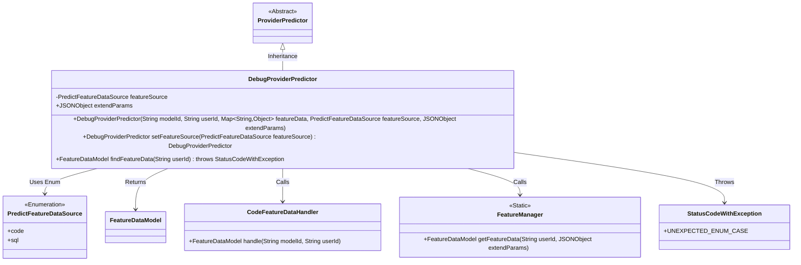
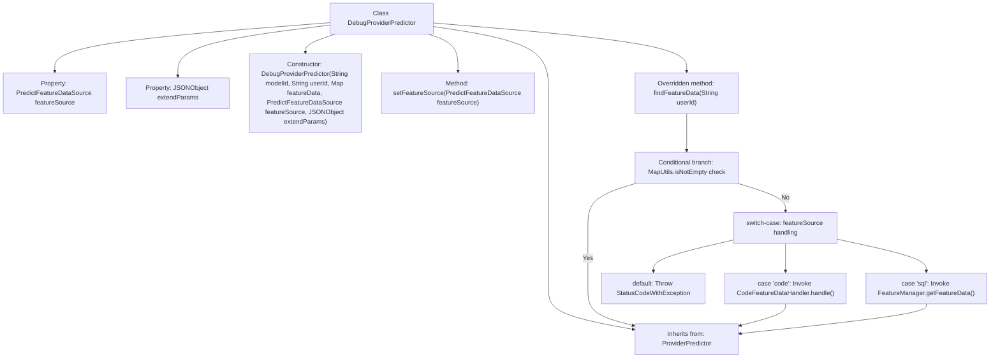

# Basic Information

|      |      |
|------|------|
| Name | DebugProviderPredictor |
| Language | .java |
| Code Path | WeFe/serving/serving-service/src/main/java/com/welab/wefe/serving/service/predicter/single/DebugProviderPredictor.java |
| Package Name | com.welab.wefe.serving.service.predicter.single |
| Dependencies | ['com.alibaba.fastjson.JSONObject', 'com.welab.wefe.common.exception.StatusCodeWithException', 'com.welab.wefe.common.wefe.enums.PredictFeatureDataSource', 'com.welab.wefe.serving.sdk.model.FeatureDataModel', 'com.welab.wefe.serving.service.feature.CodeFeatureDataHandler', 'com.welab.wefe.serving.service.manager.FeatureManager', 'org.apache.commons.collections4.MapUtils', 'java.util.Map', 'com.welab.wefe.common.StatusCode.UNEXPECTED_ENUM_CASE'] |
| Brief Description | DebugProviderPredictor inherits from ProviderPredictor and is used for debugging prediction functionality. It includes a feature data source featureSource and extended parameters extendParams. The constructor initializes parameters such as model ID and user ID. It provides a method to set the feature data source and overrides the findFeatureData method to process feature data based on the data source type. |

# Description

DebugProviderPredictor is a subclass of ProviderPredictor, designed for prediction functionality in debug mode. It includes properties such as featureSource of type PredictFeatureDataSource and extendParams of type JSONObject. The constructor accepts parameters including modelId, userId, featureData, featureSource, and extendParams. It provides the setFeatureSource method for setting featureSource and returns the current object. The findFeatureData method is overridden to retrieve feature data based on different sources of featureSource (code or sql). If the featureDataMap is not empty, it returns directly; otherwise, it throws an exception.

# Class Summary

| Name   | Type  | Description |
|-------|------|-------------|
| DebugProviderPredictor | class | DebugProviderPredictor inherits from ProviderPredictor and includes the featureSource and extendParams attributes. It provides a method for setting the data source, returns feature data based on the data source type, and supports both code and SQL processing methods. |

## Class DebugProviderPredictor

|      |      |
|------|------|
| Access Modifier | public |
| Type | class |
| Name | DebugProviderPredictor |
| Description | DebugProviderPredictor inherits from ProviderPredictor and includes the featureSource and extendParams attributes. It provides a method for setting the data source, returns feature data based on the data source type, and supports both code and SQL processing methods. |

### UML Class Diagram

This code demonstrates a debug predictor class `DebugProviderPredictor` that inherits from the abstract class `ProviderPredictor`. Its main functionality is to retrieve feature data based on different feature data sources (enum `PredictFeatureDataSource`), supporting both code and SQL approaches. The class includes a chainable setter method `setFeatureSource` and may throw `StatusCodeWithException` exceptions. It implements specific data retrieval logic through two helper classes, `CodeFeatureDataHandler` and `FeatureManager`, ultimately returning a `FeatureDataModel` object. The overall design reflects the strategy pattern concept, switching between different data processing methods via enum values.

### Internal Method Call Graph

This flowchart illustrates the structure and workflow of the DebugProviderPredictor class. The class inherits from ProviderPredictor and contains two main properties and three core methods. It details the execution logic of the findFeatureData method: first checking if the feature data map is non-empty, otherwise processing code/sql data sources based on the featureSource enum value, with exceptions thrown by default. The constructor and chained method setFeatureSource initialize object states. The entire flow demonstrates flexible feature data acquisition and exception control mechanisms.

### Field List

| Name  | Type  | Description |
|-------|-------|------|
| featureSource | PredictFeatureDataSource | Protected member variable `featureSource`, of type `PredictFeatureDataSource`. |
| extendParams | JSONObject | Extended parameter field for storing additional parameters in JSON format. |

### Method List

| Name  | Type  | Description |
|-------|-------|------|
| setFeatureSource | DebugProviderPredictor | Set the feature data source and return the current object instance. |
| findFeatureData | FeatureDataModel | Method to retrieve feature data by user ID: If data exists in predictParams, return it directly; otherwise, process according to featureSource (code calls CodeFeatureDataHandler, sql calls FeatureManager), and throw an exception if no match is found. |

