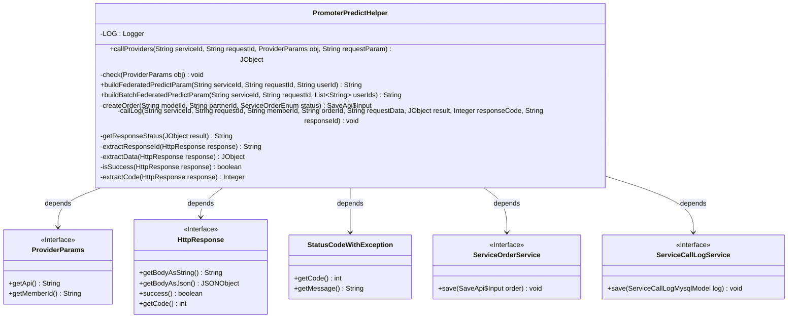
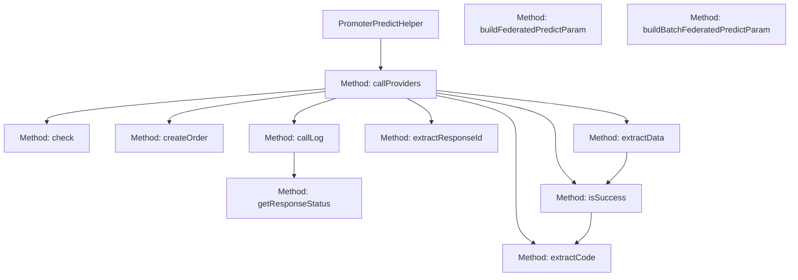
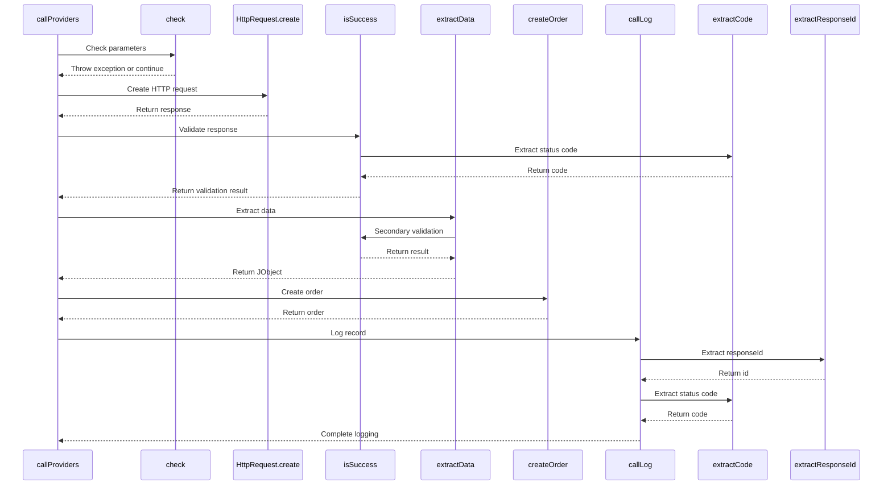

# Basic Information

|      |      |
|------|------|
| Name | PromoterPredictHelper |
| Language | .java |
| Code Path | WeFe/serving/serving-service/src/main/java/com/welab/wefe/serving/service/predicter/single/PromoterPredictHelper.java |
| Package Name | com.welab.wefe.serving.service.predicter.single |
| Dependencies | ['com.alibaba.fastjson.JSONObject', 'com.welab.wefe.common.StatusCode', 'com.welab.wefe.common.exception.StatusCodeWithException', 'com.welab.wefe.common.http.HttpRequest', 'com.welab.wefe.common.http.HttpResponse', 'com.welab.wefe.common.util.JObject', 'com.welab.wefe.common.util.RSAUtil', 'com.welab.wefe.common.util.SignUtil', 'com.welab.wefe.common.util.StringUtil', 'com.welab.wefe.common.web.Launcher', 'com.welab.wefe.serving.sdk.config.Config', 'com.welab.wefe.serving.sdk.dto.ProviderParams', 'com.welab.wefe.serving.service.api.serviceorder.SaveApi', 'com.welab.wefe.serving.service.database.entity.ServiceCallLogMysqlModel', 'com.welab.wefe.serving.service.enums.CallByMeEnum', 'com.welab.wefe.serving.service.enums.ServiceCallStatusEnum', 'com.welab.wefe.serving.service.enums.ServiceOrderEnum', 'com.welab.wefe.serving.service.enums.ServiceTypeEnum', 'com.welab.wefe.serving.service.service.CacheObjects', 'com.welab.wefe.serving.service.service.ServiceCallLogService', 'com.welab.wefe.serving.service.service.ServiceOrderService', 'com.welab.wefe.serving.service.utils.ServiceUtil', 'org.slf4j.Logger', 'org.slf4j.LoggerFactory', 'java.util.List', 'java.util.TreeMap'] |
| Brief Description | The PromoterPredictHelper class provides collaborative party prediction service invocation functions, including parameter validation, HTTP requests, response processing, order and log recording. It supports both single-user and batch-user prediction requests, using signatures to ensure data security. |

# Description

The `PromoterPredictHelper` class is a utility class designed for handling service prediction calls, with primary functionalities including invoking partner APIs, constructing request parameters, recording orders and logs, etc. The class defines the `callProviders` method, which is responsible for sending HTTP requests and processing responses, encompassing parameter validation, retry mechanisms, and error handling. Additionally, it provides the `buildFederatedPredictParam` and `buildBatchFederatedPredictParam` methods for constructing prediction request parameters for single and batch users, involving signature generation and data encapsulation. Order and call log recording are implemented through the `createOrder` and `callLog` methods, which save service call details and statuses. Auxiliary methods such as `extractData` and `isSuccess` are used for parsing and validating response data. The overall design emphasizes exception handling and log tracing to ensure the reliability and auditability of service calls.

# Class Summary

| Name   | Type  | Description |
|-------|------|-------------|
| PromoterPredictHelper | class | The `PromoterPredictHelper` class provides collaborative prediction service invocation capabilities, including request parameter validation, HTTP calls, response processing, order and log recording. It supports both single-user and batch-user predictions, using signatures to ensure data security. It handles exceptions and records statuses. |

## Class PromoterPredictHelper

|      |      |
|------|------|
| Access Modifier | public |
| Type | class |
| Name | PromoterPredictHelper |
| Description | The `PromoterPredictHelper` class provides collaborative prediction service invocation capabilities, including request parameter validation, HTTP calls, response processing, order and log recording. It supports both single-user and batch-user predictions, using signatures to ensure data security. It handles exceptions and records statuses. |

### UML Class Diagram

This code defines a utility class named PromoterPredictHelper, primarily designed to handle operations related to prediction services. It provides functionalities such as invoking partner services, constructing request parameters, creating orders, and logging activities. The class contains multiple static methods involving parameter validation, HTTP request processing, data extraction, and status determination logic. It depends on several external interfaces like ProviderParams and HttpResponse, and interacts with ServiceOrderService and ServiceCallLogService to persist order and log data. The overall design reflects a complete processing chain for service invocation flows, including exception handling and post-operation logging.

### Internal Method Call Graph

The flowchart illustrates the core method invocation relationships within the PromoterPredictHelper class, where callProviders serves as the main entry point to sequentially invoke sub-methods such as parameter checking, HTTP requests, response validation, and data extraction, ultimately completing order creation and logging. The sequence diagram details the interaction flow during callProviders execution, including exception handling paths and critical data extraction steps, reflecting comprehensive lifecycle management of remote service calls.

### Field List

| Name  | Type  | Description |
|-------|-------|------|
| LOG = LoggerFactory.getLogger(PromoterPredictHelper.class) | Logger | The class PromoterPredictHelper defines a protected static constant LOG for logging purposes. |

### Method List

| Name  | Type  | Description |
|-------|-------|------|
| buildBatchFederatedPredictParam | String | Construct batch joint prediction parameters, including service ID, request ID, and user ID list. Use TreeMap to ensure parameter ordering, generate JSON data and sign it, and finally return a JSON string containing member code, signature, and data. |
| createOrder | SaveApi.Input | Method for creating an order: Construct an order object based on the model ID, partner ID, and status, set service information, partner information, and order type, then save and return the order. |
| callLog | void | The method `callLog` records service invocation logs, including service type, order ID, request data, response code, etc., and saves them to the database. |
| callProviders | JObject | Invoke the service provider method, verify the parameters, then send an HTTP request. Process and return data upon success; log exceptions and throw errors upon failure. |
| getResponseStatus | String | The method returns a response status based on the result object: if the result is null, it returns an error status; otherwise, it returns a success status. |
| buildFederatedPredictParam | String | Construct federated prediction parameters, including serviceId, requestId, userId, etc., sort them to generate JSON data and sign it, and finally return a JSON string containing the signature and data. |
| check | void | Check if the collaborator's request address is empty. If it is empty, report an error and prompt to configure the address. |
| extractResponseId | String | Extract the responseId from the HTTP response, or return an empty string if the response is invalid or does not exist. |
| extractData | JObject | Extract HTTP response data, returning the `data` field from JSON on success, or an empty object on failure. |
| isSuccess | boolean | Check if the HTTP response is successful: the response is non-empty, the status code is 200, the JSON data has a code of 0, and contains a data field. |
| extractCode | Integer | This method extracts the status code from the HTTP response. If the response is invalid or not 200, it returns a system error code; otherwise, it returns the value of the "code" field in the JSON body. |

