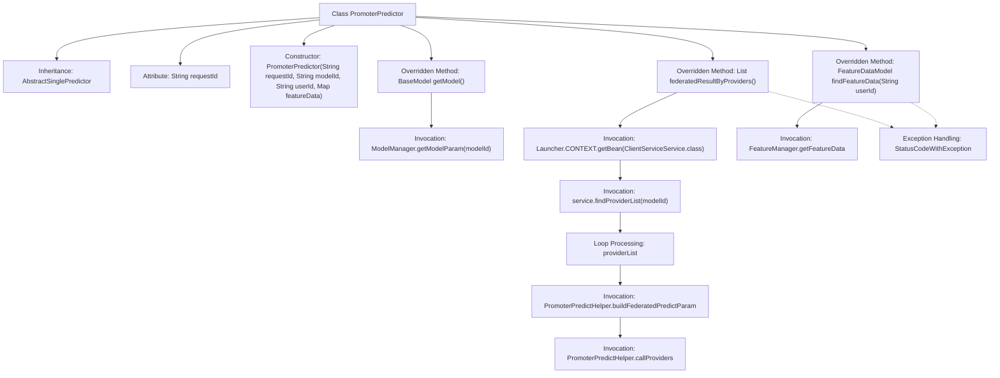

# Basic Information

|      |      |
|------|------|
| Name | PromoterPredictor |
| Language | .java |
| Code Path | WeFe/serving/serving-service/src/main/java/com/welab/wefe/serving/service/predicter/single/PromoterPredictor.java |
| Package Name | com.welab.wefe.serving.service.predicter.single |
| Dependencies | ['com.welab.wefe.common.StatusCode', 'com.welab.wefe.common.exception.StatusCodeWithException', 'com.welab.wefe.common.util.JObject', 'com.welab.wefe.common.web.Launcher', 'com.welab.wefe.serving.sdk.dto.ProviderParams', 'com.welab.wefe.serving.sdk.model.BaseModel', 'com.welab.wefe.serving.sdk.model.FeatureDataModel', 'com.welab.wefe.serving.sdk.predicter.single.AbstractSinglePredictor', 'com.welab.wefe.serving.service.manager.FeatureManager', 'com.welab.wefe.serving.service.manager.ModelManager', 'com.welab.wefe.serving.service.service.ClientServiceService', 'org.apache.commons.collections4.CollectionUtils', 'org.apache.commons.collections4.MapUtils', 'java.util.ArrayList', 'java.util.List', 'java.util.Map'] |
| Brief Description | The PromoterPredictor class inherits from AbstractSinglePredictor and implements vertical federated prediction functionality. It includes methods for requestId initialization, obtaining model parameters, invoking collaborator computations for federated results, and querying feature data. Key aspects: federated result aggregation, exception handling, and feature data management. |

# Description

The `PromoterPredictor` class inherits from `AbstractSinglePredictor` and is used to implement prediction functionality. The constructor accepts parameters including `requestId`, `modelId`, `userId`, and `featureData`. The class contains three main methods: `getModel` retrieves model parameters; `federatedResultByProviders` obtains federated prediction results by invoking collaborator services, throwing an exception if the collaborator list is empty; and `findFeatureData` searches for feature data, prioritizing the use of feature data from `predictParams` and falling back to `FeatureManager` if it does not exist. This class involves functionalities such as model management, collaborator invocation, and feature data processing.

# Class Summary

| Name   | Type  | Description |
|-------|------|-------------|
| PromoterPredictor | class | The `PromoterPredictor` class inherits from `AbstractSinglePredictor` and implements vertical federated prediction functionality, including request ID processing, model retrieval, collaborator result aggregation, and feature data query methods. |

## Class PromoterPredictor

|      |      |
|------|------|
| Access Modifier | public |
| Type | class |
| Name | PromoterPredictor |
| Description | The `PromoterPredictor` class inherits from `AbstractSinglePredictor` and implements vertical federated prediction functionality, including request ID processing, model retrieval, collaborator result aggregation, and feature data query methods. |

### UML Class Diagram

```mermaid
classDiagram
    class AbstractSinglePredictor {
        <<Abstract>>
        #String modelId
        #String userId
        #Map~String, Object~ featureData
        +AbstractSinglePredictor(String modelId, String userId, Map~String, Object~ featureData)
        +BaseModel getModel() throws StatusCodeWithException
        +List~JObject~ federatedResultByProviders() throws StatusCodeWithException
        +FeatureDataModel findFeatureData(String userId) throws StatusCodeWithException
    }

    class PromoterPredictor {
        -String requestId
        +PromoterPredictor(String requestId, String modelId, String userId, Map~String, Object~ featureData)
        +BaseModel getModel() throws StatusCodeWithException
        +List~JObject~ federatedResultByProviders() throws StatusCodeWithException
        +FeatureDataModel findFeatureData(String userId) throws StatusCodeWithException
    }

    class ClientServiceService {
        <<Interface>>
        +List~ProviderParams~ findProviderList(String modelId)
    }

    class ModelManager {
        <<Static>>
        +BaseModel getModelParam(String modelId)
    }

    class FeatureManager {
        <<Static>>
        +FeatureDataModel getFeatureData(String modelId, String userId)
    }

    class PromoterPredictHelper {
        <<Static>>
        +String buildFederatedPredictParam(String modelId, String requestId, String userId)
        +JObject callProviders(String modelId, String requestId, ProviderParams provider, String requestParam)
    }

    class ProviderParams {
        // Provider parameters class
    }

    class FeatureDataModel {
        -Map~String, Object~ featureDataMap
        +Map~String, Object~ getFeatureDataMap()
    }

    class JObject {
        // JSON object class
    }

    class StatusCodeWithException {
        // Custom exception class
    }

    AbstractSinglePredictor <|-- PromoterPredictor
    PromoterPredictor --> ClientServiceService : depends
    PromoterPredictor --> ModelManager : calls
    PromoterPredictor --> FeatureManager : calls
    PromoterPredictor --> PromoterPredictHelper : calls
    PromoterPredictor --> ProviderParams : uses
    PromoterPredictor --> FeatureDataModel : returns
    PromoterPredictor --> JObject : returns
    PromoterPredictor ..> StatusCodeWithException : throws
```

This class diagram illustrates how PromoterPredictor inherits from AbstractSinglePredictor and implements the core structure for federated prediction functionality. The PromoterPredictor obtains provider lists through ClientServiceService, uses PromoterPredictHelper to construct request parameters and invoke provider services, while relying on ModelManager and FeatureManager to acquire model parameters and feature data. The entire design reflects the collaborative workflow of vertical federated prediction, incorporating exception handling and interactions with multiple data types.

### Internal Method Call Graph

This flowchart illustrates the structure of the PromoterPredictor class and its key method invocation relationships. The class inherits from AbstractSinglePredictor, includes the requestId attribute and constructor, and overrides three core methods: getModel() retrieves model parameters via ModelManager, federatedResultByProviders() obtains provider lists through ClientServiceService for federated prediction, and findFeatureData() fetches feature data from FeatureManager. The diagram clearly depicts method call chains and exception handling paths, particularly highlighting the loop processing flow during federated prediction.

### Field List

| Name  | Type  | Description |
|-------|-------|------|
| requestId | String | The private string variable requestId is used to uniquely identify a request. |

### Method List

| Name  | Type  | Description |
|-------|-------|------|
| getModel | BaseModel | This method overrides getModel, invoking ModelManager to retrieve parameters for the specified modelId, and may throw a StatusCodeWithException. |
| federatedResultByProviders | List<JObject> | The method retrieves a list of collaborators through the service, throwing an exception if it is empty. It iterates through the collaborators, constructs prediction parameters, invokes their interfaces, and returns the aggregated results. |
| findFeatureData | FeatureDataModel | The method `findFeatureData` retrieves feature data based on the user ID. If the feature data in `predictParams` is not empty, it returns directly; otherwise, it calls `FeatureManager` to fetch the data. It may throw a `StatusCodeWithException` exception. |

