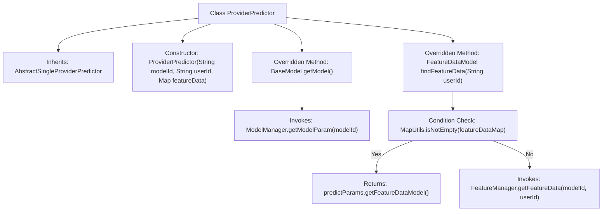

# Basic Information

|      |      |
|------|------|
| Name | ProviderPredictor |
| Language | .java |
| Code Path | WeFe/serving/serving-service/src/main/java/com/welab/wefe/serving/service/predicter/single/ProviderPredictor.java |
| Package Name | com.welab.wefe.serving.service.predicter.single |
| Dependencies | ['com.welab.wefe.common.exception.StatusCodeWithException', 'com.welab.wefe.serving.sdk.model.BaseModel', 'com.welab.wefe.serving.sdk.model.FeatureDataModel', 'com.welab.wefe.serving.sdk.predicter.single.AbstractSingleProviderPredictor', 'com.welab.wefe.serving.service.manager.FeatureManager', 'com.welab.wefe.serving.service.manager.ModelManager', 'org.apache.commons.collections4.MapUtils', 'java.util.Map'] |
| Brief Description | The `ProviderPredictor` class inherits from `AbstractSingleProviderPredictor`, providing methods to retrieve model and feature data by querying `ModelManager` and `FeatureManager` with `modelId` and `userId`. |

# Description

The ProviderPredictor class inherits from AbstractSingleProviderPredictor and is used to provide prediction functionality. The constructor accepts a model ID, user ID, and feature data. The overridden getModel method retrieves model parameters via ModelManager. The overridden findFeatureData method prioritizes using the feature data from prediction parameters; if unavailable, it fetches the specified model and user's feature data through FeatureManager.

# Class Summary

| Name   | Type  | Description |
|-------|------|-------------|
| ProviderPredictor | class | The ProviderPredictor class inherits from AbstractSingleProviderPredictor, providing methods to obtain models and feature data, implemented through ModelManager and FeatureManager. |


## Class ProviderPredictor

|      |      |
|------|------|
| Access Modifier | public |
| Type | class |
| Name | ProviderPredictor |
| Description | The ProviderPredictor class inherits from AbstractSingleProviderPredictor, providing methods to obtain models and feature data, implemented through ModelManager and FeatureManager. |


### UML Class Diagram

```mermaid
classDiagram
    class AbstractSingleProviderPredictor {
        <<Abstract>>
        +String modelId
        +String userId
        +Map~String, Object~ featureData
        +PredictParams predictParams
        +BaseModel getModel()*
        +FeatureDataModel findFeatureData(String userId)*
    }
    // AbstractSingleProviderPredictor is an abstract base class defining core prediction parameters and abstract methods

    class ProviderPredictor {
        +ProviderPredictor(String modelId, String userId, Map~String, Object~ featureData)
        +BaseModel getModel() throws StatusCodeWithException
        +FeatureDataModel findFeatureData(String userId) throws StatusCodeWithException
    }
    // ProviderPredictor implements concrete model and feature data retrieval logic

    class ModelManager {
        <<Static>>
        +BaseModel getModelParam(String modelId) throws StatusCodeWithException
    }
    // ModelManager provides static model retrieval methods

    class FeatureManager {
        <<Static>>
        +FeatureDataModel getFeatureData(String modelId, String userId) throws StatusCodeWithException
    }
    // FeatureManager provides static feature data retrieval methods

    class BaseModel {
        <<Interface>>
    }
    // BaseModel is the fundamental interface for model parameters

    class FeatureDataModel {
        -Map~String, Object~ featureDataMap
        +Map~String, Object~ getFeatureDataMap()
    }
    // FeatureDataModel encapsulates feature data mapping structure

    class PredictParams {
        -FeatureDataModel featureDataModel
        +FeatureDataModel getFeatureDataModel()
    }
    // PredictParams contains references to feature data models

    AbstractSingleProviderPredictor <|-- ProviderPredictor : Inheritance
    ProviderPredictor --> ModelManager : Calls\n: getModelParam()
    ProviderPredictor --> FeatureManager : Calls\n: getFeatureData()
    ProviderPredictor --> PredictParams : Accesses\n: featureDataModel
    ModelManager ..> BaseModel : Returns
    FeatureManager ..> FeatureDataModel : Returns
    PredictParams --> FeatureDataModel : Aggregation
```

Class Diagram Description: This structure illustrates the core hierarchy of a predictor implementation. ProviderPredictor inherits from the abstract class AbstractSingleProviderPredictor and implements its abstract methods, retrieving model parameters and feature data through static classes ModelManager and FeatureManager respectively. PredictParams aggregates FeatureDataModel to store feature data mappings, forming a modular prediction service architecture with clearly defined component responsibilities and error handling via exception mechanisms.


### Internal Method Call Graph



This flowchart illustrates the structure of the ProviderPredictor class, which inherits from AbstractSingleProviderPredictor and includes a constructor and two overridden methods. The getModel() method retrieves model parameters via ModelManager, while the findFeatureData() method first checks if the feature data map is non-empty. If empty, it fetches data through FeatureManager. The process clearly demonstrates conditional branching and external invocation relationships, comprehensively covering the class's primary behavioral logic.

### Field List

| Name  | Type  | Description |
|-------|-------|------|

### Method List

| Name  | Type  | Description |
|-------|-------|------|
| findFeatureData | FeatureDataModel | The method retrieves feature data based on the user ID. If the feature data in predictParams is not empty, it returns directly; otherwise, it fetches the data via FeatureManager. May throw a StatusCodeWithException. |
| getModel | BaseModel | Method override, call ModelManager to retrieve the model parameters for the specified modelId, which may throw a StatusCodeWithException. |


