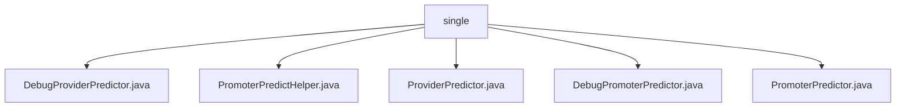

# Basic Information

|      |      |
|------|------|
| Name | single |
| Language | .java |
| Code Path | WeFe/serving/serving-service/src/main/java/com/welab/wefe/serving/service/predicter/single |
| Package Name | docs.serving.serving-service.src.main.java.com.welab.wefe.serving.service.predicter.single |
| Brief Description | DebugProviderPredictor is used for debugging mode prediction, containing featureSource and extendParams attributes. PromoterPredictHelper handles prediction calls, including API invocation, parameter construction, and logging. ProviderPredictor provides prediction functionality by obtaining models through ModelManager. DebugPromoterPredictor is designed for debugging scenarios and supports multiple feature data acquisition methods. PromoterPredictor implements prediction functionality, involving model management and collaborator invocation. |

# Description

## Overview  
The core responsibility of this module is to provide prediction capabilities in a federated learning environment, including implementations for both standard and debug modes. The interface specifications are uniformly implemented through the Predictor class family, supporting single/batch prediction, collaborator API calls, and feature data retrieval. Key data structures include PredictFeatureDataSource for feature sources, JSONObject for extended parameters, and FederatedPredictParam for request parameters. External dependencies involve ModelManager for model management, FeatureManager for feature management, and HTTP clients. For example, DebugProviderPredictor obtains debug data via code/SQL, while PromoterPredictHelper orchestrates collaborator calls in a gateway-like pattern.

## Key Business Scenarios  
The module primarily handles two business flows: the standard prediction process coordinated by PromoterPredictor across multiple collaborators, and the debug process implemented by Debug-prefixed classes for localized simulation. A typical interaction pattern follows "initialize predictor → fetch model → query features → call collaborator APIs → aggregate results," with exception handling throughout the entire process. For instance, PromoterPredictHelper's callProviders method integrates retry mechanisms and log auditing, while DebugPromoterPredictor supports SQL feature replay. The overall workflow forms a closed loop of "prediction request → parameter encapsulation → federated computation → result return," suitable for scenarios requiring multi-party data collaboration such as financial risk control.

### Package Internal Structure View

This flowchart illustrates the class file structure of the predictor module in the WeFe project. The root node "single" contains five Java class files, including core components such as the debug provider predictor, provider predictor, and debug promoter predictor. These classes collectively form the implementation foundation of the singleton prediction service.

# File List

| Name   | Type  | Description |
|-------|------|-------------|
| [DebugProviderPredictor.java](DebugProviderPredictor.md) | file | DebugProviderPredictor inherits from ProviderPredictor and is used for debugging prediction functionality. It includes the feature data source `featureSource` and extended parameters `extendParams`. The constructor initializes parameters such as model ID and user ID. It provides a method to set the feature data source and overrides the `findFeatureData` method to process feature data based on the data source type. |
| [PromoterPredictHelper.java](PromoterPredictHelper.md) | file | The PromoterPredictHelper class provides collaborative prediction service invocation capabilities, including parameter validation, HTTP requests, response processing, order and log recording. It supports both single-user and batch-user prediction requests, using signatures to ensure data security. |
| [ProviderPredictor.java](ProviderPredictor.md) | file | The `ProviderPredictor` class inherits from `AbstractSingleProviderPredictor`, providing methods to retrieve model and feature data by querying `ModelManager` and `FeatureManager` with `modelId` and `userId`. |
| [DebugPromoterPredictor.java](DebugPromoterPredictor.md) | file | DebugPromoterPredictor inherits from PromoterPredictor and is used for debugging predictors. It includes properties such as requestId, featureSource, and extendParams, providing methods to set featureSource and functionality to obtain feature data from different sources. It supports two types of feature data sources: code and SQL. |
| [PromoterPredictor.java](PromoterPredictor.md) | file | The `PromoterPredictor` class inherits from `AbstractSinglePredictor` and implements vertical federated prediction functionality. It includes methods for initializing `requestId`, retrieving model parameters, invoking collaborator computations for federated results, and querying feature data. Key aspects: federated result aggregation, exception handling, and feature data management. |

