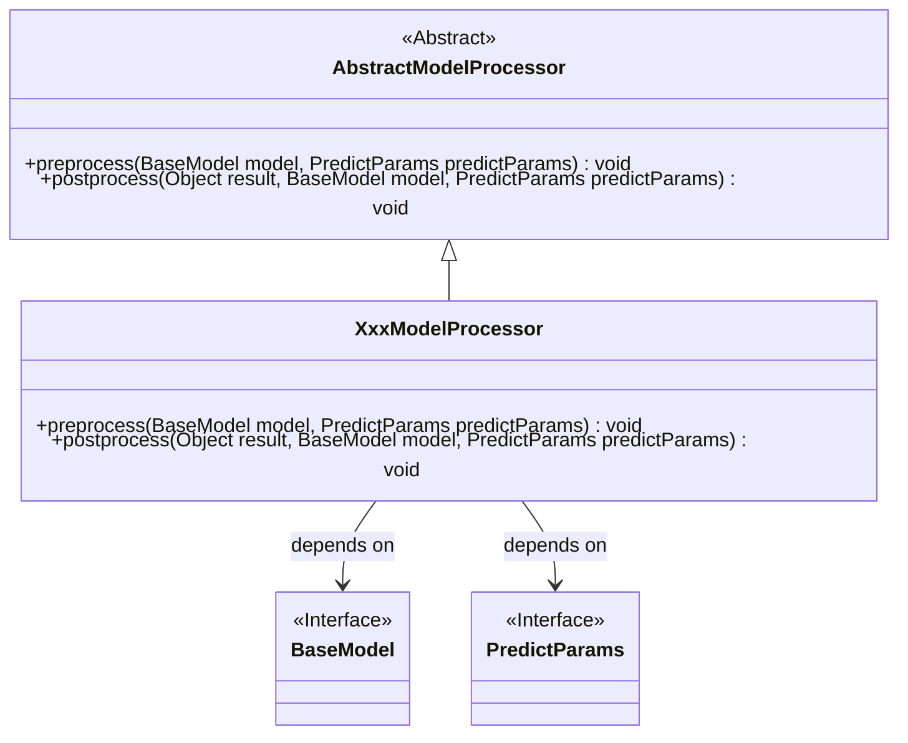
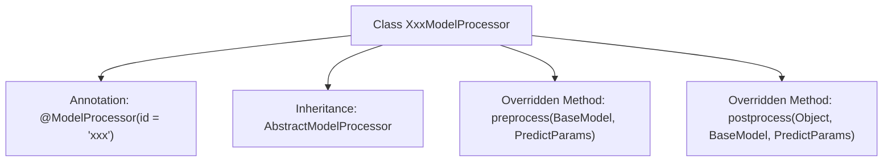

# Basic Information

|      |      |
|------|------|
| Name | XxxModelProcessor |
| Language | .java |
| Code Path | WeFe/serving/serving-service/src/main/java/com/welab/wefe/serving/service/processor/XxxModelProcessor.java |
| Package Name | com.welab.wefe.serving.service.processor |
| Dependencies | ['com.welab.wefe.serving.sdk.dto.PredictParams', 'com.welab.wefe.serving.sdk.model.BaseModel', 'com.welab.wefe.serving.sdk.processor.AbstractModelProcessor', 'com.welab.wefe.serving.sdk.processor.ModelProcessor'] |
| Brief Description | This is a model processor class named XxxModelProcessor, which inherits from AbstractModelProcessor. It includes preprocess and postprocess methods for handling logic before and after model prediction. |

# Description

The content describes a Java class named XxxModelProcessor, which extends the AbstractModelProcessor abstract class and is identified by the @ModelProcessor annotation with an ID of "xxx". This class implements two core methods: preprocess for preprocessing before model prediction, accepting BaseModel and PredictParams parameters; and postprocess for post-processing after prediction, accepting the result object, BaseModel, and PredictParams parameters. Currently, both methods are empty implementations and need to be filled with specific processing logic based on business requirements.

# Class Summary

| Name   | Type  | Description |
|-------|------|-------------|
| XxxModelProcessor | class | This is a model processor class that inherits from an abstract model processor, containing pre-processing and post-processing methods for handling logic before and after model predictions. |

## Class XxxModelProcessor

|      |      |
|------|------|
| Access Modifier | @ModelProcessor(id = "xxx");public |
| Type | class |
| Name | XxxModelProcessor |
| Description | This is a model processor class that inherits from an abstract model processor, containing pre-processing and post-processing methods for handling logic before and after model predictions. |

### UML Class Diagram

This class diagram illustrates that XxxModelProcessor inherits from the abstract class AbstractModelProcessor and implements the preprocess and postprocess methods. XxxModelProcessor depends on the BaseModel and PredictParams interfaces, which serve as parameter types for its methods. The diagram clearly depicts the inheritance and dependency relationships, with XxxModelProcessor as the concrete implementation class required to implement the abstract methods from its parent class.

### Internal Method Call Graph

This flowchart illustrates the structure of the XxxModelProcessor class, which is a model processor with a specific annotation, inheriting from the base class AbstractModelProcessor. The class overrides two key methods: preprocess for preprocessing before model prediction and postprocess for post-processing the results. The @ModelProcessor annotation defines the processor's unique identifier "xxx", indicating it is a pluggable component. The entire design adheres to the Template Method pattern, enabling extension points for specific processing logic through inheritance.

### Field List

| Name  | Type  | Description |
|-------|-------|------|

### Method List

| Name  | Type  | Description |
|-------|-------|------|
| preprocess | void | The method `preprocess` is rewritten to accept parameters `BaseModel` and `PredictParams`, with no specific implementation. |
| postprocess | void | Java method override for post-processing prediction results, which receives the result object, base model, and prediction parameters. |

