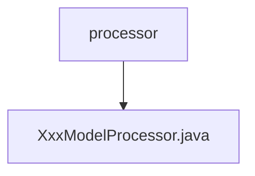

# Basic Information

|      |      |
|------|------|
| Name | processor |
| Language | .java |
| Code Path | WeFe/serving/serving-service/src/main/java/com/welab/wefe/serving/service/processor |
| Package Name | docs.serving.serving-service.src.main.java.com.welab.wefe.serving.service.processor |
| Brief Description | This is a model processor class named XxxModelProcessor, which inherits from AbstractModelProcessor. It includes preprocessing (preprocess) and postprocessing (postprocess) methods for handling logic before and after model prediction. |

# Description

The content describes a Java class named XxxModelProcessor, which extends the AbstractModelProcessor abstract class and is identified by the @ModelProcessor annotation with an ID of "xxx". This class implements two core methods: preprocess for preprocessing before model prediction, accepting BaseModel and PredictParams parameters; and postprocess for postprocessing after prediction, accepting the result object, BaseModel, and PredictParams parameters. Currently, both methods are empty implementations and need to be filled with specific processing logic based on business requirements.

### Package Internal Structure View

This flowchart illustrates the processor package structure of the serving-service module in the WeFe project. The processor folder serves as the parent node and contains a concrete processor implementation file, XxxModelProcessor.java. This structure is typical of enterprise-level Java project organization, where the processor package is commonly used to house business logic handling classes, while XxxModelProcessor represents the implementation class for processing a specific model.

# File List

| Name   | Type  | Description |
|-------|------|-------------|
| [XxxModelProcessor.java](XxxModelProcessor.md) | file | This is a model processor class named XxxModelProcessor, which inherits from AbstractModelProcessor. It includes preprocess and postprocess methods for handling logic before and after model prediction. |

