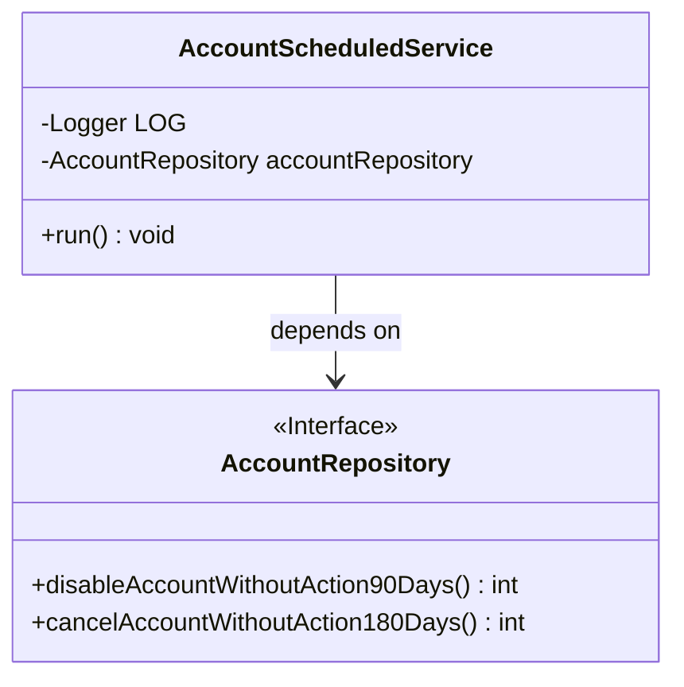
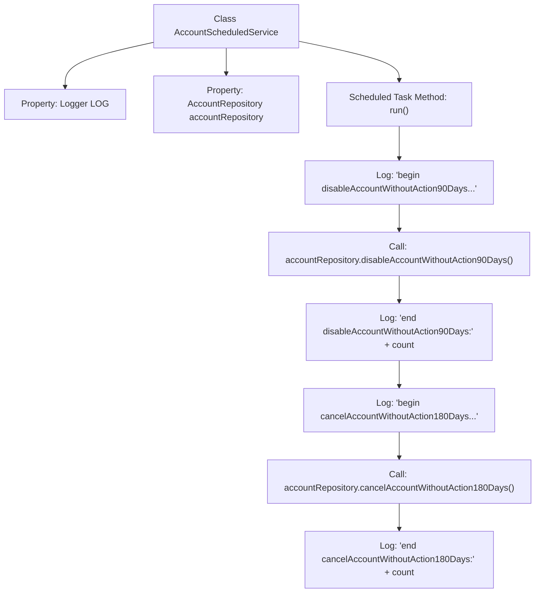

# Basic Information

|      |      |
|------|------|
| Name | AccountScheduledService |
| Language | .java |
| Code Path | WeFe/serving/serving-service/src/main/java/com/welab/wefe/serving/service/scheduler/AccountScheduledService.java |
| Package Name | com.welab.wefe.serving.service.scheduler |
| Dependencies | ['org.slf4j.Logger', 'org.slf4j.LoggerFactory', 'org.springframework.beans.factory.annotation.Autowired', 'org.springframework.context.annotation.Lazy', 'org.springframework.scheduling.annotation.Scheduled', 'org.springframework.stereotype.Component', 'com.welab.wefe.serving.service.database.repository.AccountRepository'] |
| Brief Description | The AccountScheduledService scheduled task class runs every 10 minutes, automatically disabling accounts inactive for 90 days and deactivating accounts inactive for 180 days. |

# Description

This is a Spring component class named AccountScheduledService, designed for executing scheduled tasks. The class is marked for non-lazy initialization and contains an auto-wired AccountRepository instance. The core method run() is configured via the @Scheduled annotation to execute every 10 minutes with an initial delay of 10 seconds. Its primary function is handling long-inactive accounts: first disabling accounts inactive for 90 days, then deactivating those inactive for 180 days. Each operation logs start/end timestamps and the count of processed accounts. The entire workflow records detailed execution information through a Logger.

# Class Summary

| Name   | Type  | Description |
|-------|------|-------------|
| AccountScheduledService | class | The AccountScheduledService scheduled task class runs every 10 minutes, automatically disabling accounts inactive for 90 days and deleting accounts inactive for 180 days, while logging the operations. |

## Class AccountScheduledService

|      |      |
|------|------|
| Access Modifier | @Component;@Lazy(false);public |
| Type | class |
| Name | AccountScheduledService |
| Description | The AccountScheduledService scheduled task class runs every 10 minutes, automatically disabling accounts inactive for 90 days and deleting accounts inactive for 180 days, while logging the operations. |

### UML Class Diagram

This code demonstrates a Spring scheduled task service `AccountScheduledService`, which is configured via the `@Scheduled` annotation to execute every 10 minutes. The service relies on the `AccountRepository` interface to perform two core operations: disabling accounts inactive for 90 days and canceling accounts inactive for 180 days. The class diagram clearly shows the dependency relationship between the service class and the repository interface, as well as the two critical business methods defined in the interface. The scheduled task logs operation start/end times and affected record counts, reflecting a well-designed observability approach.

### Internal Method Call Graph

This code demonstrates a Spring scheduled task service class configured with a @Scheduled annotation to execute every 10 minutes. The flowchart clearly presents two main phases of task execution: first disabling accounts inactive for 90 days, then canceling accounts inactive for 180 days. Each phase includes three steps: start log recording, calling Repository layer methods to perform database operations, and end log recording, reflecting the complete task execution flow and logging monitoring mechanism.

### Field List

| Name  | Type  | Description |
|-------|-------|------|
| accountRepository | AccountRepository | Use @Autowired to automatically inject an instance of AccountRepository. |
| LOG = LoggerFactory.getLogger(this.getClass()) | Logger | The class defines a protected and immutable logger instance for logging within the current class. |

### Method List

| Name  | Type  | Description |
|-------|-------|------|
| run | void | Scheduled task: Starts every 10 seconds, with an interval of 10 minutes. Performs two operations: deactivates accounts inactive for 90 days and deletes accounts inactive for 180 days, while logging the processed counts. |

