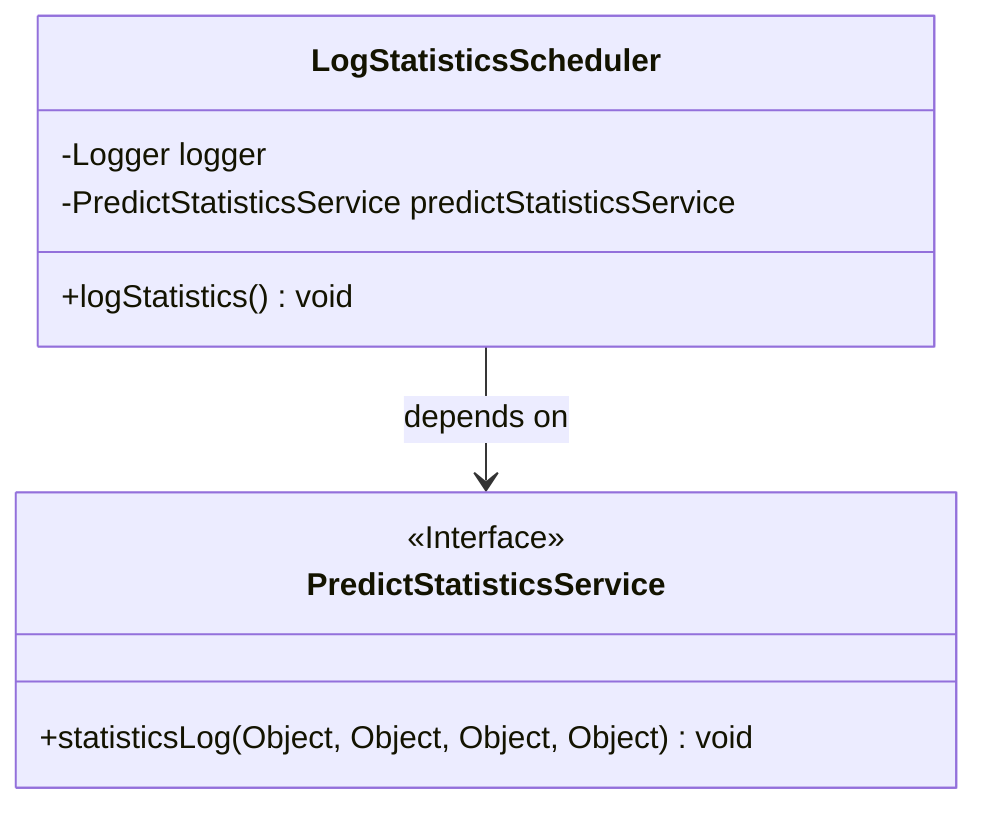
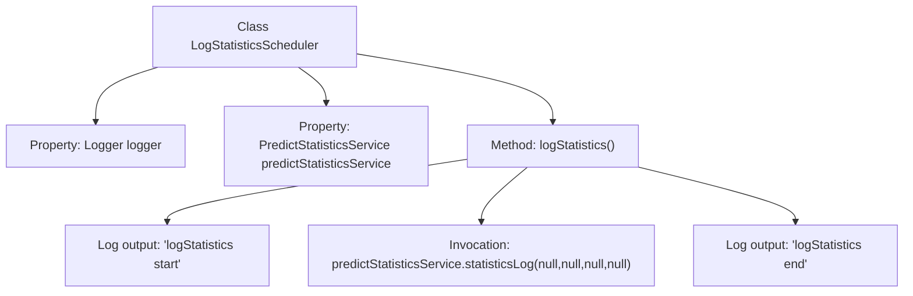

# Basic Information

|      |      |
|------|------|
| Name | LogStatisticsScheduler |
| Language | .java |
| Code Path | WeFe/serving/serving-service/src/main/java/com/welab/wefe/serving/service/scheduler/LogStatisticsScheduler.java |
| Package Name | com.welab.wefe.serving.service.scheduler |
| Dependencies | ['com.welab.wefe.serving.service.service.PredictStatisticsService', 'org.slf4j.Logger', 'org.slf4j.LoggerFactory', 'org.springframework.beans.factory.annotation.Autowired', 'org.springframework.scheduling.annotation.Scheduled', 'org.springframework.stereotype.Component'] |
| Brief Description | The `LogStatisticsScheduler` class invokes the `predictStatisticsService` via scheduled tasks to log statistics, recording both start and end information. |

# Description

The `LogStatisticsScheduler` is a scheduling class designed for recording statistical information, which includes a `Logger` for logging and an auto-injected `PredictStatisticsService` service. The class defines a `logStatistics` method that begins by logging an entry message, invokes the `statisticsLog` method of `predictStatisticsService` to perform statistical processing, and concludes by logging an exit message. Currently, the scheduling functionality is commented out, with an initial delay of 5 seconds and a fixed delay of 120 seconds.

# Class Summary

| Name   | Type  | Description |
|-------|------|-------------|
| LogStatisticsScheduler | class | The LogStatisticsScheduler class invokes the predictStatisticsService via scheduled tasks to log statistics, including start and end log records. |

## Class LogStatisticsScheduler

|      |      |
|------|------|
| Access Modifier | public |
| Type | class |
| Name | LogStatisticsScheduler |
| Description | The LogStatisticsScheduler class invokes the predictStatisticsService via scheduled tasks to log statistics, including start and end log records. |

### UML Class Diagram

This class diagram illustrates the dependency relationship between LogStatisticsScheduler and PredictStatisticsService. LogStatisticsScheduler is a scheduled task class that injects an implementation of the PredictStatisticsService interface via @Autowired and invokes its statisticsLog method for log statistics. The PredictStatisticsService is marked as an interface, containing a statistical method that accepts four Object parameters. The diagram clearly reflects the hierarchical structure of service invocation and the direction of dependency.

### Internal Method Call Graph

This code demonstrates a scheduled task class `LogStatisticsScheduler`, which injects the `PredictStatisticsService` via `@Autowired` and invokes its log statistics function within the `logStatistics()` method. Start and end logs are printed before and after method execution, with the core logic being the call to the `statisticsLog` method (currently all parameters are null). The flowchart clearly presents the class structure and method invocation chain.

### Field List

| Name  | Type  | Description |
|-------|-------|------|
| predictStatisticsService | PredictStatisticsService | Automatic injection prediction statistics service instance. |
| logger = LoggerFactory.getLogger(LogStatisticsScheduler.class) | Logger | Define a private logger, initialized with the specified class name. |

### Method List

| Name  | Type  | Description |
|-------|-------|------|
| logStatistics | void | The method `logStatistics` records statistical logs by invoking the `statisticsLog` method of `predictStatisticsService`, with all parameters set to null, and adds start and end logs before and after the call. |

