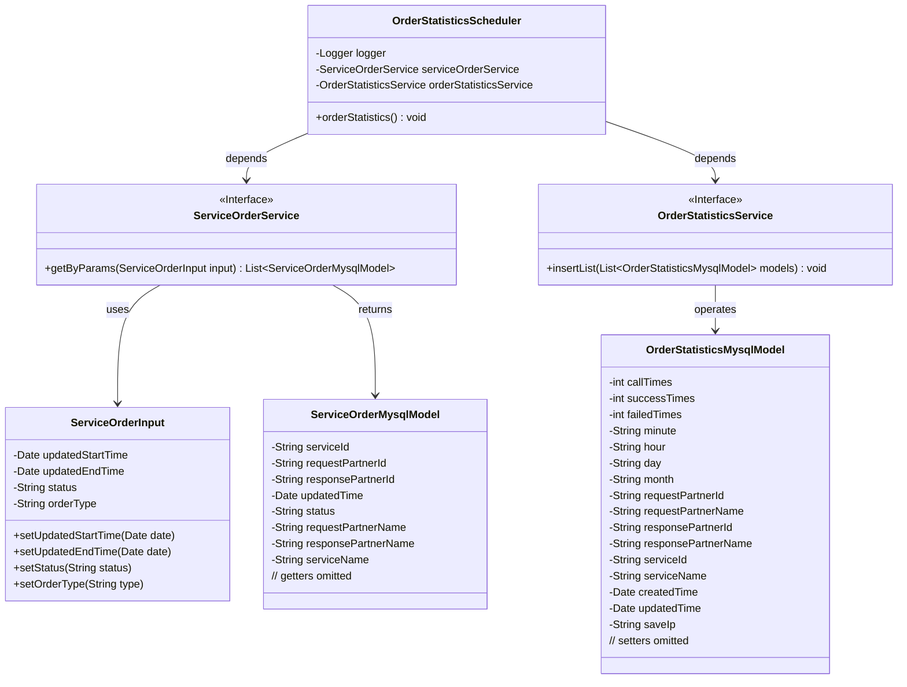
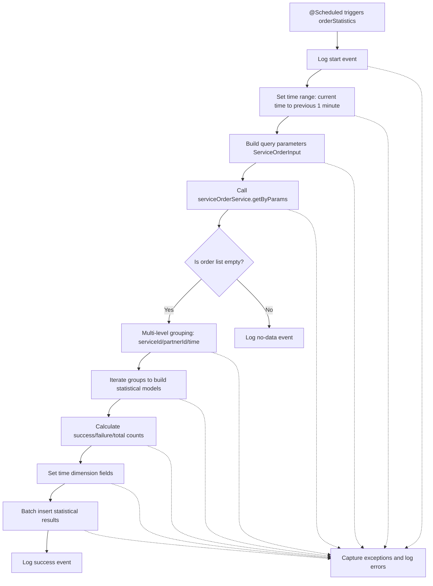

# Basic Information

|      |      |
|------|------|
| Name | OrderStatisticsScheduler |
| Language | .java |
| Code Path | WeFe/serving/serving-service/src/main/java/com/welab/wefe/serving/service/scheduler/OrderStatisticsScheduler.java |
| Package Name | com.welab.wefe.serving.service.scheduler |
| Dependencies | ['com.welab.wefe.common.util.DateUtil', 'com.welab.wefe.common.util.HostUtil', 'com.welab.wefe.common.web.util.HttpServletRequestUtil', 'com.welab.wefe.serving.service.database.entity.OrderStatisticsMysqlModel', 'com.welab.wefe.serving.service.database.entity.ServiceOrderMysqlModel', 'com.welab.wefe.serving.service.dto.ServiceOrderInput', 'com.welab.wefe.serving.service.enums.CallByMeEnum', 'com.welab.wefe.serving.service.enums.ServiceOrderEnum', 'com.welab.wefe.serving.service.service.OrderStatisticsService', 'com.welab.wefe.serving.service.service.ServiceOrderService', 'org.slf4j.Logger', 'org.slf4j.LoggerFactory', 'org.springframework.beans.factory.annotation.Autowired', 'org.springframework.scheduling.annotation.Scheduled', 'org.springframework.stereotype.Component', 'java.util', 'java.util.stream.Collectors'] |
| Brief Description | The scheduled task class `OrderStatisticsScheduler` counts non-partner order data from the previous minute every minute, groups them by service ID and partner, calculates the number of successes and failures, and stores the statistical results. |

# Description

The OrderStatisticsScheduler is a scheduled task component that triggers order statistics every minute. It retrieves non-self-generated order data from the previous minute via the ServiceOrderService, grouping and counting by service ID, requester ID, responder ID, and time. The statistics include call counts, success counts, and failure counts, with the results stored in the OrderStatisticsService. The entire process incorporates exception handling and logging to ensure the accuracy and reliability of the statistical data.

# Class Summary

| Name   | Type  | Description |
|-------|------|-------------|
| OrderStatisticsScheduler | class | The scheduled task class OrderStatisticsScheduler executes order statistics every minute, grouping by service ID, requester, responder, and time to calculate success counts, failure counts, and total call counts, with results stored in the database. |

## Class OrderStatisticsScheduler

|      |      |
|------|------|
| Access Modifier | @Component;public |
| Type | class |
| Name | OrderStatisticsScheduler |
| Description | The scheduled task class OrderStatisticsScheduler executes order statistics every minute, grouping by service ID, requester, responder, and time to calculate success counts, failure counts, and total call counts, with results stored in the database. |

### UML Class Diagram

This code implements a scheduled task for statistical order data processing. The OrderStatisticsScheduler class retrieves order data via @ServiceOrderService, performs multi-level grouping statistics by service ID, partner ID, and time to calculate metrics like success/failure counts, and finally stores the results through @OrderStatisticsService. The workflow involves 5 core classes, encompassing time processing, data grouping/aggregation, and exception handling logic, primarily used to generate minute-level order statistical reports.

### Internal Method Call Graph

This flowchart describes the complete execution process of the scheduled order statistics task. After the system triggers the task every minute, it first sets the statistical time range (current minute and previous 1 minute), then queries eligible order data. When data exists, it performs four-level grouping statistics by service ID, partner ID, and time dimension, calculates call counts, success and failure counts for each group, and finally batches the statistical results into storage. The entire process includes comprehensive logging and exception handling mechanisms to ensure the reliability of the statistical task.

### Field List

| Name  | Type  | Description |
|-------|-------|------|
| logger = LoggerFactory.getLogger(OrderStatisticsScheduler.class) | Logger | Define a private logger, initialized using the OrderStatisticsScheduler class. |
| serviceOrderService | ServiceOrderService | Use @Autowired to automatically inject the ServiceOrderService instance. |
| orderStatisticsService | OrderStatisticsService | Using @Autowired to automatically inject an instance of OrderStatisticsService. |

### Method List

| Name  | Type  | Description |
|-------|-------|------|
| orderStatistics | void | Statistics of non-our-party order data per minute, grouped by service ID and partner to calculate success and failure counts, store the statistical results, and log the records. |

