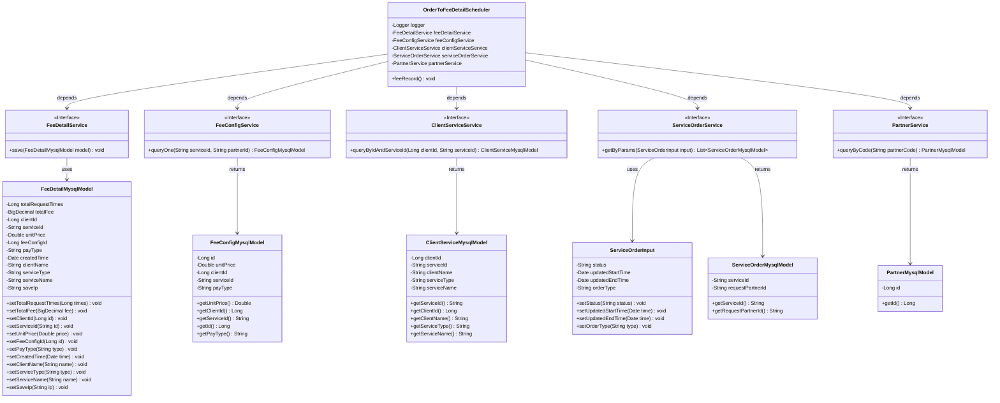
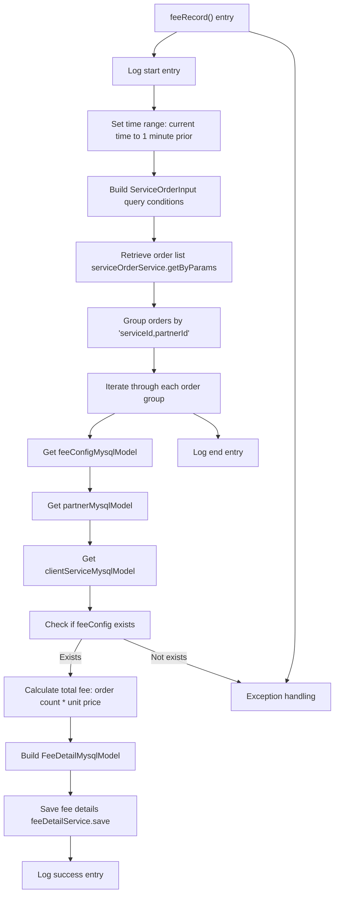

# Basic Information

|      |      |
|------|------|
| Name | OrderToFeeDetailScheduler |
| Language | .java |
| Code Path | WeFe/serving/serving-service/src/main/java/com/welab/wefe/serving/service/scheduler/OrderToFeeDetailScheduler.java |
| Package Name | com.welab.wefe.serving.service.scheduler |
| Dependencies | ['java.math.BigDecimal', 'java.util.ArrayList', 'java.util.Calendar', 'java.util.Date', 'java.util.List', 'java.util.Map', 'java.util.TimeZone', 'java.util.stream.Collectors', 'org.slf4j.Logger', 'org.slf4j.LoggerFactory', 'org.springframework.beans.factory.annotation.Autowired', 'org.springframework.scheduling.annotation.Scheduled', 'org.springframework.stereotype.Component', 'com.welab.wefe.common.util.DateUtil', 'com.welab.wefe.common.util.HostUtil', 'com.welab.wefe.serving.service.database.entity.ClientServiceMysqlModel', 'com.welab.wefe.serving.service.database.entity.FeeConfigMysqlModel', 'com.welab.wefe.serving.service.database.entity.FeeDetailMysqlModel', 'com.welab.wefe.serving.service.database.entity.PartnerMysqlModel', 'com.welab.wefe.serving.service.database.entity.ServiceOrderMysqlModel', 'com.welab.wefe.serving.service.dto.ServiceOrderInput', 'com.welab.wefe.serving.service.enums.CallByMeEnum', 'com.welab.wefe.serving.service.enums.ServiceOrderEnum', 'com.welab.wefe.serving.service.service.ClientServiceService', 'com.welab.wefe.serving.service.service.FeeConfigService', 'com.welab.wefe.serving.service.service.FeeDetailService', 'com.welab.wefe.serving.service.service.PartnerService', 'com.welab.wefe.serving.service.service.ServiceOrderService'] |
| Brief Description | The scheduled task class `OrderToFeeDetailScheduler` runs hourly, aggregating non-self-initiated orders from the previous minute. It calculates fees grouped by service ID and partner, saves the details, and logs both operations and exceptions. |

# Description

OrderToFeeDetailScheduler is a scheduled task component that executes fee record processing hourly. It retrieves data by injecting multiple service classes, including FeeDetailService, FeeConfigService, etc. The task logic is as follows: fetch orders from the previous minute that were not initiated by us and are in progress, then group them by service ID and partner ID. Query the corresponding fee configuration and partner information for each group, calculate the total fee, and save it to the fee detail table. The process logs key information such as start/end time, service ID, and partner ID. Errors are caught and logged in error logs when exceptions occur.

# Class Summary

| Name   | Type  | Description |
|-------|------|-------------|
| OrderToFeeDetailScheduler | class | The scheduled task class OrderToFeeDetailScheduler runs once per hour, collecting orders not initiated by us from the previous minute, calculating the total fees grouped by service ID and partner, and saving the results to the fee details table, including exception handling and logging. |

## Class OrderToFeeDetailScheduler

|      |      |
|------|------|
| Access Modifier | @Component;public |
| Type | class |
| Name | OrderToFeeDetailScheduler |
| Description | The scheduled task class OrderToFeeDetailScheduler runs once per hour, collecting orders not initiated by us from the previous minute, calculating the total fees grouped by service ID and partner, and saving the results to the fee details table, including exception handling and logging. |

### UML Class Diagram

This code implements a scheduled task executor `OrderToFeeDetailScheduler`, whose main function is to process fee records hourly. The scheduler retrieves order data, fee configurations, client service information, and partner details through multiple service interfaces, calculates total fees, and saves them to the fee detail table. The core workflow includes: fetching order data from the previous minute, grouping by service ID and partner, querying relevant configuration information, calculating total fees, and saving fee detail records. The process involves 6 service interfaces and 5 data model classes, achieving a loosely coupled architecture through dependency injection.

### Internal Method Call Graph

This code implements a scheduled task that executes hourly to record fee details. The main workflow includes: setting time range query conditions, retrieving order data with specific statuses, grouping orders by service ID and partner ID, calculating total fees for each group, and saving them to the fee details table. The process validates the existence of fee configurations, logs detailed operation records, and includes comprehensive exception handling. The flow involves multiple service calls and data transformations, ultimately generating structured fee detail records.

### Field List

| Name  | Type  | Description |
|-------|-------|------|
| partnerService | PartnerService | Using @Autowired to automatically inject an instance of PartnerService. |
| logger = LoggerFactory.getLogger(OrderToFeeDetailScheduler.class) | Logger | Define a private logger, initialized using the OrderToFeeDetailScheduler class. |
| feeDetailService | FeeDetailService | Automatically inject the FeeDetailService service instance. |
| feeConfigService | FeeConfigService | Using @Autowired to automatically inject an instance of FeeConfigService. |
| serviceOrderService | ServiceOrderService | Using @Autowired to automatically inject the ServiceOrderService instance. |
| clientServiceService | ClientServiceService | Using @Autowired to automatically inject an instance of ClientServiceService. |

### Method List

| Name  | Type  | Description |
|-------|-------|------|
| feeRecord | void | The scheduled task runs every minute, counting orders not initiated by us from the previous minute, calculating fees by service ID and partner, saving the details, and logging records and exceptions. |

