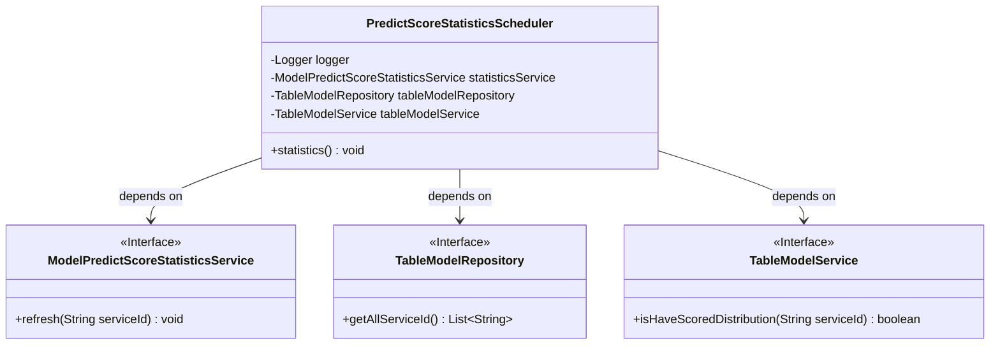
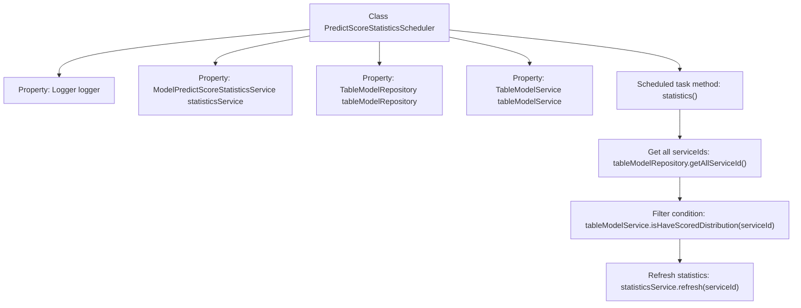

# Basic Information

|      |      |
|------|------|
| Name | PredictScoreStatisticsScheduler |
| Language | .java |
| Code Path | WeFe/serving/serving-service/src/main/java/com/welab/wefe/serving/service/scheduler/PredictScoreStatisticsScheduler.java |
| Package Name | com.welab.wefe.serving.service.scheduler |
| Dependencies | ['com.welab.wefe.serving.service.database.repository.TableModelRepository', 'com.welab.wefe.serving.service.service.ModelPredictScoreStatisticsService', 'com.welab.wefe.serving.service.service.TableModelService', 'org.slf4j.Logger', 'org.slf4j.LoggerFactory', 'org.springframework.beans.factory.annotation.Autowired', 'org.springframework.scheduling.annotation.Scheduled', 'org.springframework.stereotype.Component', 'java.util.List'] |
| Brief Description | Scheduled task class, executed every 5 minutes, filters service IDs with rating distributions and refreshes statistical information. Depends on statistical services, model repositories, and model services. |

# Description

This is a Spring component class named `PredictScoreStatisticsScheduler`, designed to periodically execute prediction score statistics tasks. The class configures a scheduled task to run every 5 minutes using the `@Scheduled` annotation. Its primary function is to retrieve all service IDs, filter out services with score distributions, and then invoke `statisticsService` to refresh the statistical information for each service. The class injects three dependencies: a logger, a statistics service, and two table model-related services. The scheduled task method `statistics()` iterates through all eligible service IDs and refreshes their statistical information one by one.

# Class Summary

| Name   | Type  | Description |
|-------|------|-------------|
| PredictScoreStatisticsScheduler | class | The `PredictScoreStatisticsScheduler` class is scheduled to execute every 5 minutes, querying all `serviceId` values and filtering out those with score distributions, then calling `statisticsService` to refresh the data. |

## Class PredictScoreStatisticsScheduler

|      |      |
|------|------|
| Access Modifier | @Component;public |
| Type | class |
| Name | PredictScoreStatisticsScheduler |
| Description | The `PredictScoreStatisticsScheduler` class is scheduled to execute every 5 minutes, querying all `serviceId` values and filtering out those with score distributions, then calling `statisticsService` to refresh the data. |

### UML Class Diagram

This code demonstrates a scheduled task class `PredictScoreStatisticsScheduler`, which utilizes three service interfaces through dependency injection. The class executes the `statistics()` method every 5 minutes, first retrieving all `serviceId`s, then filtering those requiring statistics, and finally invoking the statistics service for refresh. The class diagram clearly illustrates the dependency relationships between the main class and the three interfaces, where `ModelPredictScoreStatisticsService`, `TableModelRepository`, and `TableModelService` are all marked as interfaces. The main class leverages these interface-provided services through Spring's dependency injection mechanism.

### Internal Method Call Graph

This code represents a Spring component class primarily implementing scheduled prediction score statistics. The flowchart illustrates the class structure and core method invocation chain: The `statistics()` method is triggered every 5 minutes via `@Scheduled` annotation, first retrieving all service IDs, then filtering services requiring score distribution statistics, and finally invoking the statistics refresh service. Components are automatically injected via `@Autowired`, encompassing logging, data access, and business logic processing functionalities.

### Field List

| Name  | Type  | Description |
|-------|-------|------|
| tableModelService | TableModelService | Automatically inject the TableModelService instance. |
| tableModelRepository | TableModelRepository | The code snippet uses the @Autowired annotation to automatically inject an instance of TableModelRepository. |
| statisticsService | ModelPredictScoreStatisticsService | The code snippet uses @Autowired to automatically inject an instance of ModelPredictScoreStatisticsService into the statisticsService variable. |
| logger = LoggerFactory.getLogger(PredictScoreStatisticsScheduler.class) | Logger | Private logger instance for logging output of the PredictScoreStatisticsScheduler class. |

### Method List

| Name  | Type  | Description |
|-------|-------|------|
| statistics | void | The scheduled task runs every 5 minutes, filtering service IDs with rating distributions and refreshing statistics. |

