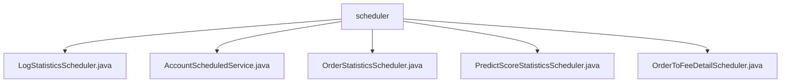

# Basic Information

|      |      |
|------|------|
| Name | scheduler |
| Language | .java |
| Code Path | WeFe/serving/serving-service/src/main/java/com/welab/wefe/serving/service/scheduler |
| Package Name | docs.serving.serving-service.src.main.java.com.welab.wefe.serving.service.scheduler |
| Brief Description | The LogStatisticsScheduler logs statistical information with an initial delay of 5 seconds and a fixed delay of 120 seconds. The AccountScheduledService processes inactive accounts every 10 minutes, with an initial delay of 10 seconds. The OrderStatisticsScheduler collects order data statistics every minute. The PredictScoreStatisticsScheduler refreshes predicted score statistics every 5 minutes. The OrderToFeeDetailScheduler processes fee records hourly. |

# Description

## Overview  
This module is a scheduled task dispatching system responsible for executing various periodic statistics and state maintenance tasks, functioning similarly to a background daemon process. Its core responsibilities include log statistics, account status management, order analysis, predictive scoring statistics, and fee detail processing. The interface specifications uniformly adopt Spring's `@Scheduled` annotation to configure execution cycles, all incorporating start/end logging and exception handling mechanisms. Key data structures involve dimensions such as service ID, partner ID, and time grouping. External dependencies include 8 service classes such as `PredictStatisticsService` and `AccountRepository`. For example, `LogStatisticsScheduler` invokes statistical services, while `OrderToFeeDetailScheduler` relies on 5 fee-related services.  

## Core Business Scenarios  
The module implements five types of scheduled tasks: 1) Account lifecycle management (e.g., disabling inactive accounts for 90 days); 2) Multi-dimensional order statistics (e.g., calculating call success rates per minute); 3) Predictive score distribution refresh (traversing services every 5 minutes); 4) Fee detail generation (calculating partner fees hourly); 5) Log aggregation processing. It employs a fixed-delay trigger mode, such as `AccountScheduledService` executing every 10 minutes. A typical interaction follows a "query-group calculation-store" workflow, e.g., `OrderStatisticsScheduler` groups and persists order data after statistical aggregation. All API types are background scheduled tasks, with integration cases including statistical service calls (`PredictScoreStatisticsScheduler`) and repository operations (`AccountScheduledService`).

### Package Internal Structure View

This flowchart illustrates the relationships of 5 scheduler class files under the scheduler directory in the WeFe project. All Java files are direct child nodes of scheduler, including implementation classes for scheduling tasks such as log statistics, account service, order statistics, prediction score statistics, and order-to-fee details, forming a flat file structure relationship.

# File List

| Name   | Type  | Description |
|-------|------|-------------|
| [LogStatisticsScheduler.java](LogStatisticsScheduler.md) | file | The LogStatisticsScheduler class invokes the predictStatisticsService via scheduled tasks to log statistics, recording both start and end information. |
| [AccountScheduledService.java](AccountScheduledService.md) | file | The AccountScheduledService scheduled task class runs every 10 minutes, automatically disabling accounts inactive for 90 days and deactivating accounts inactive for 180 days. |
| [OrderStatisticsScheduler.java](OrderStatisticsScheduler.md) | file | The scheduled task class `OrderStatisticsScheduler` counts non-our-order data from the previous minute every minute, groups them by service ID and partner, calculates the number of successes and failures, and stores the statistical results. |
| [PredictScoreStatisticsScheduler.java](PredictScoreStatisticsScheduler.md) | file | Scheduled task class, executed every 5 minutes, filters service IDs with rating distributions and refreshes statistical information. Depends on statistical services, model repositories, and model services. |
| [OrderToFeeDetailScheduler.java](OrderToFeeDetailScheduler.md) | file | The scheduled task class `OrderToFeeDetailScheduler` runs hourly, counting orders not initiated by us from the previous minute. It calculates fees by grouping them based on service ID and partner, saves the details, and logs both records and exceptions. |

