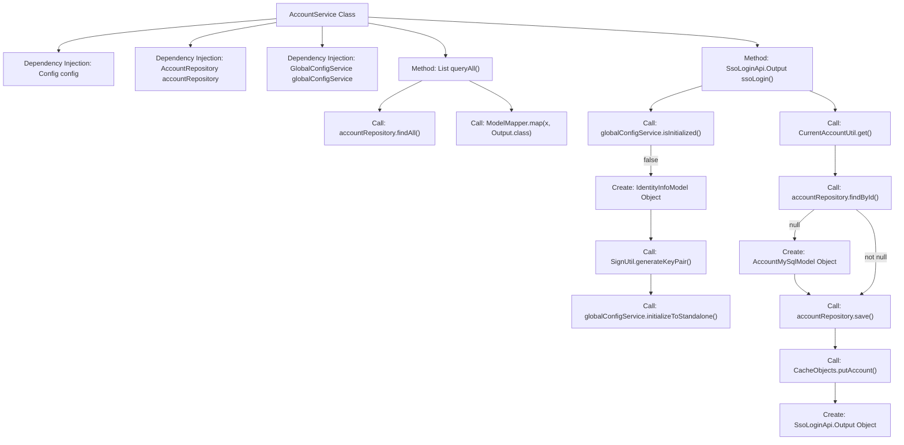
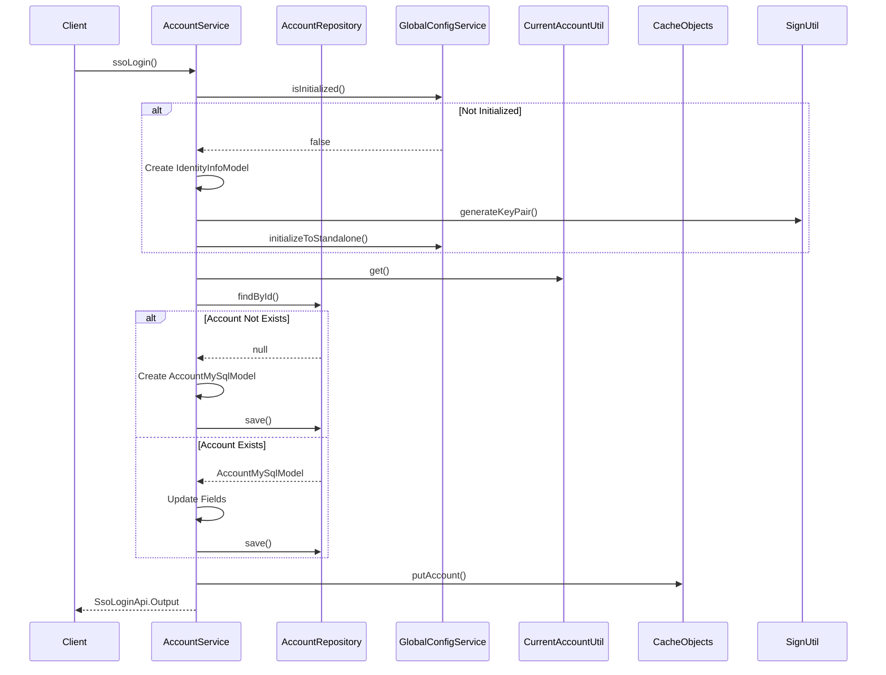

# Basic Information

|      |      |
|------|------|
| Name | AccountService |
| Language | .java |
| Code Path | WeFe/serving/serving-service/src/main/java/com/welab/wefe/serving/service/service/AccountService.java |
| Package Name | com.welab.wefe.serving.service.service |
| Dependencies | ['java.security.NoSuchAlgorithmException', 'java.util.Date', 'java.util.List', 'java.util.UUID', 'java.util.stream.Collectors', 'com.welab.wefe.serving.service.config.Config', 'org.springframework.beans.factory.annotation.Autowired', 'org.springframework.stereotype.Service', 'com.welab.wefe.common.SecurityUtil', 'com.welab.wefe.common.constant.SecretKeyType', 'com.welab.wefe.common.exception.StatusCodeWithException', 'com.welab.wefe.common.util.Sha1', 'com.welab.wefe.common.util.SignUtil', 'com.welab.wefe.common.util.StringUtil', 'com.welab.wefe.common.web.service.account.SsoAccountInfo', 'com.welab.wefe.common.web.util.CurrentAccountUtil', 'com.welab.wefe.common.wefe.enums.AuditStatus', 'com.welab.wefe.serving.service.api.account.SsoLoginApi', 'com.welab.wefe.serving.service.database.entity.AccountMySqlModel', 'com.welab.wefe.serving.service.database.repository.AccountRepository', 'com.welab.wefe.serving.service.dto.globalconfig.IdentityInfoModel', 'com.welab.wefe.serving.service.enums.ServingModeEnum', 'com.welab.wefe.serving.service.service.globalconfig.GlobalConfigService', 'com.welab.wefe.serving.service.api.account.QueryAllApi.Output'] |
| Brief Description | The AccountService provides account query and SSO login functionality. It retrieves all account data and maps it for output. During SSO login, it checks the global configuration; if uninitialized, it generates and stores a key pair. It then updates or creates an account based on the account information and finally returns the login result. |

# Description

The AccountService is a Spring service class that includes functionalities for querying all accounts and SSO login. The queryAll method retrieves all accounts via accountRepository and maps them into a list of Output objects. The ssoLogin method first checks whether the system is initialized. If not, it generates an RSA key pair and sets the identity information for standalone mode. It then fetches the current account information. If the account does not exist, a new account is created with a random password and salt value. If the account exists, it checks and updates fields such as nickname, mobile number, and email. Finally, the account information is stored in the cache, and an output object containing the ID, token, mobile number, and nickname is returned.

# Class Summary

| Name   | Type  | Description |
|-------|------|-------------|
| AccountService | class | The AccountService provides functionality for querying accounts and SSO login. It queries all accounts and maps them to output objects. During SSO login, it checks the global configuration; if uninitialized, it generates and saves a key. It updates or creates accounts based on account information and returns the login output. |


## Class AccountService

|      |      |
|------|------|
| Access Modifier | @Service;public |
| Type | class |
| Name | AccountService |
| Description | The AccountService provides functionality for querying accounts and SSO login. It queries all accounts and maps them to output objects. During SSO login, it checks the global configuration; if uninitialized, it generates and saves a key. It updates or creates accounts based on account information and returns the login output. |


### UML Class Diagram

```mermaid
classDiagram
    class AccountService {
        -Config config
        -AccountRepository accountRepository
        -GlobalConfigService globalConfigService
        +queryAll() List~Output~
        +ssoLogin() SsoLoginApi$Output
    }

    class Config {
        <<Interface>>
        +getInitializeSecretKeyType() String
    }

    class AccountRepository {
        <<Interface>>
        +findAll() List~AccountMySqlModel~
        +findById(String id) Optional~AccountMySqlModel~
        +save(AccountMySqlModel entity) AccountMySqlModel
    }

    class GlobalConfigService {
        <<Interface>>
        +isInitialized() boolean
        +initializeToStandalone(IdentityInfoModel model) void
    }

    class AccountMySqlModel {
        -String id
        -String nickname
        -String phoneNumber
        -String password
        -String salt
        -boolean superAdminRole
        -boolean adminRole
        -AuditStatus auditStatus
        -boolean enable
        -String email
        -Date updatedTime
        +setId(String id)
        +setNickname(String nickname)
        +setPhoneNumber(String phoneNumber)
        +setPassword(String password)
        +setSalt(String salt)
        +setSuperAdminRole(boolean superAdminRole)
        +setAdminRole(boolean adminRole)
        +setAuditStatus(AuditStatus auditStatus)
        +setEnable(boolean enable)
        +setEmail(String email)
        +setUpdatedTime(Date updatedTime)
        +getNickname() String
        +getPhoneNumber() String
        +getEmail() String
    }

    class IdentityInfoModel {
        -String memberId
        -String memberName
        -String mode
        -String rsaPrivateKey
        -String rsaPublicKey
        -SecretKeyType secretKeyType
        +setMemberId(String memberId)
        +setMemberName(String memberName)
        +setMode(String mode)
        +setRsaPrivateKey(String rsaPrivateKey)
        +setRsaPublicKey(String rsaPublicKey)
        +setSecretKeyType(SecretKeyType secretKeyType)
    }

    class SsoLoginApi$Output {
        -String id
        -String token
        -String phoneNumber
        -String nickname
        +setId(String id)
        +setToken(String token)
        +setPhoneNumber(String phoneNumber)
        +setNickname(String nickname)
    }

    class CurrentAccountUtil {
        <<Utility>>
        +get() SsoAccountInfo
    }

    class CacheObjects {
        <<Utility>>
        +putAccount(AccountMySqlModel account) void
    }

    AccountService --> Config : depends
    AccountService --> AccountRepository : depends
    AccountService --> GlobalConfigService : depends
    AccountService --> CurrentAccountUtil : calls
    AccountService --> CacheObjects : calls
    GlobalConfigService --> IdentityInfoModel : uses
    AccountRepository --> AccountMySqlModel : operates
    SsoLoginApi$Output --> SsoAccountInfo : data source
```

This diagram illustrates the core class relationships of AccountService, comprising 6 main classes and 2 utility classes. AccountService utilizes Config, AccountRepository, and GlobalConfigService through dependency injection, and invokes CurrentAccountUtil and CacheObjects utility classes. IdentityInfoModel is used for configuration initialization, AccountMySqlModel stores account data, and SsoLoginApi$Output encapsulates login responses. The class diagram clearly presents data flow and dependency relationships in the SSO login process.


### Internal Method Call Graph





Flowchart Description: This flowchart illustrates the core method invocation relationships of the AccountService class, with a focus on the complete execution flow of the ssoLogin() method. When the system is uninitialized, it creates identity information and generates a key pair. It then retrieves the current account information—creating and saving a new account model if the account doesn't exist, or checking and updating necessary fields if it does. Finally, it caches the account information and returns the login output. The entire process includes critical steps such as conditional checks, data operations, and external service calls.

### Field List

| Name  | Type  | Description |
|-------|-------|------|
| globalConfigService | GlobalConfigService | Using @Autowired to automatically inject an instance of GlobalConfigService. |
| config | Config | Using @Autowired to automatically inject an instance of the Config configuration class. |
| accountRepository | AccountRepository | Use @Autowired to automatically inject an instance of AccountRepository. |

### Method List

| Name  | Type  | Description |
|-------|-------|------|
| queryAll | List<Output> | Query all account data and convert it into a list of output objects. |
| ssoLogin | SsoLoginApi.Output | The method `ssoLogin` handles single sign-on: when uninitialized, it generates a key pair and creates independent identity information; it checks the existence of the account, creating a new account with a random password if it does not exist, or updating the information if it exists; finally, it returns an output object containing the ID, token, phone number, and nickname. |


