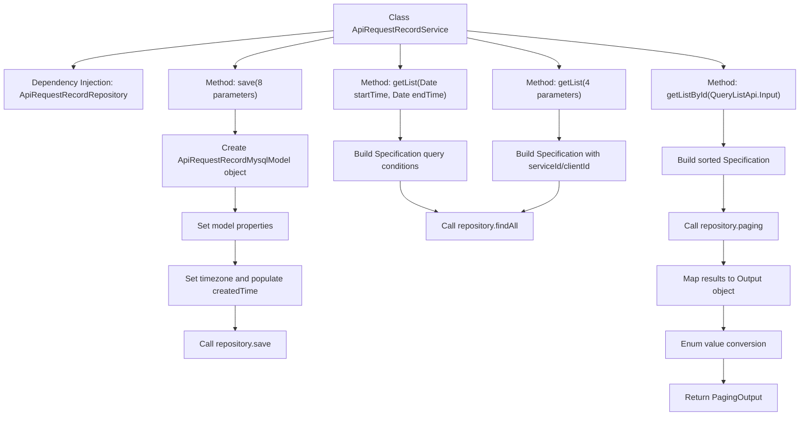

# Basic Information

|      |      |
|------|------|
| Name | ApiRequestRecordService |
| Language | .java |
| Code Path | WeFe/serving/serving-service/src/main/java/com/welab/wefe/serving/service/service/ApiRequestRecordService.java |
| Package Name | com.welab.wefe.serving.service.service |
| Dependencies | ['java.util.ArrayList', 'java.util.Calendar', 'java.util.Date', 'java.util.List', 'java.util.TimeZone', 'org.springframework.beans.factory.annotation.Autowired', 'org.springframework.data.jpa.domain.Specification', 'org.springframework.stereotype.Service', 'com.welab.wefe.common.data.mysql.Where', 'com.welab.wefe.common.data.mysql.enums.OrderBy', 'com.welab.wefe.common.web.util.ModelMapper', 'com.welab.wefe.serving.service.api.apirequestrecord.QueryListApi', 'com.welab.wefe.serving.service.database.entity.ApiRequestRecordMysqlModel', 'com.welab.wefe.serving.service.database.repository.ApiRequestRecordRepository', 'com.welab.wefe.serving.service.dto.PagingOutput', 'com.welab.wefe.serving.service.enums.ServiceResultEnum', 'com.welab.wefe.serving.service.enums.ServiceTypeEnum'] |
| Brief Description | The ApiRequestRecordService class provides API request record management functionalities, including saving records, querying by time range, querying by service ID and client ID, as well as paginated querying with output format conversion methods. |

# Description

ApiRequestRecordService is a service class designed for handling the storage and querying of API request records. It interacts with the database through ApiRequestRecordRepository, providing functionalities to save records and perform various queries. The save method accepts parameters such as service ID, name, type, client information, duration, IP address, and request result, constructs a model, and stores it. Query functionalities include retrieving records within a specified time range, filtering by service ID and client ID within a time range, as well as paginated queries with output format conversion. All queries support time range filtering, while some also support sorting and pagination. The output results are mapped to a specific format, including the conversion of enumerated values.

# Class Summary

| Name   | Type  | Description |
|-------|------|-------------|
| ApiRequestRecordService | class | The ApiRequestRecordService class provides API request recording operations, including saving records, querying by time range, querying by service ID and client ID, as well as paginated querying with mapped output results. |


## Class ApiRequestRecordService

|      |      |
|------|------|
| Access Modifier | @Service;public |
| Type | class |
| Name | ApiRequestRecordService |
| Description | The ApiRequestRecordService class provides API request recording operations, including saving records, querying by time range, querying by service ID and client ID, as well as paginated querying with mapped output results. |


### UML Class Diagram

```mermaid
classDiagram
    class ApiRequestRecordService {
        -ApiRequestRecordRepository apiRequestRecordRepository
        +save(String serviceId, String serviceName, Integer serviceType, String clientName, String clientId, Long spend, String ipAdd, Integer requestResult) void
        +getList(Date startTime, Date endTime) List~ApiRequestRecordMysqlModel~
        +getList(String serviceId, String clientId, Date startTime, Date endTime) List~ApiRequestRecordMysqlModel~
        +getListById(QueryListApi.Input input) PagingOutput~QueryListApi.Output~
    }

    class ApiRequestRecordRepository {
        <<Interface>>
        +save(ApiRequestRecordMysqlModel model) void
        +findAll(Specification~ApiRequestRecordMysqlModel~ where) List~ApiRequestRecordMysqlModel~
        +paging(Specification~ApiRequestRecordMysqlModel~ where, QueryListApi.Input input) PagingOutput~ApiRequestRecordMysqlModel~
    }

    class ApiRequestRecordMysqlModel {
        -String serviceId
        -String clientId
        -String serviceName
        -String clientName
        -Integer serviceType
        -Integer requestResult
        -Long spend
        -String ipAdd
        -Date createdTime
        +setters/getters
    }

    class QueryListApi {
        class Input {
            +String serviceId
            +String clientId
            +Date startTime
            +Date endTime
            +getters
        }
        class Output {
            +String serviceType
            +String requestResult
            +setters/getters
        }
    }

    class Where {
        +create() Builder
        <<static>>
    }

    class Builder {
        +equal(String field, Object value) Builder
        +betweenAndDate(String field, Long start, Long end) Builder
        +orderBy(String field, OrderBy order) Builder
        +build(Class~T~ clazz) Specification~T~
    }

    class PagingOutput~T~ {
        -Long total
        -List~T~ list
        +of(Long total, List~T~ list) PagingOutput~T~
        +getters
    }

    class ModelMapper {
        <<static>>
        +map(Object source, Class~D~ destinationClass) D
    }

    class ServiceTypeEnum {
        <<Enum>>
        +getValue(Integer code) String
    }

    class ServiceResultEnum {
        <<Enum>>
        +getValueByCode(Integer code) String
    }

    ApiRequestRecordService --> ApiRequestRecordRepository : Dependency
    ApiRequestRecordService --> ApiRequestRecordMysqlModel : Operates
    ApiRequestRecordService --> QueryListApi : Uses
    ApiRequestRecordService --> Where : Uses
    ApiRequestRecordService --> PagingOutput : Returns
    ApiRequestRecordService --> ModelMapper : Uses
    ApiRequestRecordService --> ServiceTypeEnum : Uses
    ApiRequestRecordService --> ServiceResultEnum : Uses
    Where --> Builder : Creates
    Builder --> Specification : Generates
```

This code demonstrates an API request record service class, whose main functionalities include saving request records, querying records by time range, querying records by service ID and client ID, and paginating query results with output format conversion. The class interacts with the database through JPA specifications, uses Where to construct query conditions, and involves multiple enum classes and model mapping utilities. The overall design reflects a layered architecture approach, where the service layer handles business logic processing, decouples from the data access layer, and supports multiple query methods and result transformations.


### Internal Method Call Graph



This flowchart illustrates the core method call chain of the ApiRequestRecordService class. The service class interacts with the database through Repository, containing four main operations: saving records, two conditional queries, and paginated queries. The paginated query method involves complex result mapping and enum conversion. All methods revolve around the ApiRequestRecordMysqlModel entity, demonstrating a typical Spring Data JPA usage pattern.

### Field List

| Name  | Type  | Description |
|-------|-------|------|
| apiRequestRecordRepository | ApiRequestRecordRepository | Automatically inject the ApiRequestRecordRepository instance. |

### Method List

| Name  | Type  | Description |
|-------|-------|------|
| getList | List<ApiRequestRecordMysqlModel> | This method queries the API request record list by service ID, client ID, and time range, using a conditional constructor to generate query conditions and return the results. |
| save | void | The method `save` is used to store API request records. It accepts parameters such as service ID, name, type, client name, ID, duration, IP, and result, creates a model object, and sets its attributes, including the current Shanghai time zone time. Finally, it saves the record via the repository. |
| getListById | PagingOutput<QueryListApi.Output> | The method `getListById` queries API request records based on input conditions and returns paginated results. It filters by `serviceId`, `clientId`, and time range, sorting in descending order by creation time. The query results are mapped to output objects with enum values converted, and finally, the paginated data is returned. |
| getList | List<ApiRequestRecordMysqlModel> | Retrieve the list of API request records within a specified time range, filtered by creation time. |


