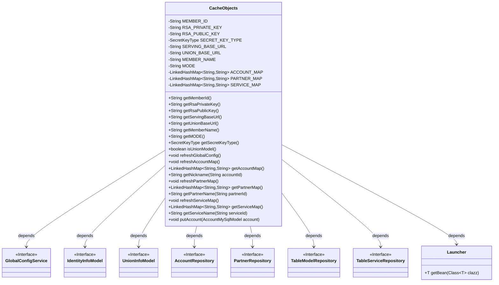
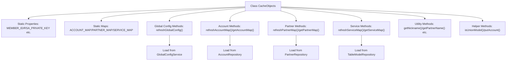
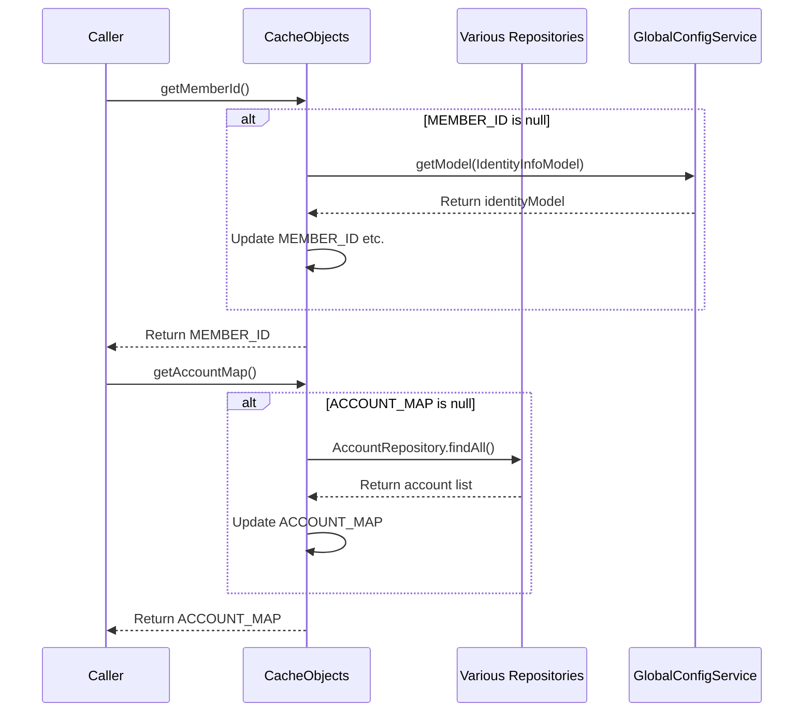

# Basic Information

|      |      |
|------|------|
| Name | CacheObjects |
| Language | .java |
| Code Path | WeFe/serving/serving-service/src/main/java/com/welab/wefe/serving/service/service/CacheObjects.java |
| Package Name | com.welab.wefe.serving.service.service |
| Dependencies | ['com.welab.wefe.common.constant.SecretKeyType', 'com.welab.wefe.common.web.Launcher', 'com.welab.wefe.serving.service.database.entity', 'com.welab.wefe.serving.service.database.repository.AccountRepository', 'com.welab.wefe.serving.service.database.repository.PartnerRepository', 'com.welab.wefe.serving.service.database.repository.TableModelRepository', 'com.welab.wefe.serving.service.database.repository.TableServiceRepository', 'com.welab.wefe.serving.service.dto.globalconfig.IdentityInfoModel', 'com.welab.wefe.serving.service.dto.globalconfig.UnionInfoModel', 'com.welab.wefe.serving.service.enums.ServingModeEnum', 'com.welab.wefe.serving.service.service.globalconfig.GlobalConfigService', 'org.springframework.data.domain.Sort', 'java.util.LinkedHashMap', 'java.util.List'] |
| Brief Description | The CacheObjects class stores system configuration information, including member IDs, public/private keys, service addresses, etc., and provides refresh and retrieval methods. It supports both standalone and federated modes, managing accounts, partners, and service mappings. |

# Description

The `CacheObjects` class is a utility class designed for caching system configurations and various mapping relationships. It contains static member variables that store global configuration information such as system IDs, RSA public/private keys, service addresses, and operation modes. Additionally, it caches account, partner, and service information using `LinkedHashMap`. The class provides static methods to retrieve these configurations and mappings, automatically invoking the `refresh` method to reload data from the database when it is empty. All refresh operations are executed by querying the database through the corresponding `Repository` or `Service` obtained via `Launcher`. The class also includes utility methods to determine whether the current mode is federated and offers thread-safe methods for updating account information.

# Class Summary

| Name   | Type  | Description |
|-------|------|-------------|
| CacheObjects | class | The CacheObjects class manages cached data, including system IDs, public and private keys, service addresses, operation modes, as well as account, partner, and service mapping tables, providing methods for retrieval and refresh. |

## Class CacheObjects

|      |      |
|------|------|
| Access Modifier | public |
| Type | class |
| Name | CacheObjects |
| Description | The CacheObjects class manages cached data, including system IDs, public and private keys, service addresses, operation modes, as well as account, partner, and service mapping tables, providing methods for retrieval and refresh. |

### UML Class Diagram

This code defines a class named `CacheObjects`, primarily used for caching and managing system configuration information, account information, partner information, and service information. The class stores this information via static variables and provides a series of static methods to retrieve and refresh these cached data. `CacheObjects` depends on multiple interfaces and the `Launcher` class to fetch and update data, ensuring real-time consistency. Through lazy loading, data is refreshed only when needed, improving system performance.

### Internal Method Call Graph

This code implements a cache management class with the following key functionalities: 1) Caching system configuration information via static variables; 2) Maintaining mapping tables for three core datasets: accounts, partners, and services; 3) Providing on-demand loading mechanism that automatically refreshes data upon first access; 4) Encapsulating various data retrieval and update methods. It adopts lazy loading pattern for performance optimization, ensures thread safety through synchronized methods, and incorporates robustness designs such as default value handling.

### Field List

| Name  | Type  | Description |
|-------|-------|------|
| SERVICE_MAP = new LinkedHashMap<>() | LinkedHashMap<String, String> | Define a static ordered hash map SERVICE_MAP with both keys and values of string type. |
| PARTNER_MAP = new LinkedHashMap<>() | LinkedHashMap<String, String> | The private static LinkedHashMap variable PARTNER_MAP has key-value pairs of type String. |
| ACCOUNT_MAP = new LinkedHashMap<>() | LinkedHashMap<String, String> | The private static LinkedHashMap variable ACCOUNT_MAP, with both keys and values being of String type. |
| SERVING_BASE_URL | String | Define a static string variable SERVING_BASE_URL to store the base URL. |
| MEMBER_NAME | String | Private static string member variable MEMBER_NAME. |
| MEMBER_ID | String | private static String memberId; |
| UNION_BASE_URL | String | Private static string variable storing the base URL. |
| RSA_PUBLIC_KEY | String | The private static string variable RSA_PUBLIC_KEY is used to store the RSA public key. |
| SECRET_KEY_TYPE | SecretKeyType | Static private key type variable SECRET_KEY_TYPE. |
| RSA_PRIVATE_KEY | String | The private static string variable RSA_PRIVATE_KEY is used to store the RSA private key. |
| MODE | String | private static String variable MODE. |

### Method List

| Name  | Type  | Description |
|-------|-------|------|
| getServingBaseUrl | String | This method checks if SERVING_BASE_URL is empty. If it is empty, it calls refreshGlobalConfig to update the configuration, and finally returns the URL. |
| getAccountMap | LinkedHashMap<String, String> | This is a Java method that checks if the ACCOUNT_MAP is empty. If it is empty, it calls refreshAccountMap to refresh it, and finally returns the map. |
| getMemberId | String | The static method `getMemberId` checks if `MEMBER_ID` is empty. If it is empty, it calls `refreshGlobalConfig` to update, and finally returns `MEMBER_ID`. |
| getSecretKeyType | SecretKeyType | Check if SECRET_KEY_TYPE is empty; if it is, refresh the configuration, and finally return SECRET_KEY_TYPE or the default rsa type. |
| getRsaPrivateKey | String | Methods to obtain the RSA private key: If the private key is empty, refresh the global configuration, and finally return the private key. |
| getRsaPublicKey | String | Method to obtain RSA public key: If the public key is empty, refresh the configuration, and finally return the public key. |
| getUnionBaseUrl | String | The static method `getUnionBaseUrl` checks if `UNION_BASE_URL` is empty. If it is empty, it calls `refreshGlobalConfig` to refresh the configuration, and finally returns the URL. |
| refreshPartnerMap | void | This method refreshes the partner mapping table: it retrieves all partners sorted by name from the database, clears the existing mappings, and then stores the IDs and names in the global mapping table PARTNER_MAP. |
| refreshGlobalConfig | void | Refresh global configuration: Retrieve identity and federation information from the GlobalConfigService, then update member ID, RSA keys, name, mode, service URL, and key type. If federation information exists, update the federation base URL. |
| refreshAccountMap | void | Refresh account mapping table: Retrieve all accounts from the database, sort them by nickname, and store them in an in-memory mapping table with IDs as keys and nicknames as values. |
| getPartnerMap | LinkedHashMap<String, String> | This is a Java method used to retrieve the partner map. If the map is empty, it calls the refreshPartnerMap method to refresh it. Finally, it returns PARTNER_MAP. |
| isUnionModel | boolean | Check whether the current mode is the joint mode. |
| getMODE | String | This method checks whether the static variable MODE is null. If it is null, it calls refreshGlobalConfig() to update the configuration, and finally returns the value of MODE. |
| getPartnerName | String | Get the partner name based on partnerId, return null or "Unknown" if the id is empty or not found. |
| getMemberName | String | This is a Java static method used to retrieve the member name. If the member name is empty, it refreshes the global configuration and finally returns the member name. |
| getNickname | String | The static method `getNickname` retrieves the nickname from `AccountMap` based on the `accountId`. If the `accountId` is empty or not found, it returns null or "Unknown". |
| putAccount | void | The static synchronized method `putAccount` accepts an `AccountMySqlModel` parameter and stores the account ID and nickname in `ACCOUNT_MAP` when they are non-null. |
| refreshServiceMap | void | Refresh service mapping table: Retrieve data from two MySQL tables, sort it by name, and store it in the global SERVICE_MAP with service IDs as keys and service names as values. |
| getServiceMap | LinkedHashMap<String, String> | This method checks whether the SERVICE_MAP is empty. If it is empty, it calls refreshServiceMap to update it, and finally returns the map. |
| getServiceName | String | Static method retrieves the service name based on the serviceId, returning null or "Unknown" if the ID is empty or not found. |

