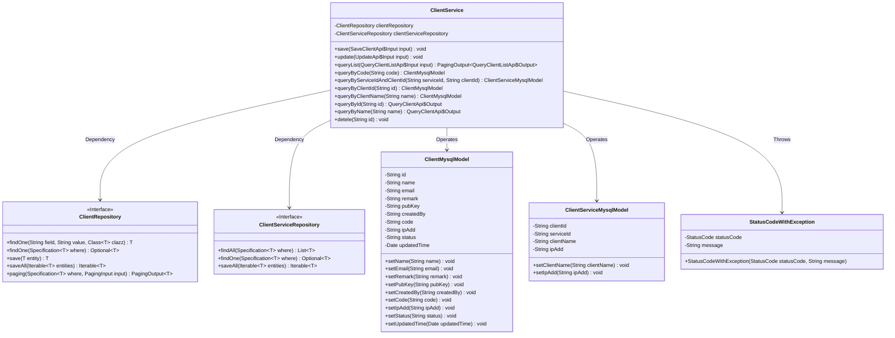
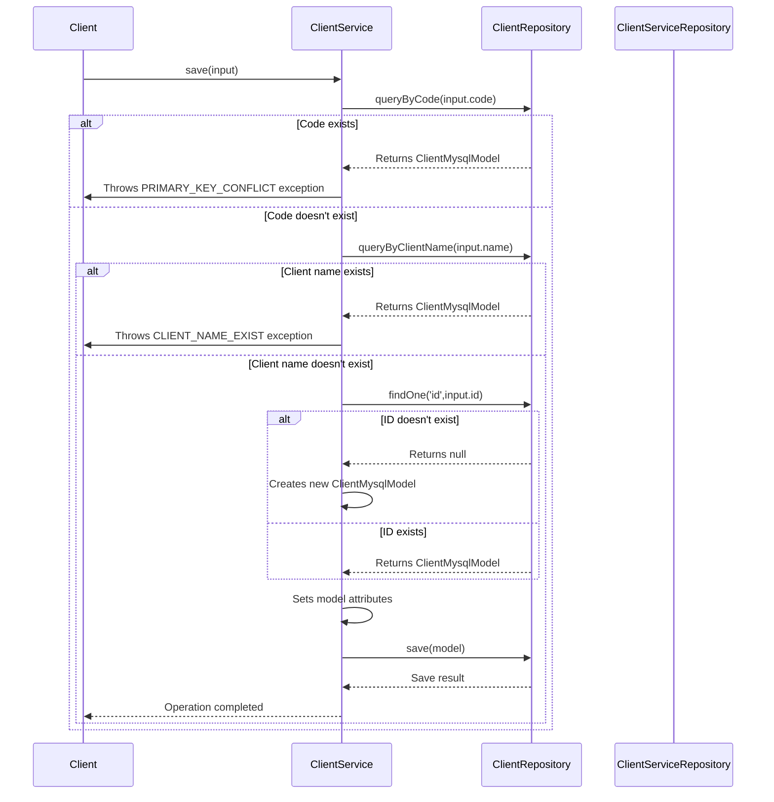

# Basic Information

|      |      |
|------|------|
| Name | ClientService |
| Language | .java |
| Code Path | WeFe/serving/serving-service/src/main/java/com/welab/wefe/serving/service/service/ClientService.java |
| Package Name | com.welab.wefe.serving.service.service |
| Dependencies | ['com.welab.wefe.common.StatusCode', 'com.welab.wefe.common.data.mysql.Where', 'com.welab.wefe.common.exception.StatusCodeWithException', 'com.welab.wefe.common.util.StringUtil', 'com.welab.wefe.common.web.util.ModelMapper', 'com.welab.wefe.serving.service.api.client.QueryClientApi', 'com.welab.wefe.serving.service.api.client.QueryClientListApi', 'com.welab.wefe.serving.service.api.client.SaveClientApi', 'com.welab.wefe.serving.service.api.client.UpdateApi', 'com.welab.wefe.serving.service.database.entity.ClientMysqlModel', 'com.welab.wefe.serving.service.database.entity.ClientServiceMysqlModel', 'com.welab.wefe.serving.service.database.repository.ClientRepository', 'com.welab.wefe.serving.service.database.repository.ClientServiceRepository', 'com.welab.wefe.serving.service.dto.PagingOutput', 'com.welab.wefe.serving.service.enums.ClientStatusEnum', 'org.springframework.beans.factory.annotation.Autowired', 'org.springframework.data.jpa.domain.Specification', 'org.springframework.stereotype.Service', 'java.util.Date', 'java.util.List', 'java.util.stream.Collectors'] |
| Brief Description | The `ClientService` class provides customer data management functionalities, including save, update, query, and delete operations. During saving, it checks the uniqueness of customer codes and names. During updates, it synchronizes data in the customer service table. Querying supports pagination and fuzzy search, while deletion marks the status rather than performing a physical delete. Key fields include name, email, public key, etc. |

# Description

ClientService is a service class primarily responsible for CRUD operations on customer data. It interacts with the database through ClientRepository and ClientServiceRepository. The save method is used to store customer information and checks whether the customer code and name already exist to avoid duplicates. The update method modifies customer information and synchronously updates associated data in the customer service table. queryList provides paginated query functionality, supporting filtering by name and time range, with public keys partially obscured in the returned results. Other query methods include retrieving customer information by code, ID, or name, with public keys also partially hidden in the responses. The delete method marks a customer's status as deleted. All methods involve operations on basic fields of the customer model, such as name, email, remarks, public key, IP address, etc.

# Class Summary

| Name   | Type  | Description |
|-------|------|-------------|
| ClientService | class | The `ClientService` class provides customer data management functionalities, including save, update, query, and delete operations. During saving, it checks the uniqueness of codes and names. During updates, it synchronizes information in the customer service table. Queries support pagination and fuzzy search, while deletions mark the status rather than performing physical deletion. Key fields include name, email, public key, etc. |

## Class ClientService

|      |      |
|------|------|
| Access Modifier | @Service;public |
| Type | class |
| Name | ClientService |
| Description | The `ClientService` class provides customer data management functionalities, including save, update, query, and delete operations. During saving, it checks the uniqueness of codes and names. During updates, it synchronizes information in the customer service table. Queries support pagination and fuzzy search, while deletions mark the status rather than performing physical deletion. Key fields include name, email, public key, etc. |

### UML Class Diagram

This code describes a client service management system, primarily consisting of the ClientService class and its related components. ClientService interacts with the database through two interfaces, ClientRepository and ClientServiceRepository, which manage basic client information and client service information respectively. Core functionalities include CRUD operations for client information, uniqueness validation, paginated queries, and synchronized updates of client-service association data. The system handles business exceptions via StatusCodeWithException and uses ClientMysqlModel and ClientServiceMysqlModel as data models mapped to database tables.

### Internal Method Call Graph

```mermaid
graph TD
    A["ClientService Class"]
    B["Dependency Injection: ClientRepository"]
    C["Dependency Injection: ClientServiceRepository"]
    D["Method: save(SaveClientApi.Input)"]
    E["Method: update(UpdateApi.Input)"]
    F["Method: queryList(QueryClientListApi.Input)"]
    G["Method: queryByCode(String)"]
    H["Method: queryByServiceIdAndClientId(String,String)"]
    I["Method: queryByClientId(String)"]
    J["Method: queryByClientName(String)"]
    K["Method: queryById(String)"]
    L["Method: queryByName(String)"]
    M["Method: detele(String)"]

    A --> B
    A --> C
    A --> D
    A --> E
    A --> F
    A --> G
    A --> H
    A --> I
    A --> J
    A --> K
    A --> L
    A --> M
```

This code implements a client service management system, primarily containing CRUD functionalities for client information. Marked as a service layer component via Spring's @Service annotation, it utilizes JPA repositories for data persistence operations. Core features include: uniqueness validation when saving client information, cascading updates when modifying client data, paginated client list queries, and various query methods. The code employs exception handling mechanisms to enforce business rules, such as uniqueness validation for client codes and names. The flowchart illustrates the class structure and main methods, while the sequence diagram details the complete interaction process during client information saving.

### Field List

| Name  | Type  | Description |
|-------|-------|------|
| clientServiceRepository | ClientServiceRepository | Automatically inject the ClientServiceRepository instance. |
| clientRepository | ClientRepository | Using @Autowired to automatically inject a ClientRepository instance. |

### Method List

| Name  | Type  | Description |
|-------|-------|------|
| save | void | The method `save` checks whether the customer code and name are duplicated. If no duplicates exist, it creates or updates the customer information and saves it. If conflicts are detected, an exception is thrown. |
| queryByCode | ClientMysqlModel | This method queries the ClientMysqlModel via code, constructs query conditions using Where, and returns matching results or null. |
| update | void | Update customer information and associated service table data: Locate the customer by the input ID, and report an error if not found; update customer fields (name, email, etc.), and update if the public key is valid; synchronize the associated service table's IP and customer name after saving. |
| queryList | PagingOutput<QueryClientListApi.Output> | The method `queryList` retrieves a list of customers based on input conditions, supporting fuzzy name matching and time range filtering. It returns results in paginated form and applies desensitization to public key information. |
| queryByClientId | ClientMysqlModel | This method retrieves client information by ID, calls the findOne method of clientRepository, and returns a ClientMysqlModel object. |
| queryById | QueryClientApi.Output | This method retrieves client information by ID, desensitizes the public key after obtaining the data (retaining the first and last four digits while replacing the middle part with asterisks), and finally maps it to the API output format for return. |
| queryByName | QueryClientApi.Output | The method `queryByName` retrieves client data by name, obtains the public key and partially masks it (keeping the first and last 4 digits), then maps it to an output class for return. |
| detele | void | Delete the client record with the specified ID, set its status to deleted, and update the modification time. |
| queryByServiceIdAndClientId | ClientServiceMysqlModel | This method queries the ClientServiceMysqlModel using serviceId and clientId, constructs the query condition with Where, and returns the matching result or null. |
| queryByClientName | ClientMysqlModel | Query client information by name and return the matching MySQL model object. |

