# Basic Information

|      |      |
|------|------|
| Name | ClientServiceService |
| Language | .java |
| Code Path | WeFe/serving/serving-service/src/main/java/com/welab/wefe/serving/service/service/ClientServiceService.java |
| Package Name | com.welab.wefe.serving.service.service |
| Dependencies | ['cn.hutool.core.lang.UUID', 'com.welab.wefe.common.StatusCode', 'com.welab.wefe.common.constant.SecretKeyType', 'com.welab.wefe.common.data.mysql.Where', 'com.welab.wefe.common.data.mysql.enums.OrderBy', 'com.welab.wefe.common.exception.StatusCodeWithException', 'com.welab.wefe.common.http.HttpRequest', 'com.welab.wefe.common.http.HttpResponse', 'com.welab.wefe.common.util.SignUtil', 'com.welab.wefe.common.util.StringUtil', 'com.welab.wefe.common.web.util.CurrentAccountUtil', 'com.welab.wefe.common.web.util.ModelMapper', 'com.welab.wefe.serving.sdk.dto.ProviderParams', 'com.welab.wefe.serving.service.api.clientservice', 'com.welab.wefe.serving.service.api.clientservice.ServiceUrlTestApi.Input', 'com.welab.wefe.serving.service.database.entity', 'com.welab.wefe.serving.service.database.repository', 'com.welab.wefe.serving.service.dto.PagingOutput', 'com.welab.wefe.serving.service.enums.PayTypeEnum', 'com.welab.wefe.serving.service.enums.ServiceClientTypeEnum', 'com.welab.wefe.serving.service.enums.ServiceStatusEnum', 'com.welab.wefe.serving.service.enums.ServiceTypeEnum', 'com.welab.wefe.serving.service.utils.ServiceUtil', 'org.apache.commons.lang3.StringUtils', 'org.springframework.beans.factory.annotation.Autowired', 'org.springframework.data.jpa.domain.Specification', 'org.springframework.stereotype.Service', 'java.util.ArrayList', 'java.util.Date', 'java.util.List', 'java.util.Optional', 'java.util.stream.Collectors'] |
| Brief Description | The ClientServiceService class provides client service management functionalities, including adding, querying, updating, and deleting services. It supports both activation and provisioning service types, handling public-private keys, billing rules, and status changes. It includes URL validation and provider list queries. |

# Description

ClientServiceService is a service class responsible for managing client service-related operations. Its main functionalities include adding, querying, updating, and deleting client service records. When adding services, it distinguishes between activation and subscription types: activation services automatically generate serviceId and clientId, while subscription services require validation of public key types and unit prices. The query functionality supports pagination, conditional filtering, and detailed viewing. Update operations can modify service status, billing rules, and other information. Deletion is only permitted for administrators and applies solely to activation-type services. Additionally, it provides batch updates based on serviceId, service URL testing, and other features. The class injects multiple Repositories for data access and handles various business logic and exception scenarios.

# Class Summary

| Name   | Type  | Description |
|-------|------|-------------|
| ClientServiceService | class | The ClientServiceService class provides client service management functionalities, including adding, querying, updating, and deleting services, handling activation and provisioning logic, as well as managing billing rules and key configurations. |

## Class ClientServiceService

|      |      |
|------|------|
| Access Modifier | @Service;public |
| Type | class |
| Name | ClientServiceService |
| Description | The ClientServiceService class provides client service management functionalities, including adding, querying, updating, and deleting services, handling activation and provisioning logic, as well as managing billing rules and key configurations. |

### UML Class Diagram

```mermaid
classDiagram
    class ClientServiceService {
        -ClientServiceRepository clientServiceRepository
        -ClientServiceQueryRepository clientServiceQueryRepository
        -BaseServiceRepository~BaseServiceMySqlModel~ serviceRepository
        -FeeConfigRepository feeConfigRepository
        -PartnerRepository partnerRepository
        -PartnerService partnerService
        +add(SaveApi.Input input) void
        +queryList(QueryListApi.Input input) PagingOutput~QueryListApi.Output~
        +queryOne(QueryApi.Input input) ClientServiceOutputModel
        +findActivateClientServiceByUrl(String url) ClientServiceMysqlModel
        +queryByIdAndServiceId(String partnerId, String serviceId) ClientServiceMysqlModel
        +detail(DetailApi.Input input) ClientServiceOutputModel
        +deleteActivate(UpdateApi.Input input) void
        +update(UpdateApi.Input input) void
        +updateStatus(UpdateStatusApi.Input input) void
        +updateAllByServiceId(String serviceId, String serviceName, String url, Integer serviceType) void
        +getAll() List~ClientServiceMysqlModel~
        +openService(String serviceId, String serviceName, String url, String clientId, String publicKey, ServiceTypeEnum serviceType, SecretKeyType secretKeyType) void
        +activateService(String serviceId, String serviceName, String clientId, String privateKey, String publicKey, SecretKeyType secretKeyType, String url, ServiceTypeEnum serviceType) void
        +serviceUrlTest(Input input) int
        +queryByServiceIdAndClientId(String serviceId, String clientId) ClientServiceMysqlModel
        +queryActivateListByServiceId(String serviceId) List~ClientServiceMysqlModel~
        +findProviderList(String serviceId) List~ProviderParams~
    }

    class ClientServiceRepository {
        +findOne(Specification~ClientServiceMysqlModel~ where) Optional~ClientServiceMysqlModel~
        +save(ClientServiceMysqlModel model) void
        +delete(ClientServiceMysqlModel model) void
        +findAll(Specification~ClientServiceMysqlModel~ where) List~ClientServiceMysqlModel~
        +paging(Specification~ClientServiceMysqlModel~ spec, QueryListApi.Input input) PagingOutput~ClientServiceMysqlModel~
        +saveAll(List~ClientServiceMysqlModel~ models) void
    }

    class ClientServiceQueryRepository {
        +queryOne(String id) ClientServiceOutputModel
    }

    class BaseServiceRepository~T~ {
        +findOne(String field, String value, Class~T~ clazz) T
    }

    class FeeConfigRepository {
        +save(FeeConfigMysqlModel model) void
    }

    class PartnerRepository {
        +findOne(String field, String value, Class~PartnerMysqlModel~ clazz) PartnerMysqlModel
    }

    class PartnerService {
        +findModelServiceUrl(String clientId) String
    }

    class ClientServiceMysqlModel {
        -String id
        -String serviceId
        -String clientId
        -String serviceName
        -String clientName
        -String url
        -String privateKey
        -String publicKey
        -Integer serviceType
        -Integer type
        -Integer status
        -Integer payType
        -Double unitPrice
        -String ipAdd
        -String code
        -SecretKeyType secretKeyType
        -Date createdTime
        -Date updatedTime
        -String updatedBy
        -String createdBy
    }

    class FeeConfigMysqlModel {
        -String serviceId
        -String clientId
        -Integer payType
        -Double unitPrice
    }

    class PartnerMysqlModel {
        -String id
        -String name
    }

    class ProviderParams {
        +String clientId
        +String url
        +of(String clientId, String url) ProviderParams
    }

    ClientServiceService --> ClientServiceRepository : Dependency
    ClientServiceService --> ClientServiceQueryRepository : Dependency
    ClientServiceService --> BaseServiceRepository~BaseServiceMySqlModel~ : Dependency
    ClientServiceService --> FeeConfigRepository : Dependency
    ClientServiceService --> PartnerRepository : Dependency
    ClientServiceService --> PartnerService : Dependency
    ClientServiceService --> ClientServiceMysqlModel : Dependency
    ClientServiceService --> FeeConfigMysqlModel : Dependency
    ClientServiceService --> PartnerMysqlModel : Dependency
    ClientServiceService --> ProviderParams : Dependency
```

Class Diagram Description: This diagram illustrates the ClientServiceService class and its dependencies, including multiple Repository classes (such as ClientServiceRepository, FeeConfigRepository, etc.) and model classes (such as ClientServiceMysqlModel, FeeConfigMysqlModel, etc.). The ClientServiceService provides client service management functionalities like adding, querying, updating, and deleting services, as well as operations related to fee configuration and partners. The classes collaborate through dependency relationships to fulfill business logic.

### Internal Method Call Graph

```mermaid
graph TD
    A["Class ClientServiceService"]
    B["Dependency Injection: ClientServiceRepository"]
    C["Dependency Injection: ClientServiceQueryRepository"]
    D["Dependency Injection: BaseServiceRepository"]
    E["Dependency Injection: FeeConfigRepository"]
    F["Dependency Injection: PartnerRepository"]
    G["Dependency Injection: PartnerService"]
    H["Core Method: add(SaveApi.Input)"]
    I["Core Method: queryList(QueryListApi.Input)"]
    J["Core Method: queryOne(QueryApi.Input)"]
    K["Core Method: findActivateClientServiceByUrl(String)"]
    L["Core Method: queryByIdAndServiceId(String, String)"]
    M["Core Method: detail(DetailApi.Input)"]
    N["Core Method: deleteActivate(UpdateApi.Input)"]
    O["Core Method: update(UpdateApi.Input)"]
    P["Core Method: updateStatus(UpdateStatusApi.Input)"]
    Q["Core Method: updateAllByServiceId(String, String, String, Integer)"]
    R["Core Method: getAll()"]
    S["Core Method: openService(String, String, String, String, String, ServiceTypeEnum, SecretKeyType)"]
    T["Core Method: activateService(String, String, String, String, String, SecretKeyType, String, ServiceTypeEnum)"]
    U["Core Method: serviceUrlTest(Input)"]
    V["Core Method: queryByServiceIdAndClientId(String, String)"]
    W["Core Method: queryActivateListByServiceId(String)"]
    X["Core Method: findProviderList(String)"]

    A --> B
    A --> C
    A --> D
    A --> E
    A --> F
    A --> G
    A --> H
    A --> I
    A --> J
    A --> K
    A --> L
    A --> M
    A --> N
    A --> O
    A --> P
    A --> Q
    A --> R
    A --> S
    A --> T
    A --> U
    A --> V
    A --> W
    A --> X
```

This flowchart illustrates the main structure and functionality of the ClientServiceService class. As a service layer component, it accesses data through multiple repositories and provides a comprehensive feature set for client service management. Core methods include adding/querying/updating/deleting client service records, handling two service types (ACTIVATE/OPEN), and various conditional queries and batch operations. Each method is explicitly connected to the class body via arrows, demonstrating clear hierarchical relationships and service dependencies. Special attention is given to different processing logic for service types (ACTIVATE/OPEN), as well as security-related operations such as URL validation and secret key management.

### Field List

| Name  | Type  | Description |
|-------|-------|------|
| feeConfigRepository | FeeConfigRepository | Using @Autowired to automatically inject an instance of FeeConfigRepository. |
| clientServiceRepository | ClientServiceRepository | Automatically inject the ClientServiceRepository instance. |
| partnerRepository | PartnerRepository | Using @Autowired to automatically inject an instance of PartnerRepository. |
| clientServiceQueryRepository | ClientServiceQueryRepository | Using @Autowired to automatically inject an instance of ClientServiceQueryRepository. |
| partnerService | PartnerService | Use @Autowired to automatically inject an instance of PartnerService. |
| serviceRepository | BaseServiceRepository<BaseServiceMySqlModel> | Automatically injects a base service repository instance of BaseServiceMySqlModel. |

### Method List

| Name  | Type  | Description |
|-------|-------|------|
| update | void | This method updates client service information based on input parameters. If the service type is activation, it updates fields such as unit price and payment type while verifying the unit price is non-negative. For activation types, it resets certain fields and processes the key. Finally, it saves the updates, adding a billing rule record if the type is activation. An exception is thrown if no data is found. |
| updateAllByServiceId | void | This method updates the database record based on the serviceId, modifies the serviceName, url, and serviceType fields, sets the updater and timestamp, and finally performs a batch save. |
| queryOne | ClientServiceOutputModel | Query a single client service, which calls the repository query method based on the input ID and returns the result model. |
| deleteActivate | void | This method deletes client service records in an active state based on the input parameters. It first queries for matching records, then deletes them if they exist and are of the active type; otherwise, it throws an exception. |
| queryList | PagingOutput<QueryListApi.Output> | The method `queryList` filters `ClientServiceMysqlModel` data based on input conditions and returns paginated results. It handles queries involving service names, client names, statuses, and types, maps enumeration values, and adjusts the output format. |
| serviceUrlTest | int | The method `serviceUrlTest` validates the format of the input URL. If valid, it sends an HTTP request and returns the status code; if invalid, it throws a parameter exception. |
| openService | void | This method is used to open a service, receiving parameters such as service ID, name, and URL, then saving the information after setting the service type, key type, status, and other details. |
| updateStatus | void | Method for updating service status: Query service records based on input parameters, verify the validity of type and status, update the status and save, otherwise throw an exception. |
| add | void | This method handles the logic of adding services, distinguishing between activation and provisioning types. Activated services automatically generate an ID, while provisioning services require parameter validation and billing rule storage. It checks whether the service exists—if not, it creates and saves the model; if it exists, an exception is thrown. |
| getAll | List<ClientServiceMysqlModel> | The method returns a list containing all ClientServiceMysqlModel objects by calling the findAll method of clientServiceRepository to retrieve all data. |
| detail | ClientServiceOutputModel | This method queries customer service details based on the input parameters, maps them to the output model and processes key display if they exist; otherwise, it returns null. |
| activateService | void | This method is used to activate a service, accepting parameters such as service ID, name, client ID, and secret key. If the service does not exist, it will be created, with all attributes configured before being saved to the database. |
| queryByIdAndServiceId | ClientServiceMysqlModel | This method queries the ClientServiceMysqlModel using partnerId and serviceId, constructs query conditions with the Where condition builder, calls the repository for the query, and returns the result if it exists or null otherwise. |
| findActivateClientServiceByUrl | ClientServiceMysqlModel | This method queries the activated client service via URL, uses a condition builder to create query conditions, and returns the corresponding model if found; otherwise, it returns null. |
| queryByServiceIdAndClientId | ClientServiceMysqlModel | Query the ClientServiceMysqlModel based on the service ID and customer ID, construct the query using conditions, and return the result or null. |
| queryActivateListByServiceId | List<ClientServiceMysqlModel> | This method queries the list of activated services by serviceId, using the condition builder Where to create query conditions that match the serviceId and records of type ACTIVATE, and finally returns the list of query results. |
| findProviderList | List<ProviderParams> | The method queries the activation list based on the serviceId, converts each entry into a ProviderParams object, which includes the clientId and the concatenated URL address. |

